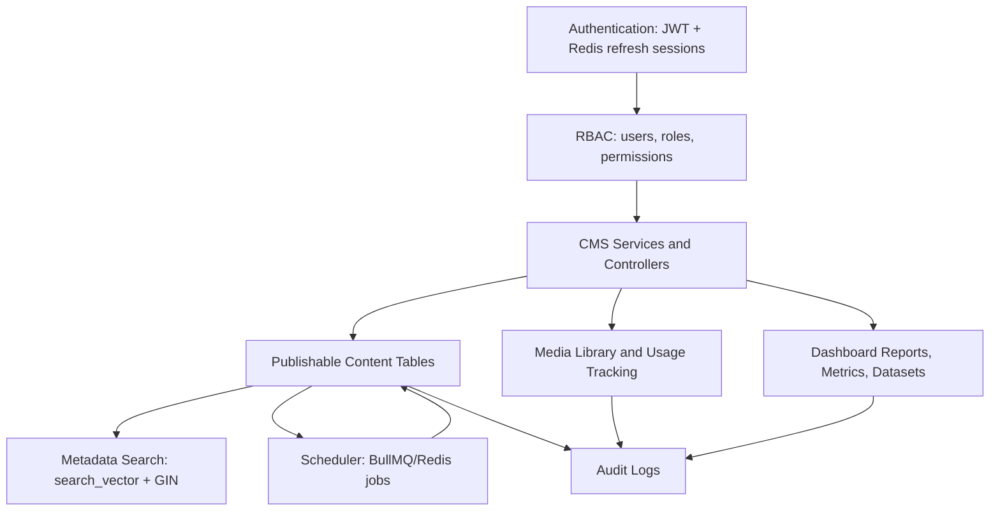
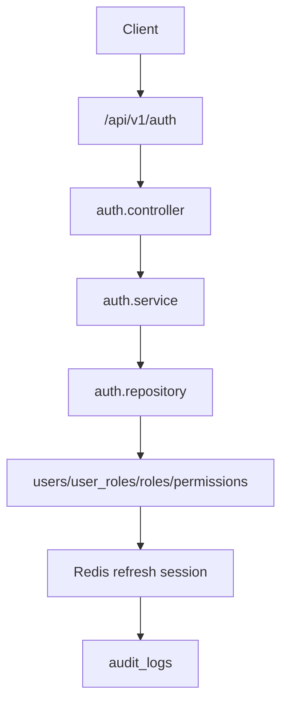
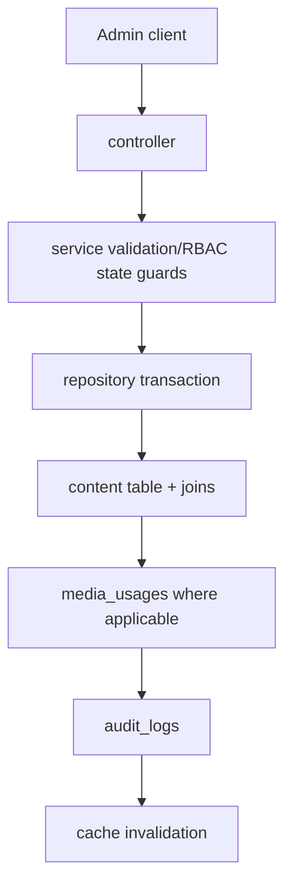
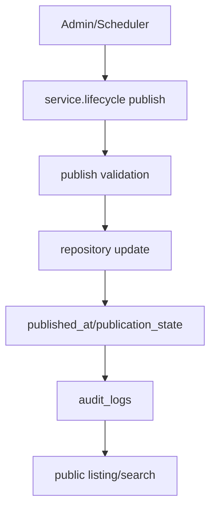
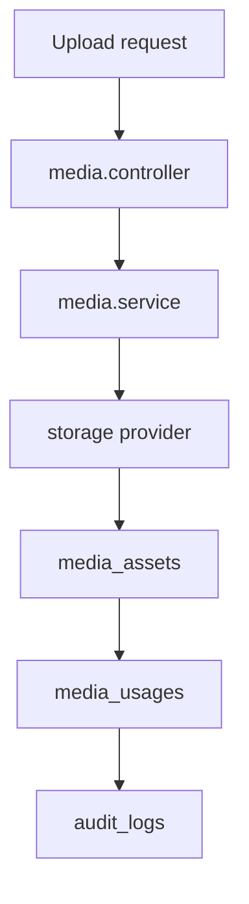
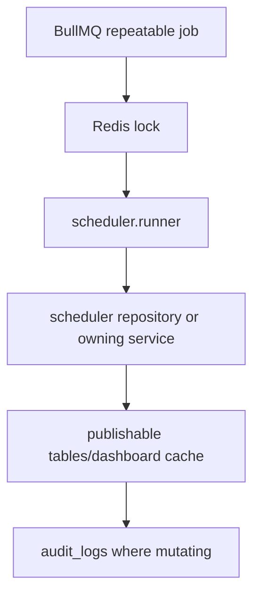
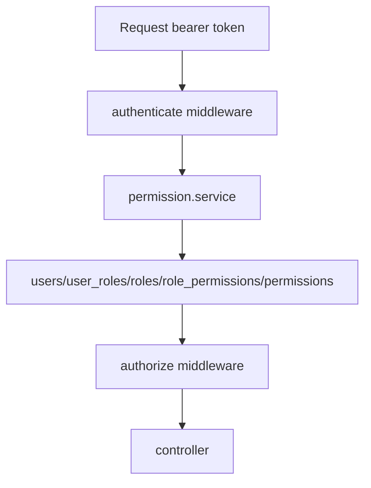
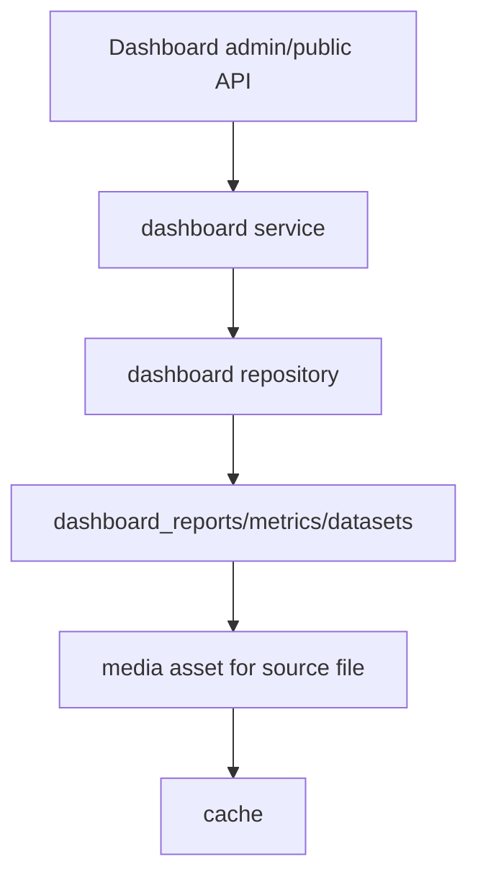

# Database Structure

---

Generated from the current codebase on 2026-06-26. Sources inspected: `prisma/schema.prisma`, all applied migrations, parked migrations, backend repositories/services/controllers/routes, seeders, scheduler jobs, and foundation/module/API docs. This document records implemented facts; unavailable areas are marked exactly as "Not found in current codebase."

# 1. Database Overview

- Database type: PostgreSQL via Prisma datasource `provider = "postgresql"`; connection uses `DATABASE_URL` and `DIRECT_URL`.
- ORM: Prisma Client with schema at `prisma/schema.prisma`.
- Naming conventions: Prisma model names are PascalCase; database tables/columns are snake_case through `@@map` and `@map`; permission keys use `module.action`.
- UUID strategy: current Prisma models use UUID primary keys with `@default(uuid()) @db.Uuid`, and FK fields use `@db.Uuid` where modeled.
- Soft delete strategy: publishable content uses `archived_at` plus `publication_state = archived`; master data uses `is_active`; media uses `archived_at`; broad `deleted_at`/`deleted_by` columns are not found.
- Timestamp strategy: `created_at`, `updated_at`, `published_at`, `publish_start_at`, `archived_at`, `highlight_*`, `last_login_at`, `processed_at` appear according to table purpose.
- Audit strategy: services write to `audit_logs` through `auditService`; audit writes are fail-open with retries and alert logging.
- Transaction strategy: repositories expose `prisma.$transaction` for multi-table writes; audit writes are intentionally outside business transactions.
- Migration strategy: ordered Prisma migrations plus raw SQL for PostgreSQL-specific features (`tsvector`, GIN, `citext`, `NULLS NOT DISTINCT`).
- Multi-tenancy: Not found in current codebase.

# 2. Database Statistics

| Metric | Count | Notes |
| --- | --- | --- |
| Total Prisma models / tables | 61 | Tables represented in current Prisma schema. |
| Tables created in applied migrations | 61 | CREATE TABLE statements in `prisma/migrations`. |
| Core tables | 6 | users, roles, permissions, role_permissions, user_roles, settings |
| CMS tables | 30 | Content, join, publishing, menu, membership tables. |
| Media tables | 5 | media_assets, media_usages, galleries, gallery_images, videos |
| Analytics tables | 3 | dashboard_reports, dashboard_metrics, dashboard_datasets |
| Audit tables | 1 | `audit_logs`. |
| Join/detail tables | 17 | role_permissions, user_roles, gallery_images, media_usages, document_commodities, document_districts, document_tags, document_programmes, document_institutions, event_commodities, event_programmes, event_institutions, event_documents, event_galleries, programme_commodities, programme_permitted_training_types, toolkit_distribution_items |
| Enums | 15 | Language, AuditAction, PublicationState, HighlightType, ReportingPeriodType, DateMode, EventStatus, FieldDataType, TranslationSource, DistributionBasis, DistributionModel, MembershipLevel, MembershipType, MembershipStatus, DatasetSource |
| Indexes | 173 | Applied SQL indexes, including unique indexes. |
| Foreign keys | 65 | Applied SQL FK constraints parsed from migrations. |
| Unique constraints/indexes | 153 | SQL unique indexes plus Prisma-declared unique constraints. |
| Views | 0 | Not found in current codebase. |
| Materialized Views | 0 | Not found in current codebase. |
| Functions | 0 | Not found in current codebase. |
| Triggers | 0 | Not found in current codebase. |
| Sequences | 0 | Not found in current codebase. |
| Approximate relationship count | 65 | FK relationships in applied migrations. |

# 3. Entity Relationship Diagram

```mermaid
erDiagram

  roles ||--o{ role_permissions : "role_id -> id (CASCADE)"

  permissions ||--o{ role_permissions : "permission_id -> id (CASCADE)"

  users ||--o{ user_roles : "user_id -> id (CASCADE)"

  roles ||--o{ user_roles : "role_id -> id (RESTRICT)"

  galleries ||--o{ gallery_images : "gallery_id -> id (CASCADE)"

  media_assets ||--o{ gallery_images : "media_id -> id (RESTRICT)"

  media_assets ||--o{ media_usages : "media_id -> id (RESTRICT)"

  districts ||--o{ blocks : "district_id -> id (RESTRICT)"

  document_types ||--o{ documents : "document_type_id -> id (RESTRICT)"

  media_assets ||--o{ documents : "file_asset_id -> id (RESTRICT)"

  documents ||--o{ document_commodities : "document_id -> id (CASCADE)"

  commodities ||--o{ document_commodities : "commodity_id -> id (RESTRICT)"

  documents ||--o{ document_districts : "document_id -> id (CASCADE)"

  districts ||--o{ document_districts : "district_id -> id (RESTRICT)"

  documents ||--o{ document_tags : "document_id -> id (CASCADE)"

  tags ||--o{ document_tags : "tag_id -> id (RESTRICT)"

  event_types ||--o{ events : "event_type_id -> id (RESTRICT)"

  training_types ||--o{ events : "training_type_id -> id (RESTRICT)"

  districts ||--o{ events : "district_id -> id (RESTRICT)"

  blocks ||--o{ events : "block_id -> id (RESTRICT)"

  event_types ||--o{ event_field_definitions : "event_type_id -> id (CASCADE)"

  events ||--o{ event_news : "event_id -> id (RESTRICT)"

  events ||--o{ event_commodities : "event_id -> id (CASCADE)"

  commodities ||--o{ event_commodities : "commodity_id -> id (RESTRICT)"

  events ||--o{ event_programmes : "event_id -> id (CASCADE)"

  programme_schemes ||--o{ event_programmes : "programme_scheme_id -> id (RESTRICT)"

  events ||--o{ event_institutions : "event_id -> id (CASCADE)"

  institutions ||--o{ event_institutions : "institution_id -> id (RESTRICT)"

  events ||--o{ event_documents : "event_id -> id (CASCADE)"

  documents ||--o{ event_documents : "document_id -> id (RESTRICT)"

  events ||--o{ event_galleries : "event_id -> id (CASCADE)"

  galleries ||--o{ event_galleries : "gallery_id -> id (RESTRICT)"

  programme_schemes ||--o{ programme_commodities : "programme_scheme_id -> id (CASCADE)"

  commodities ||--o{ programme_commodities : "commodity_id -> id (RESTRICT)"

  programme_schemes ||--o{ programme_permitted_training_types : "programme_scheme_id -> id (CASCADE)"

  training_types ||--o{ programme_permitted_training_types : "training_type_id -> id (RESTRICT)"

  institution_types ||--o{ institutions : "institution_type_id -> id (RESTRICT)"

  districts ||--o{ institutions : "district_id -> id (RESTRICT)"

  documents ||--o{ document_programmes : "document_id -> id (CASCADE)"

  programme_schemes ||--o{ document_programmes : "programme_scheme_id -> id (RESTRICT)"

  documents ||--o{ document_institutions : "document_id -> id (CASCADE)"

  institutions ||--o{ document_institutions : "institution_id -> id (RESTRICT)"

  programme_schemes ||--o{ toolkits : "programme_scheme_id -> id (RESTRICT)"

  commodities ||--o{ toolkits : "commodity_id -> id (RESTRICT)"

  toolkits ||--o{ toolkit_items : "toolkit_id -> id (CASCADE)"

  events ||--o{ toolkit_distribution_summaries : "event_id -> id (CASCADE)"

  toolkits ||--o{ toolkit_distribution_summaries : "toolkit_id -> id (RESTRICT)"

  toolkit_distribution_summaries ||--o{ toolkit_distribution_items : "toolkit_distribution_summary_id -> id (CASCADE)"

  toolkit_items ||--o{ toolkit_distribution_items : "toolkit_item_id -> id (RESTRICT)"

  menu_items ||--o{ menu_items : "parent_id -> id (CASCADE)"

  faq_categories ||--o{ faqs : "faq_category_id -> id (RESTRICT)"

  communication_types ||--o{ official_communications : "communication_type_id -> id (RESTRICT)"

  documents ||--o{ official_communications : "document_id -> id (RESTRICT)"

  tender_types ||--o{ tenders : "tender_type_id -> id (RESTRICT)"

  procurement_update_types ||--o{ procurement_updates : "procurement_update_type_id -> id (RESTRICT)"

  commodities ||--o{ procurement_updates : "commodity_id -> id (RESTRICT)"

  districts ||--o{ procurement_updates : "district_id -> id (RESTRICT)"

  blocks ||--o{ procurement_updates : "block_id -> id (RESTRICT)"

  programme_schemes ||--o{ procurement_updates : "programme_scheme_id -> id (RESTRICT)"

  documents ||--o{ procurement_updates : "document_id -> id (RESTRICT)"

  institutions ||--o{ institutional_memberships : "institution_id -> id (RESTRICT)"

  institutions ||--o{ institutional_memberships : "district_union_id -> id (RESTRICT)"

  districts ||--o{ institutional_memberships : "district_id -> id (RESTRICT)"

  dashboard_reports ||--o{ dashboard_metrics : "report_id -> id (CASCADE)"

  dashboard_reports ||--o{ dashboard_datasets : "report_id -> id (RESTRICT)"

```

# 4. Database Architecture

Data flows through Express routes/controllers into service-layer validation and RBAC guards, then repository-layer Prisma calls. Public reads filter publishable tables by published/public/not archived conditions. Admin writes record audit rows through the central audit service. Scheduler jobs use Redis/BullMQ for timing and locks, then call owning module services for publish transitions or repository maintenance queries for highlight cleanup.

# 5. Every Table Documentation

## Table: users

**Prisma model:** `User`

**Purpose**

--------------- Users & RBAC ---------------

**Columns**

| Column | Type | Nullable | Default | Description |
| --- | --- | --- | --- | --- |
| id | String @db.Uuid | No | @default(uuid()) | id (primary key) |
| email | String | No | Not found in current codebase. | email (unique) |
| password_hash | String | No | Not found in current codebase. | passwordHash mapped from passwordHash |
| full_name | String | No | Not found in current codebase. | fullName mapped from fullName |
| preferred_language | Language | No | @default(en) @map("preferred_language") | preferredLanguage mapped from preferredLanguage |
| is_active | Boolean | No | @default(true) @map("is_active") | isActive mapped from isActive |
| last_login_at | DateTime? | Yes | Not found in current codebase. | lastLoginAt mapped from lastLoginAt |
| created_at | DateTime | No | @default(now()) | createdAt mapped from createdAt |
| updated_at | DateTime | No | @updatedAt | updatedAt mapped from updatedAt |

**Primary Key**

- id

**Unique Keys**

| Name | Columns | Source |
| --- | --- | --- |
| Prisma/default generated | email | email             String    @unique |

**Foreign Keys**

Not found in current codebase.

**Indexes**

| Index | Columns | Unique | Method | Notes |
| --- | --- | --- | --- | --- |
| users_email_key | "email" | Yes | BTREE | Prisma/application query support. |

**Relationships**

| Direction | Related Table | Columns | Cardinality | Cascade |
| --- | --- | --- | --- | --- |
| Referenced by | user_roles | user_id | one-to-many | CASCADE |

**Used By**

- `src/jobs/scheduler/scheduler.repository.ts`
- `src/middleware/auth-middleware.test.ts`
- `src/modules/auth/auth.repository.ts`
- `prisma/seed/index.ts`

**APIs**

/api/v1/auth

**Services**

Not found in current codebase.

**Repositories**

src/jobs/scheduler/scheduler.repository.ts, src/modules/auth/auth.repository.ts

**Controllers**

Not found in current codebase.

**Scheduler**

Not found in current codebase.

**Triggers**

Not found in current codebase.

**Lifecycle**

Active/deactivated master-data lifecycle through `is_active`.

**Typical Queries**

Repository usage not found beyond direct primary-key/natural-key operations.

**Security Notes**

Contains password hashes and account status; never expose `password_hash`. Contains contact/PII fields.

**Performance Notes**

Indexed columns: "email".

**Future Improvements**

Not found in current codebase.

## Table: roles

**Prisma model:** `Role`

**Purpose**

Platform identity, RBAC, or settings table.

**Columns**

| Column | Type | Nullable | Default | Description |
| --- | --- | --- | --- | --- |
| id | String @db.Uuid | No | @default(uuid()) | id (primary key) |
| key | String | No | Not found in current codebase. | key (unique) |
| name_en | String | No | Not found in current codebase. | nameEn mapped from nameEn |
| description | String? | Yes | Not found in current codebase. | description |
| is_system | Boolean | No | @default(true) @map("is_system") | isSystem mapped from isSystem |
| created_at | DateTime | No | @default(now()) | createdAt mapped from createdAt |
| updated_at | DateTime | No | @updatedAt | updatedAt mapped from updatedAt |

**Primary Key**

- id

**Unique Keys**

| Name | Columns | Source |
| --- | --- | --- |
| Prisma/default generated | key | key         String   @unique |

**Foreign Keys**

Not found in current codebase.

**Indexes**

| Index | Columns | Unique | Method | Notes |
| --- | --- | --- | --- | --- |
| roles_key_key | "key" | Yes | BTREE | Prisma/application query support. |

**Relationships**

| Direction | Related Table | Columns | Cardinality | Cascade |
| --- | --- | --- | --- | --- |
| Referenced by | role_permissions | role_id | one-to-many | CASCADE |
| Referenced by | user_roles | role_id | one-to-many | RESTRICT |

**Used By**

- `prisma/seed/index.ts`

**APIs**

Not found in current codebase.

**Services**

Not found in current codebase.

**Repositories**

Not found in current codebase.

**Controllers**

Not found in current codebase.

**Scheduler**

Not found in current codebase.

**Triggers**

Not found in current codebase.

**Lifecycle**

Not found in current codebase.

**Typical Queries**

Repository usage not found beyond direct primary-key/natural-key operations.

**Security Notes**

No table-specific security notes found beyond normal RBAC/service validation.

**Performance Notes**

Indexed columns: "key".

**Future Improvements**

Not found in current codebase.

## Table: permissions

**Prisma model:** `Permission`

**Purpose**

Platform identity, RBAC, or settings table.

**Columns**

| Column | Type | Nullable | Default | Description |
| --- | --- | --- | --- | --- |
| id | String @db.Uuid | No | @default(uuid()) | id (primary key) |
| key | String | No | Not found in current codebase. | key (unique) |
| module | String | No | Not found in current codebase. | module |
| action | String | No | Not found in current codebase. | action |
| description | String? | Yes | Not found in current codebase. | description |

**Primary Key**

- id

**Unique Keys**

| Name | Columns | Source |
| --- | --- | --- |
| Prisma/default generated | key | key         String  @unique |
| Prisma/default generated | module, action | @@unique([module, action]) |

**Foreign Keys**

Not found in current codebase.

**Indexes**

| Index | Columns | Unique | Method | Notes |
| --- | --- | --- | --- | --- |
| permissions_key_key | "key" | Yes | BTREE | Prisma/application query support. |
| permissions_module_action_key | "module", "action" | Yes | BTREE | Prisma/application query support. |

**Relationships**

| Direction | Related Table | Columns | Cardinality | Cascade |
| --- | --- | --- | --- | --- |
| Referenced by | role_permissions | permission_id | one-to-many | CASCADE |

**Used By**

- `prisma/seed/index.ts`

**APIs**

Not found in current codebase.

**Services**

Not found in current codebase.

**Repositories**

Not found in current codebase.

**Controllers**

Not found in current codebase.

**Scheduler**

Not found in current codebase.

**Triggers**

Not found in current codebase.

**Lifecycle**

Not found in current codebase.

**Typical Queries**

Repository usage not found beyond direct primary-key/natural-key operations.

**Security Notes**

No table-specific security notes found beyond normal RBAC/service validation.

**Performance Notes**

Indexed columns: "key"; "module", "action".

**Future Improvements**

Not found in current codebase.

## Table: role_permissions

**Prisma model:** `RolePermission`

**Purpose**

Platform identity, RBAC, or settings table.

**Columns**

| Column | Type | Nullable | Default | Description |
| --- | --- | --- | --- | --- |
| id | String @db.Uuid | No | @default(uuid()) | id (primary key) |
| role_id | String @db.Uuid | No | Not found in current codebase. | roleId mapped from roleId |
| permission_id | String @db.Uuid | No | Not found in current codebase. | permissionId mapped from permissionId |

**Primary Key**

- id

**Unique Keys**

| Name | Columns | Source |
| --- | --- | --- |
| Prisma/default generated | role_id, permission_id | @@unique([roleId, permissionId]) |

**Foreign Keys**

| Constraint | Columns | References | On Delete | On Update |
| --- | --- | --- | --- | --- |
| role_permissions_role_id_fkey | role_id | roles(id) | CASCADE | CASCADE |
| role_permissions_permission_id_fkey | permission_id | permissions(id) | CASCADE | CASCADE |

**Indexes**

| Index | Columns | Unique | Method | Notes |
| --- | --- | --- | --- | --- |
| role_permissions_role_id_permission_id_key | "role_id", "permission_id" | Yes | BTREE | Prisma/application query support. |

**Relationships**

| Direction | Related Table | Columns | Cardinality | Cascade |
| --- | --- | --- | --- | --- |
| Depends on | roles | role_id | many-to-one | Cascade |
| Depends on | permissions | permission_id | many-to-one | Cascade |

**Used By**

- `prisma/seed/index.ts`

**APIs**

Not found in current codebase.

**Services**

Not found in current codebase.

**Repositories**

Not found in current codebase.

**Controllers**

Not found in current codebase.

**Scheduler**

Not found in current codebase.

**Triggers**

Not found in current codebase.

**Lifecycle**

Not found in current codebase.

**Typical Queries**

Repository usage not found beyond direct primary-key/natural-key operations.

**Security Notes**

No table-specific security notes found beyond normal RBAC/service validation.

**Performance Notes**

Indexed columns: "role_id", "permission_id".

**Future Improvements**

Not found in current codebase.

## Table: user_roles

**Prisma model:** `UserRole`

**Purpose**

Platform identity, RBAC, or settings table.

**Columns**

| Column | Type | Nullable | Default | Description |
| --- | --- | --- | --- | --- |
| id | String @db.Uuid | No | @default(uuid()) | id (primary key) |
| user_id | String @db.Uuid | No | Not found in current codebase. | userId mapped from userId |
| role_id | String @db.Uuid | No | Not found in current codebase. | roleId mapped from roleId |

**Primary Key**

- id

**Unique Keys**

| Name | Columns | Source |
| --- | --- | --- |
| Prisma/default generated | user_id, role_id | @@unique([userId, roleId]) |

**Foreign Keys**

| Constraint | Columns | References | On Delete | On Update |
| --- | --- | --- | --- | --- |
| user_roles_user_id_fkey | user_id | users(id) | CASCADE | CASCADE |
| user_roles_role_id_fkey | role_id | roles(id) | RESTRICT | CASCADE |

**Indexes**

| Index | Columns | Unique | Method | Notes |
| --- | --- | --- | --- | --- |
| user_roles_user_id_role_id_key | "user_id", "role_id" | Yes | BTREE | Prisma/application query support. |

**Relationships**

| Direction | Related Table | Columns | Cardinality | Cascade |
| --- | --- | --- | --- | --- |
| Depends on | users | user_id | many-to-one | Cascade |
| Depends on | roles | role_id | many-to-one | Restrict |

**Used By**

- `src/modules/auth/auth.repository.ts`
- `prisma/seed/index.ts`

**APIs**

/api/v1/auth

**Services**

Not found in current codebase.

**Repositories**

src/modules/auth/auth.repository.ts

**Controllers**

Not found in current codebase.

**Scheduler**

Not found in current codebase.

**Triggers**

Not found in current codebase.

**Lifecycle**

Not found in current codebase.

**Typical Queries**

Repository usage not found beyond direct primary-key/natural-key operations.

**Security Notes**

No table-specific security notes found beyond normal RBAC/service validation.

**Performance Notes**

Indexed columns: "user_id", "role_id".

**Future Improvements**

Not found in current codebase.

## Table: audit_logs

**Prisma model:** `AuditLog`

**Purpose**

--------------- Governance: Audit log --------------- Append-only record of every state-changing action (CMS requirements §17). Written by the cross-cutting audit service; never updated/deleted in the app layer.

**Columns**

| Column | Type | Nullable | Default | Description |
| --- | --- | --- | --- | --- |
| id | String @db.Uuid | No | @default(uuid()) | id (primary key) |
| user_id | String @db.Uuid? | Yes | Not found in current codebase. | userId mapped from userId |
| action | AuditAction | No | Not found in current codebase. | action |
| module | String | No | Not found in current codebase. | module |
| record_id | String @db.Uuid? | Yes | Not found in current codebase. | recordId mapped from recordId |
| previous_state | String? | Yes | Not found in current codebase. | previousState mapped from previousState |
| new_state | String? | Yes | Not found in current codebase. | newState mapped from newState |
| change_summary | String? | Yes | Not found in current codebase. | changeSummary mapped from changeSummary |
| metadata | Json? | Yes | Not found in current codebase. | metadata |
| ip_hash | String? | Yes | Not found in current codebase. | ipHash mapped from ipHash |
| created_at | DateTime | No | @default(now()) | createdAt mapped from createdAt |

**Primary Key**

- id

**Unique Keys**

Not found in current codebase.

**Foreign Keys**

Not found in current codebase.

**Indexes**

| Index | Columns | Unique | Method | Notes |
| --- | --- | --- | --- | --- |
| audit_logs_module_record_id_idx | "module", "record_id" | No | BTREE | Prisma/application query support. |
| audit_logs_user_id_idx | "user_id" | No | BTREE | Prisma/application query support. |
| audit_logs_action_idx | "action" | No | BTREE | Prisma/application query support. |
| audit_logs_created_at_idx | "created_at" | No | BTREE | Prisma/application query support. |

**Relationships**

| Direction | Related Table | Columns | Cardinality | Cascade |
| --- | --- | --- | --- | --- |
| Depends on | users | user_id | many-to-zero/one | SetNull |

**Used By**

- `src/modules/audit/audit.repository.ts`

**APIs**

/api/v1/admin/audit-logs

**Services**

Not found in current codebase.

**Repositories**

src/modules/audit/audit.repository.ts

**Controllers**

Not found in current codebase.

**Scheduler**

Not found in current codebase.

**Triggers**

Not found in current codebase.

**Lifecycle**

Append-only audit lifecycle; application does not update/delete audit rows.

**Typical Queries**

Repository usage not found beyond direct primary-key/natural-key operations.

**Security Notes**

Contains actor IDs, hashed IPs, metadata snapshots and change summaries; Super Admin read-only API.

**Performance Notes**

Indexed columns: "module", "record_id"; "user_id"; "action"; "created_at".

**Future Improvements**

Not found in current codebase.

## Table: settings

**Prisma model:** `Setting`

**Purpose**

--------------- Governance: Settings --------------- Schema-backed key/value config (site/footer/social/translation, enquiry recipient, upload restrictions). Editable by Super Admin via /admin/settings; the env layer provides bootstrap defaults/secrets (docs/foundation/05-environment-variables.md).

**Columns**

| Column | Type | Nullable | Default | Description |
| --- | --- | --- | --- | --- |
| id | String @db.Uuid | No | @default(uuid()) | id (primary key) |
| key | String | No | Not found in current codebase. | key (unique) |
| value_text | String? | Yes | Not found in current codebase. | valueText mapped from valueText |
| value_json | Json? | Yes | Not found in current codebase. | valueJson mapped from valueJson |
| description | String? | Yes | Not found in current codebase. | description |
| updated_by | String @db.Uuid? | Yes | Not found in current codebase. | updatedById mapped from updatedById |
| updated_at | DateTime | No | @updatedAt | updatedAt mapped from updatedAt |

**Primary Key**

- id

**Unique Keys**

| Name | Columns | Source |
| --- | --- | --- |
| Prisma/default generated | key | key         String   @unique |

**Foreign Keys**

Not found in current codebase.

**Indexes**

| Index | Columns | Unique | Method | Notes |
| --- | --- | --- | --- | --- |
| settings_key_key | "key" | Yes | BTREE | Prisma/application query support. |

**Relationships**

| Direction | Related Table | Columns | Cardinality | Cascade |
| --- | --- | --- | --- | --- |
| Depends on | users | updated_by_id | many-to-zero/one | SetNull |

**Used By**

- `src/modules/settings/settings.repository.ts`

**APIs**

/api/v1/admin/settings

**Services**

Not found in current codebase.

**Repositories**

src/modules/settings/settings.repository.ts

**Controllers**

Not found in current codebase.

**Scheduler**

Not found in current codebase.

**Triggers**

Not found in current codebase.

**Lifecycle**

Not found in current codebase.

**Typical Queries**

Repository usage not found beyond direct primary-key/natural-key operations.

**Security Notes**

Actor FKs use `ON DELETE SET NULL` to preserve content history after user deletion.

**Performance Notes**

Indexed columns: "key".

**Future Improvements**

Not found in current codebase.

## Table: media_assets

**Prisma model:** `MediaAsset`

**Purpose**

--------------- Media System (Part 7 / Part 13) --------------- Added VERBATIM from Part 13, TRIMMED to the relations whose counterpart models exist in this phase (self-replace chain, gallery images, media usages, gallery/video covers). The content back-relations in Part 13 (event/news/programme/toolkit/institution/ document/story/service/commodity/dataset covers) are intentionally omitted here and re-added additively when those content modules land - the documented module-by-module process. `created_by`/`updated_by`/`uploaded_by` are scalar UUID columns (as in Part 13), not modeled relations.

**Columns**

| Column | Type | Nullable | Default | Description |
| --- | --- | --- | --- | --- |
| id | String @db.Uuid | No | @default(uuid()) | id (primary key) |
| storage_key | String | No | Not found in current codebase. | storageKey (unique) mapped from storageKey |
| url | String | No | Not found in current codebase. | url |
| file_name | String | No | Not found in current codebase. | fileName mapped from fileName |
| mime_type | String | No | Not found in current codebase. | mimeType mapped from mimeType |
| file_size_bytes | BigInt | No | Not found in current codebase. | fileSizeBytes mapped from fileSizeBytes |
| width | Int? | Yes | Not found in current codebase. | width |
| height | Int? | Yes | Not found in current codebase. | height |
| title | String? | Yes | Not found in current codebase. | title |
| alt_text | String? | Yes | Not found in current codebase. | altText mapped from altText |
| caption | String? | Yes | Not found in current codebase. | caption |
| checksum | String? | Yes | Not found in current codebase. | checksum |
| replaced_by_id | String @db.Uuid? | Yes | Not found in current codebase. | replacedById mapped from replacedById |
| archived_at | DateTime? | Yes | Not found in current codebase. | archivedAt mapped from archivedAt |
| uploaded_by | String @db.Uuid? | Yes | Not found in current codebase. | uploadedById mapped from uploadedById |
| created_at | DateTime | No | @default(now()) | createdAt mapped from createdAt |
| updated_at | DateTime | No | @updatedAt | updatedAt mapped from updatedAt |

**Primary Key**

- id

**Unique Keys**

| Name | Columns | Source |
| --- | --- | --- |
| Prisma/default generated | storage_key | storageKey    String    @unique @map("storage_key") |

**Foreign Keys**

Not found in current codebase.

**Indexes**

| Index | Columns | Unique | Method | Notes |
| --- | --- | --- | --- | --- |
| media_assets_storage_key_key | "storage_key" | Yes | BTREE | Prisma/application query support. |
| media_assets_mime_type_idx | "mime_type" | No | BTREE | Prisma/application query support. |
| media_assets_archived_at_idx | "archived_at" | No | BTREE | Prisma/application query support. |
| media_assets_checksum_idx | "checksum" | No | BTREE | Prisma/application query support. |

**Relationships**

| Direction | Related Table | Columns | Cardinality | Cascade |
| --- | --- | --- | --- | --- |
| Depends on | users | uploaded_by_id | many-to-zero/one | SetNull |
| Depends on | media_assets | replaced_by_id | many-to-zero/one | Default/Not specified |
| Referenced by | gallery_images | media_id | one-to-many | RESTRICT |
| Referenced by | media_usages | media_id | one-to-many | RESTRICT |
| Referenced by | documents | file_asset_id | one-to-many | RESTRICT |

**Used By**

- `src/modules/dashboard/dashboard.repository.ts`
- `src/modules/media/media.repository.ts`
- `src/modules/search/search.repository.ts`

**APIs**

/api/v1/admin/media, /api/v1/admin/dashboard, /api/v1/admin/search, /api/v1/public/media, /api/v1/public/dashboard, /api/v1/public/search

**Services**

Not found in current codebase.

**Repositories**

src/modules/dashboard/dashboard.repository.ts, src/modules/media/media.repository.ts, src/modules/search/search.repository.ts

**Controllers**

Not found in current codebase.

**Scheduler**

Not found in current codebase.

**Triggers**

Not found in current codebase.

**Lifecycle**

Upload -> linked/replaced/archived; hard delete guarded by usage/references.

**Typical Queries**

Repository usage not found beyond direct primary-key/natural-key operations.

**Security Notes**

Actor FKs use `ON DELETE SET NULL` to preserve content history after user deletion.

**Performance Notes**

Indexed columns: "storage_key"; "mime_type"; "archived_at"; "checksum".

**Future Improvements**

Not found in current codebase.

## Table: galleries

**Prisma model:** `Gallery`

**Purpose**

Media library, gallery, video, or usage-tracking table.

**Columns**

| Column | Type | Nullable | Default | Description |
| --- | --- | --- | --- | --- |
| id | String @db.Uuid | No | @default(uuid()) | id (primary key) |
| title_en | String | No | Not found in current codebase. | titleEn mapped from titleEn |
| title_hi | String? | Yes | Not found in current codebase. | titleHi mapped from titleHi |
| description_en | String? | Yes | Not found in current codebase. | descriptionEn mapped from descriptionEn |
| description_hi | String? | Yes | Not found in current codebase. | descriptionHi mapped from descriptionHi |
| cover_media_id | String @db.Uuid? | Yes | Not found in current codebase. | coverMediaId mapped from coverMediaId |
| slug | String | No | Not found in current codebase. | slug (unique) |
| publication_state | PublicationState | No | @default(draft) @map("publication_state") | publicationState mapped from publicationState |
| public_visibility | Boolean | No | @default(true) @map("public_visibility") | publicVisibility mapped from publicVisibility |
| publish_start_at | DateTime? | Yes | Not found in current codebase. | publishStartAt mapped from publishStartAt |
| published_at | DateTime? | Yes | Not found in current codebase. | publishedAt mapped from publishedAt |
| archived_at | DateTime? | Yes | Not found in current codebase. | archivedAt mapped from archivedAt |
| highlight_type | HighlightType? | Yes | Not found in current codebase. | highlightType mapped from highlightType |
| highlight_start_at | DateTime? | Yes | Not found in current codebase. | highlightStartAt mapped from highlightStartAt |
| highlight_end_at | DateTime? | Yes | Not found in current codebase. | highlightEndAt mapped from highlightEndAt |
| display_order | Int? | Yes | Not found in current codebase. | displayOrder mapped from displayOrder |
| show_on_homepage | Boolean | No | @default(false) @map("show_on_homepage") | showOnHomepage mapped from showOnHomepage |
| created_by | String @db.Uuid? | Yes | Not found in current codebase. | createdById mapped from createdById |
| updated_by | String @db.Uuid? | Yes | Not found in current codebase. | updatedById mapped from updatedById |
| created_at | DateTime | No | @default(now()) | createdAt mapped from createdAt |
| updated_at | DateTime | No | @updatedAt | updatedAt mapped from updatedAt |

**Primary Key**

- id

**Unique Keys**

| Name | Columns | Source |
| --- | --- | --- |
| Prisma/default generated | slug | slug             String           @unique |

**Foreign Keys**

Not found in current codebase.

**Indexes**

| Index | Columns | Unique | Method | Notes |
| --- | --- | --- | --- | --- |
| galleries_slug_key | "slug" | Yes | BTREE | Prisma/application query support. |
| galleries_publication_state_public_visibility_archived_at_p_idx | "publication_state", "public_visibility", "archived_at", "published_at" | No | BTREE | Prisma/application query support. |

**Relationships**

| Direction | Related Table | Columns | Cardinality | Cascade |
| --- | --- | --- | --- | --- |
| Depends on | media_assets | cover_media_id | many-to-zero/one | Default/Not specified |
| Depends on | users | created_by_id | many-to-zero/one | SetNull |
| Depends on | users | updated_by_id | many-to-zero/one | SetNull |
| Referenced by | gallery_images | gallery_id | one-to-many | CASCADE |
| Referenced by | event_galleries | gallery_id | one-to-many | RESTRICT |

**Used By**

- `src/jobs/scheduler/publishable.registry.test.ts`
- `src/jobs/scheduler/publishable.registry.ts`
- `src/jobs/scheduler/scheduler.repository.ts`
- `src/modules/events/events.repository.ts`
- `src/modules/galleries/gallery.repository.ts`
- `src/modules/galleries/gallery.service.test.ts`
- `src/modules/galleries/gallery.service.ts`
- `src/modules/media/media-usage.test.ts`
- `src/modules/media/media.repository.ts`

**APIs**

/api/v1/public/events, /api/v1/admin/events, /api/v1/admin/media, /api/v1/admin/galleries, /api/v1/admin/events, /api/v1/admin/events, /api/v1/admin/event-types, /api/v1/admin/news, /api/v1/public/media, /api/v1/public/events, /api/v1/public/news

**Services**

src/modules/galleries/gallery.service.test.ts, src/modules/galleries/gallery.service.ts

**Repositories**

src/jobs/scheduler/scheduler.repository.ts, src/modules/events/events.repository.ts, src/modules/galleries/gallery.repository.ts, src/modules/media/media.repository.ts

**Controllers**

Not found in current codebase.

**Scheduler**

Scheduler discovers due `publish_start_at` drafts and expired highlights for this publishable model. Event status job additionally touches `events`; dashboard refresh uses dashboard/public service cache.

**Triggers**

Not found in current codebase.

**Lifecycle**

draft -> published -> unpublished/archived/restored; `published_at` is set on first publish; `archived_at` is the archive marker.

**Typical Queries**

public/admin listing by publication state, visibility, archive and published timestamp. detail lookup by slug.

**Security Notes**

Actor FKs use `ON DELETE SET NULL` to preserve content history after user deletion.

**Performance Notes**

Indexed columns: "slug"; "publication_state", "public_visibility", "archived_at", "published_at".

**Future Improvements**

Not found in current codebase.

## Table: gallery_images

**Prisma model:** `GalleryImage`

**Purpose**

Media library, gallery, video, or usage-tracking table.

**Columns**

| Column | Type | Nullable | Default | Description |
| --- | --- | --- | --- | --- |
| id | String @db.Uuid | No | @default(uuid()) | id (primary key) |
| gallery_id | String @db.Uuid | No | Not found in current codebase. | galleryId mapped from galleryId |
| media_id | String @db.Uuid | No | Not found in current codebase. | mediaId mapped from mediaId |
| display_order | Int | No | @default(0) @map("display_order") | displayOrder mapped from displayOrder |
| caption_en | String? | Yes | Not found in current codebase. | captionEn mapped from captionEn |
| caption_hi | String? | Yes | Not found in current codebase. | captionHi mapped from captionHi |

**Primary Key**

- id

**Unique Keys**

| Name | Columns | Source |
| --- | --- | --- |
| Prisma/default generated | gallery_id, media_id | @@unique([galleryId, mediaId]) |

**Foreign Keys**

| Constraint | Columns | References | On Delete | On Update |
| --- | --- | --- | --- | --- |
| gallery_images_gallery_id_fkey | gallery_id | galleries(id) | CASCADE | CASCADE |
| gallery_images_media_id_fkey | media_id | media_assets(id) | RESTRICT | CASCADE |

**Indexes**

| Index | Columns | Unique | Method | Notes |
| --- | --- | --- | --- | --- |
| gallery_images_gallery_id_media_id_key | "gallery_id", "media_id" | Yes | BTREE | Prisma/application query support. |

**Relationships**

| Direction | Related Table | Columns | Cardinality | Cascade |
| --- | --- | --- | --- | --- |
| Depends on | galleries | gallery_id | many-to-one | Cascade |
| Depends on | media_assets | media_id | many-to-one | Restrict |

**Used By**

- `src/modules/galleries/gallery.repository.ts`
- `src/modules/media/media.repository.ts`

**APIs**

/api/v1/admin/media, /api/v1/admin/galleries, /api/v1/public/media

**Services**

Not found in current codebase.

**Repositories**

src/modules/galleries/gallery.repository.ts, src/modules/media/media.repository.ts

**Controllers**

Not found in current codebase.

**Scheduler**

Not found in current codebase.

**Triggers**

Not found in current codebase.

**Lifecycle**

Not found in current codebase.

**Typical Queries**

Repository usage not found beyond direct primary-key/natural-key operations.

**Security Notes**

No table-specific security notes found beyond normal RBAC/service validation.

**Performance Notes**

Indexed columns: "gallery_id", "media_id".

**Future Improvements**

Not found in current codebase.

## Table: videos

**Prisma model:** `Video`

**Purpose**

Media library, gallery, video, or usage-tracking table.

**Columns**

| Column | Type | Nullable | Default | Description |
| --- | --- | --- | --- | --- |
| id | String @db.Uuid | No | @default(uuid()) | id (primary key) |
| title_en | String | No | Not found in current codebase. | titleEn mapped from titleEn |
| title_hi | String? | Yes | Not found in current codebase. | titleHi mapped from titleHi |
| description_en | String? | Yes | Not found in current codebase. | descriptionEn mapped from descriptionEn |
| description_hi | String? | Yes | Not found in current codebase. | descriptionHi mapped from descriptionHi |
| youtube_id | String | No | Not found in current codebase. | youtubeId mapped from youtubeId |
| youtube_url | String | No | Not found in current codebase. | youtubeUrl mapped from youtubeUrl |
| thumbnail_media_id | String @db.Uuid? | Yes | Not found in current codebase. | thumbnailMediaId mapped from thumbnailMediaId |
| slug | String | No | Not found in current codebase. | slug (unique) |
| publication_state | PublicationState | No | @default(draft) @map("publication_state") | publicationState mapped from publicationState |
| public_visibility | Boolean | No | @default(true) @map("public_visibility") | publicVisibility mapped from publicVisibility |
| publish_start_at | DateTime? | Yes | Not found in current codebase. | publishStartAt mapped from publishStartAt |
| published_at | DateTime? | Yes | Not found in current codebase. | publishedAt mapped from publishedAt |
| archived_at | DateTime? | Yes | Not found in current codebase. | archivedAt mapped from archivedAt |
| highlight_type | HighlightType? | Yes | Not found in current codebase. | highlightType mapped from highlightType |
| highlight_start_at | DateTime? | Yes | Not found in current codebase. | highlightStartAt mapped from highlightStartAt |
| highlight_end_at | DateTime? | Yes | Not found in current codebase. | highlightEndAt mapped from highlightEndAt |
| display_order | Int? | Yes | Not found in current codebase. | displayOrder mapped from displayOrder |
| show_on_homepage | Boolean | No | @default(false) @map("show_on_homepage") | showOnHomepage mapped from showOnHomepage |
| created_by | String @db.Uuid? | Yes | Not found in current codebase. | createdById mapped from createdById |
| updated_by | String @db.Uuid? | Yes | Not found in current codebase. | updatedById mapped from updatedById |
| created_at | DateTime | No | @default(now()) | createdAt mapped from createdAt |
| updated_at | DateTime | No | @updatedAt | updatedAt mapped from updatedAt |

**Primary Key**

- id

**Unique Keys**

| Name | Columns | Source |
| --- | --- | --- |
| Prisma/default generated | slug | slug             String           @unique |

**Foreign Keys**

Not found in current codebase.

**Indexes**

| Index | Columns | Unique | Method | Notes |
| --- | --- | --- | --- | --- |
| videos_slug_key | "slug" | Yes | BTREE | Prisma/application query support. |
| videos_publication_state_public_visibility_archived_at_publ_idx | "publication_state", "public_visibility", "archived_at", "published_at" | No | BTREE | Prisma/application query support. |
| videos_show_on_homepage_display_order_idx | "show_on_homepage", "display_order" | No | BTREE | Prisma/application query support. |

**Relationships**

| Direction | Related Table | Columns | Cardinality | Cascade |
| --- | --- | --- | --- | --- |
| Depends on | media_assets | thumbnail_media_id | many-to-zero/one | Default/Not specified |
| Depends on | users | created_by_id | many-to-zero/one | SetNull |
| Depends on | users | updated_by_id | many-to-zero/one | SetNull |

**Used By**

- `src/jobs/scheduler/publishable.registry.test.ts`
- `src/jobs/scheduler/publishable.registry.ts`
- `src/jobs/scheduler/scheduler.repository.ts`
- `src/modules/media/media.repository.ts`
- `src/modules/videos/video.repository.ts`
- `src/modules/videos/video.service.test.ts`
- `src/modules/videos/video.service.ts`

**APIs**

/api/v1/admin/media, /api/v1/admin/videos, /api/v1/public/media

**Services**

src/modules/videos/video.service.test.ts, src/modules/videos/video.service.ts

**Repositories**

src/jobs/scheduler/scheduler.repository.ts, src/modules/media/media.repository.ts, src/modules/videos/video.repository.ts

**Controllers**

Not found in current codebase.

**Scheduler**

Scheduler discovers due `publish_start_at` drafts and expired highlights for this publishable model. Event status job additionally touches `events`; dashboard refresh uses dashboard/public service cache.

**Triggers**

Not found in current codebase.

**Lifecycle**

draft -> published -> unpublished/archived/restored; `published_at` is set on first publish; `archived_at` is the archive marker.

**Typical Queries**

public/admin listing by publication state, visibility, archive and published timestamp. homepage ordering/filtering. detail lookup by slug.

**Security Notes**

Actor FKs use `ON DELETE SET NULL` to preserve content history after user deletion.

**Performance Notes**

Indexed columns: "slug"; "publication_state", "public_visibility", "archived_at", "published_at"; "show_on_homepage", "display_order".

**Future Improvements**

Not found in current codebase.

## Table: media_usages

**Prisma model:** `MediaUsage`

**Purpose**

Media library, gallery, video, or usage-tracking table.

**Columns**

| Column | Type | Nullable | Default | Description |
| --- | --- | --- | --- | --- |
| id | String @db.Uuid | No | @default(uuid()) | id (primary key) |
| media_id | String @db.Uuid | No | Not found in current codebase. | mediaId mapped from mediaId |
| entity_type | String | No | Not found in current codebase. | entityType mapped from entityType |
| entity_id | String @db.Uuid | No | Not found in current codebase. | entityId mapped from entityId |
| field | String | No | Not found in current codebase. | field |
| created_at | DateTime | No | @default(now()) | createdAt mapped from createdAt |

**Primary Key**

- id

**Unique Keys**

| Name | Columns | Source |
| --- | --- | --- |
| Prisma/default generated | media_id, entity_type, entity_id, field | @@unique([mediaId, entityType, entityId, field]) |

**Foreign Keys**

| Constraint | Columns | References | On Delete | On Update |
| --- | --- | --- | --- | --- |
| media_usages_media_id_fkey | media_id | media_assets(id) | RESTRICT | CASCADE |

**Indexes**

| Index | Columns | Unique | Method | Notes |
| --- | --- | --- | --- | --- |
| media_usages_entity_type_entity_id_idx | "entity_type", "entity_id" | No | BTREE | Prisma/application query support. |
| media_usages_media_id_entity_type_entity_id_field_key | "media_id", "entity_type", "entity_id", "field" | Yes | BTREE | Prisma/application query support. |

**Relationships**

| Direction | Related Table | Columns | Cardinality | Cascade |
| --- | --- | --- | --- | --- |
| Depends on | media_assets | media_id | many-to-one | Restrict |

**Used By**

- `src/modules/media/media-usage.service.ts`
- `src/modules/media/media-usage.test.ts`

**APIs**

/api/v1/admin/media, /api/v1/public/media

**Services**

src/modules/media/media-usage.service.ts

**Repositories**

Not found in current codebase.

**Controllers**

Not found in current codebase.

**Scheduler**

Not found in current codebase.

**Triggers**

Not found in current codebase.

**Lifecycle**

Not found in current codebase.

**Typical Queries**

Repository usage not found beyond direct primary-key/natural-key operations.

**Security Notes**

No table-specific security notes found beyond normal RBAC/service validation.

**Performance Notes**

Indexed columns: "entity_type", "entity_id"; "media_id", "entity_type", "entity_id", "field".

**Future Improvements**

Not found in current codebase.

## Table: event_types

**Prisma model:** `EventType`

**Purpose**

--------------- Masters (Phase 4 - database-schema-design.md Part 4 / Part 13) --------------- Added VERBATIM from Part 13, TRIMMED to the relations whose counterpart models exist in this phase (only `commodities.icon_media_id` → MediaAsset, and the District↔Block and FinancialYear↔ReportingPeriod intra-masters relations). The content back-relations in Part 13 (events, documents, toolkits, institutions, communications, tenders, procurement, stories, enquiries, faqs, dashboard metrics/datasets, document junctions) are intentionally omitted here and re-added additively when those content modules land - the documented module-by-module process (foundation/03-module-dependency-graph.md, Tier 5).  Shared shape (Part 4): id, name_en (UNIQUE), name_hi?, slug (UNIQUE), is_active, display_order?, timestamps. FKs use onDelete: Restrict so a master in use cannot be removed.

**Columns**

| Column | Type | Nullable | Default | Description |
| --- | --- | --- | --- | --- |
| id | String @db.Uuid | No | @default(uuid()) | id (primary key) |
| name_en | String | No | Not found in current codebase. | nameEn (unique) mapped from nameEn |
| name_hi | String? | Yes | Not found in current codebase. | nameHi mapped from nameHi |
| slug | String | No | Not found in current codebase. | slug (unique) |
| is_active | Boolean | No | @default(true) @map("is_active") | isActive mapped from isActive |
| display_order | Int? | Yes | Not found in current codebase. | displayOrder mapped from displayOrder |
| created_at | DateTime | No | @default(now()) | createdAt mapped from createdAt |
| updated_at | DateTime | No | @updatedAt | updatedAt mapped from updatedAt |

**Primary Key**

- id

**Unique Keys**

| Name | Columns | Source |
| --- | --- | --- |
| Prisma/default generated | name_en | nameEn       String   @unique @map("name_en") |
| Prisma/default generated | slug | slug         String   @unique |

**Foreign Keys**

Not found in current codebase.

**Indexes**

| Index | Columns | Unique | Method | Notes |
| --- | --- | --- | --- | --- |
| event_types_name_en_key | "name_en" | Yes | BTREE | Prisma/application query support. |
| event_types_slug_key | "slug" | Yes | BTREE | Prisma/application query support. |

**Relationships**

| Direction | Related Table | Columns | Cardinality | Cascade |
| --- | --- | --- | --- | --- |
| Referenced by | events | event_type_id | one-to-many | RESTRICT |
| Referenced by | event_field_definitions | event_type_id | one-to-many | CASCADE |

**Used By**

- `src/modules/events/events.repository.ts`
- `src/modules/events/field-definitions/field-definitions.repository.ts`
- `src/modules/masters/base-master.repository.ts`
- `src/modules/masters/masters.registry.ts`
- `prisma/seed/masters.ts`

**APIs**

/api/v1/public/events, /api/v1/admin/events, /api/v1/admin/masters, /api/v1/admin/events, /api/v1/admin/events, /api/v1/admin/event-types, /api/v1/admin/news, /api/v1/public/masters, /api/v1/public/events, /api/v1/public/news

**Services**

Not found in current codebase.

**Repositories**

src/modules/events/events.repository.ts, src/modules/events/field-definitions/field-definitions.repository.ts, src/modules/masters/base-master.repository.ts

**Controllers**

Not found in current codebase.

**Scheduler**

Not found in current codebase.

**Triggers**

Not found in current codebase.

**Lifecycle**

Active/deactivated master-data lifecycle through `is_active`.

**Typical Queries**

detail lookup by slug.

**Security Notes**

No table-specific security notes found beyond normal RBAC/service validation.

**Performance Notes**

Indexed columns: "name_en"; "slug".

**Future Improvements**

Not found in current codebase.

## Table: training_types

**Prisma model:** `TrainingType`

**Purpose**

Master/lookup data table used for validated references and dropdowns.

**Columns**

| Column | Type | Nullable | Default | Description |
| --- | --- | --- | --- | --- |
| id | String @db.Uuid | No | @default(uuid()) | id (primary key) |
| name_en | String | No | Not found in current codebase. | nameEn (unique) mapped from nameEn |
| name_hi | String? | Yes | Not found in current codebase. | nameHi mapped from nameHi |
| slug | String | No | Not found in current codebase. | slug (unique) |
| is_active | Boolean | No | @default(true) @map("is_active") | isActive mapped from isActive |
| display_order | Int? | Yes | Not found in current codebase. | displayOrder mapped from displayOrder |
| created_at | DateTime | No | @default(now()) | createdAt mapped from createdAt |
| updated_at | DateTime | No | @updatedAt | updatedAt mapped from updatedAt |

**Primary Key**

- id

**Unique Keys**

| Name | Columns | Source |
| --- | --- | --- |
| Prisma/default generated | name_en | nameEn       String   @unique @map("name_en") |
| Prisma/default generated | slug | slug         String   @unique |

**Foreign Keys**

Not found in current codebase.

**Indexes**

| Index | Columns | Unique | Method | Notes |
| --- | --- | --- | --- | --- |
| training_types_name_en_key | "name_en" | Yes | BTREE | Prisma/application query support. |
| training_types_slug_key | "slug" | Yes | BTREE | Prisma/application query support. |

**Relationships**

| Direction | Related Table | Columns | Cardinality | Cascade |
| --- | --- | --- | --- | --- |
| Referenced by | events | training_type_id | one-to-many | RESTRICT |
| Referenced by | programme_permitted_training_types | training_type_id | one-to-many | RESTRICT |

**Used By**

- `src/modules/events/events.repository.ts`
- `src/modules/masters/masters.registry.ts`
- `src/modules/programmes/programmes.repository.ts`
- `prisma/seed/masters.ts`

**APIs**

/api/v1/public/events, /api/v1/admin/events, /api/v1/admin/masters, /api/v1/admin/programmes, /api/v1/admin/events, /api/v1/admin/events, /api/v1/admin/event-types, /api/v1/admin/news, /api/v1/public/masters, /api/v1/public/programmes, /api/v1/public/events, /api/v1/public/news

**Services**

Not found in current codebase.

**Repositories**

src/modules/events/events.repository.ts, src/modules/programmes/programmes.repository.ts

**Controllers**

Not found in current codebase.

**Scheduler**

Not found in current codebase.

**Triggers**

Not found in current codebase.

**Lifecycle**

Active/deactivated master-data lifecycle through `is_active`.

**Typical Queries**

detail lookup by slug.

**Security Notes**

No table-specific security notes found beyond normal RBAC/service validation.

**Performance Notes**

Indexed columns: "name_en"; "slug".

**Future Improvements**

Not found in current codebase.

## Table: commodities

**Prisma model:** `Commodity`

**Purpose**

Master/lookup data table used for validated references and dropdowns.

**Columns**

| Column | Type | Nullable | Default | Description |
| --- | --- | --- | --- | --- |
| id | String @db.Uuid | No | @default(uuid()) | id (primary key) |
| name_en | String | No | Not found in current codebase. | nameEn (unique) mapped from nameEn |
| name_hi | String? | Yes | Not found in current codebase. | nameHi mapped from nameHi |
| slug | String | No | Not found in current codebase. | slug (unique) |
| description_en | String? | Yes | Not found in current codebase. | descriptionEn mapped from descriptionEn |
| description_hi | String? | Yes | Not found in current codebase. | descriptionHi mapped from descriptionHi |
| icon_media_id | String @db.Uuid? | Yes | Not found in current codebase. | iconMediaId mapped from iconMediaId |
| is_active | Boolean | No | @default(true) @map("is_active") | isActive mapped from isActive |
| display_order | Int? | Yes | Not found in current codebase. | displayOrder mapped from displayOrder |
| created_at | DateTime | No | @default(now()) | createdAt mapped from createdAt |
| updated_at | DateTime | No | @updatedAt | updatedAt mapped from updatedAt |

**Primary Key**

- id

**Unique Keys**

| Name | Columns | Source |
| --- | --- | --- |
| Prisma/default generated | name_en | nameEn        String   @unique @map("name_en") |
| Prisma/default generated | slug | slug          String   @unique |

**Foreign Keys**

Not found in current codebase.

**Indexes**

| Index | Columns | Unique | Method | Notes |
| --- | --- | --- | --- | --- |
| commodities_name_en_key | "name_en" | Yes | BTREE | Prisma/application query support. |
| commodities_slug_key | "slug" | Yes | BTREE | Prisma/application query support. |

**Relationships**

| Direction | Related Table | Columns | Cardinality | Cascade |
| --- | --- | --- | --- | --- |
| Depends on | media_assets | icon_media_id | many-to-zero/one | Default/Not specified |
| Referenced by | document_commodities | commodity_id | one-to-many | RESTRICT |
| Referenced by | event_commodities | commodity_id | one-to-many | RESTRICT |
| Referenced by | programme_commodities | commodity_id | one-to-many | RESTRICT |
| Referenced by | toolkits | commodity_id | one-to-many | RESTRICT |
| Referenced by | procurement_updates | commodity_id | one-to-many | RESTRICT |

**Used By**

- `src/modules/documents/documents.repository.ts`
- `src/modules/events/events.repository.ts`
- `src/modules/masters/masters.registry.ts`
- `src/modules/media/media.repository.ts`
- `src/modules/procurement-updates/procurement-updates.query.ts`
- `src/modules/procurement-updates/procurement-updates.repository.ts`
- `src/modules/programmes/programmes.query.ts`
- `src/modules/programmes/programmes.repository.ts`
- `src/modules/search/search.validators.ts`
- `src/modules/toolkits/toolkits.query.ts`
- `src/modules/toolkits/toolkits.repository.ts`
- `src/shared/list-query.test.ts`
- `prisma/seed/masters.ts`

**APIs**

/api/v1/public/events, /api/v1/admin/events, /api/v1/admin/media, /api/v1/admin/masters, /api/v1/admin/documents, /api/v1/admin/programmes, /api/v1/admin/toolkits, /api/v1/admin/events, /api/v1/admin/events, /api/v1/admin/event-types, /api/v1/admin/news, /api/v1/admin/procurement-updates, /api/v1/admin/search, /api/v1/public/masters, /api/v1/public/media, /api/v1/public/documents, /api/v1/public/programmes, /api/v1/public/toolkits, /api/v1/public/events, /api/v1/public/news, /api/v1/public/procurement-updates, /api/v1/public/search

**Services**

Not found in current codebase.

**Repositories**

src/modules/documents/documents.repository.ts, src/modules/events/events.repository.ts, src/modules/media/media.repository.ts, src/modules/procurement-updates/procurement-updates.repository.ts, src/modules/programmes/programmes.repository.ts, src/modules/toolkits/toolkits.repository.ts

**Controllers**

Not found in current codebase.

**Scheduler**

Not found in current codebase.

**Triggers**

Not found in current codebase.

**Lifecycle**

Active/deactivated master-data lifecycle through `is_active`.

**Typical Queries**

detail lookup by slug.

**Security Notes**

No table-specific security notes found beyond normal RBAC/service validation.

**Performance Notes**

Indexed columns: "name_en"; "slug".

**Future Improvements**

Not found in current codebase.

## Table: districts

**Prisma model:** `District`

**Purpose**

Master/lookup data table used for validated references and dropdowns.

**Columns**

| Column | Type | Nullable | Default | Description |
| --- | --- | --- | --- | --- |
| id | String @db.Uuid | No | @default(uuid()) | id (primary key) |
| name_en | String | No | Not found in current codebase. | nameEn (unique) mapped from nameEn |
| name_hi | String? | Yes | Not found in current codebase. | nameHi mapped from nameHi |
| slug | String | No | Not found in current codebase. | slug (unique) |
| state | String | No | @default("Jharkhand") | state |
| is_active | Boolean | No | @default(true) @map("is_active") | isActive mapped from isActive |
| display_order | Int? | Yes | Not found in current codebase. | displayOrder mapped from displayOrder |
| created_at | DateTime | No | @default(now()) | createdAt mapped from createdAt |
| updated_at | DateTime | No | @updatedAt | updatedAt mapped from updatedAt |

**Primary Key**

- id

**Unique Keys**

| Name | Columns | Source |
| --- | --- | --- |
| Prisma/default generated | name_en | nameEn       String   @unique @map("name_en") |
| Prisma/default generated | slug | slug         String   @unique |

**Foreign Keys**

Not found in current codebase.

**Indexes**

| Index | Columns | Unique | Method | Notes |
| --- | --- | --- | --- | --- |
| districts_name_en_key | "name_en" | Yes | BTREE | Prisma/application query support. |
| districts_slug_key | "slug" | Yes | BTREE | Prisma/application query support. |

**Relationships**

| Direction | Related Table | Columns | Cardinality | Cascade |
| --- | --- | --- | --- | --- |
| Referenced by | blocks | district_id | one-to-many | RESTRICT |
| Referenced by | document_districts | district_id | one-to-many | RESTRICT |
| Referenced by | events | district_id | one-to-many | RESTRICT |
| Referenced by | institutions | district_id | one-to-many | RESTRICT |
| Referenced by | procurement_updates | district_id | one-to-many | RESTRICT |
| Referenced by | institutional_memberships | district_id | one-to-many | RESTRICT |

**Used By**

- `src/modules/documents/documents.repository.ts`
- `src/modules/events/events.repository.ts`
- `src/modules/institutions/institutions.query.ts`
- `src/modules/institutions/institutions.repository.ts`
- `src/modules/institutions/institutions.test.ts`
- `src/modules/masters/masters.registry.ts`
- `src/modules/memberships/memberships.query.ts`
- `src/modules/memberships/memberships.repository.ts`
- `src/modules/procurement-updates/procurement-updates.query.ts`
- `src/modules/procurement-updates/procurement-updates.repository.ts`
- `src/modules/search/search.validators.ts`
- `prisma/seed/masters.ts`

**APIs**

/api/v1/public/events, /api/v1/admin/events, /api/v1/admin/masters, /api/v1/admin/documents, /api/v1/admin/institutions, /api/v1/admin/events, /api/v1/admin/events, /api/v1/admin/event-types, /api/v1/admin/news, /api/v1/admin/procurement-updates, /api/v1/admin/memberships, /api/v1/admin/search, /api/v1/public/masters, /api/v1/public/documents, /api/v1/public/institutions, /api/v1/public/events, /api/v1/public/news, /api/v1/public/procurement-updates, /api/v1/public/memberships, /api/v1/public/search

**Services**

Not found in current codebase.

**Repositories**

src/modules/documents/documents.repository.ts, src/modules/events/events.repository.ts, src/modules/institutions/institutions.repository.ts, src/modules/memberships/memberships.repository.ts, src/modules/procurement-updates/procurement-updates.repository.ts

**Controllers**

Not found in current codebase.

**Scheduler**

Not found in current codebase.

**Triggers**

Not found in current codebase.

**Lifecycle**

Active/deactivated master-data lifecycle through `is_active`.

**Typical Queries**

detail lookup by slug.

**Security Notes**

No table-specific security notes found beyond normal RBAC/service validation.

**Performance Notes**

Indexed columns: "name_en"; "slug".

**Future Improvements**

Not found in current codebase.

## Table: blocks

**Prisma model:** `Block`

**Purpose**

Master/lookup data table used for validated references and dropdowns.

**Columns**

| Column | Type | Nullable | Default | Description |
| --- | --- | --- | --- | --- |
| id | String @db.Uuid | No | @default(uuid()) | id (primary key) |
| district_id | String @db.Uuid | No | Not found in current codebase. | districtId mapped from districtId |
| name_en | String | No | Not found in current codebase. | nameEn mapped from nameEn |
| name_hi | String? | Yes | Not found in current codebase. | nameHi mapped from nameHi |
| slug | String | No | Not found in current codebase. | slug (unique) |
| is_active | Boolean | No | @default(true) @map("is_active") | isActive mapped from isActive |
| display_order | Int? | Yes | Not found in current codebase. | displayOrder mapped from displayOrder |
| created_at | DateTime | No | @default(now()) | createdAt mapped from createdAt |
| updated_at | DateTime | No | @updatedAt | updatedAt mapped from updatedAt |

**Primary Key**

- id

**Unique Keys**

| Name | Columns | Source |
| --- | --- | --- |
| Prisma/default generated | slug | slug         String   @unique |
| Prisma/default generated | district_id, name_en | @@unique([districtId, nameEn]) |

**Foreign Keys**

| Constraint | Columns | References | On Delete | On Update |
| --- | --- | --- | --- | --- |
| blocks_district_id_fkey | district_id | districts(id) | RESTRICT | CASCADE |

**Indexes**

| Index | Columns | Unique | Method | Notes |
| --- | --- | --- | --- | --- |
| blocks_slug_key | "slug" | Yes | BTREE | Prisma/application query support. |
| blocks_district_id_idx | "district_id" | No | BTREE | Prisma/application query support. |
| blocks_district_id_name_en_key | "district_id", "name_en" | Yes | BTREE | Prisma/application query support. |

**Relationships**

| Direction | Related Table | Columns | Cardinality | Cascade |
| --- | --- | --- | --- | --- |
| Depends on | districts | district_id | many-to-one | Restrict |
| Referenced by | events | block_id | one-to-many | RESTRICT |
| Referenced by | procurement_updates | block_id | one-to-many | RESTRICT |

**Used By**

- `src/modules/events/events.repository.ts`
- `src/modules/masters/masters.registry.ts`
- `src/modules/procurement-updates/procurement-updates.query.ts`
- `src/modules/procurement-updates/procurement-updates.repository.ts`
- `prisma/seed/masters.ts`

**APIs**

/api/v1/public/events, /api/v1/admin/events, /api/v1/admin/masters, /api/v1/admin/events, /api/v1/admin/events, /api/v1/admin/event-types, /api/v1/admin/news, /api/v1/admin/procurement-updates, /api/v1/public/masters, /api/v1/public/events, /api/v1/public/news, /api/v1/public/procurement-updates

**Services**

Not found in current codebase.

**Repositories**

src/modules/events/events.repository.ts, src/modules/procurement-updates/procurement-updates.repository.ts

**Controllers**

Not found in current codebase.

**Scheduler**

Not found in current codebase.

**Triggers**

Not found in current codebase.

**Lifecycle**

Active/deactivated master-data lifecycle through `is_active`.

**Typical Queries**

detail lookup by slug.

**Security Notes**

No table-specific security notes found beyond normal RBAC/service validation.

**Performance Notes**

Indexed columns: "slug"; "district_id"; "district_id", "name_en".

**Future Improvements**

Not found in current codebase.

## Table: institution_types

**Prisma model:** `InstitutionType`

**Purpose**

Master/lookup data table used for validated references and dropdowns.

**Columns**

| Column | Type | Nullable | Default | Description |
| --- | --- | --- | --- | --- |
| id | String @db.Uuid | No | @default(uuid()) | id (primary key) |
| name_en | String | No | Not found in current codebase. | nameEn (unique) mapped from nameEn |
| name_hi | String? | Yes | Not found in current codebase. | nameHi mapped from nameHi |
| slug | String | No | Not found in current codebase. | slug (unique) |
| is_active | Boolean | No | @default(true) @map("is_active") | isActive mapped from isActive |
| display_order | Int? | Yes | Not found in current codebase. | displayOrder mapped from displayOrder |
| created_at | DateTime | No | @default(now()) | createdAt mapped from createdAt |
| updated_at | DateTime | No | @updatedAt | updatedAt mapped from updatedAt |

**Primary Key**

- id

**Unique Keys**

| Name | Columns | Source |
| --- | --- | --- |
| Prisma/default generated | name_en | nameEn       String   @unique @map("name_en") |
| Prisma/default generated | slug | slug         String   @unique |

**Foreign Keys**

Not found in current codebase.

**Indexes**

| Index | Columns | Unique | Method | Notes |
| --- | --- | --- | --- | --- |
| institution_types_name_en_key | "name_en" | Yes | BTREE | Prisma/application query support. |
| institution_types_slug_key | "slug" | Yes | BTREE | Prisma/application query support. |

**Relationships**

| Direction | Related Table | Columns | Cardinality | Cascade |
| --- | --- | --- | --- | --- |
| Referenced by | institutions | institution_type_id | one-to-many | RESTRICT |

**Used By**

- `src/modules/institutions/institutions.repository.ts`
- `src/modules/masters/masters.registry.ts`
- `prisma/seed/masters.ts`

**APIs**

/api/v1/admin/masters, /api/v1/admin/institutions, /api/v1/public/masters, /api/v1/public/institutions

**Services**

Not found in current codebase.

**Repositories**

src/modules/institutions/institutions.repository.ts

**Controllers**

Not found in current codebase.

**Scheduler**

Not found in current codebase.

**Triggers**

Not found in current codebase.

**Lifecycle**

Active/deactivated master-data lifecycle through `is_active`.

**Typical Queries**

detail lookup by slug.

**Security Notes**

No table-specific security notes found beyond normal RBAC/service validation.

**Performance Notes**

Indexed columns: "name_en"; "slug".

**Future Improvements**

Not found in current codebase.

## Table: document_types

**Prisma model:** `DocumentType`

**Purpose**

Master/lookup data table used for validated references and dropdowns.

**Columns**

| Column | Type | Nullable | Default | Description |
| --- | --- | --- | --- | --- |
| id | String @db.Uuid | No | @default(uuid()) | id (primary key) |
| name_en | String | No | Not found in current codebase. | nameEn (unique) mapped from nameEn |
| name_hi | String? | Yes | Not found in current codebase. | nameHi mapped from nameHi |
| slug | String | No | Not found in current codebase. | slug (unique) |
| is_active | Boolean | No | @default(true) @map("is_active") | isActive mapped from isActive |
| display_order | Int? | Yes | Not found in current codebase. | displayOrder mapped from displayOrder |
| created_at | DateTime | No | @default(now()) | createdAt mapped from createdAt |
| updated_at | DateTime | No | @updatedAt | updatedAt mapped from updatedAt |

**Primary Key**

- id

**Unique Keys**

| Name | Columns | Source |
| --- | --- | --- |
| Prisma/default generated | name_en | nameEn       String   @unique @map("name_en") |
| Prisma/default generated | slug | slug         String   @unique |

**Foreign Keys**

Not found in current codebase.

**Indexes**

| Index | Columns | Unique | Method | Notes |
| --- | --- | --- | --- | --- |
| document_types_name_en_key | "name_en" | Yes | BTREE | Prisma/application query support. |
| document_types_slug_key | "slug" | Yes | BTREE | Prisma/application query support. |

**Relationships**

| Direction | Related Table | Columns | Cardinality | Cascade |
| --- | --- | --- | --- | --- |
| Referenced by | documents | document_type_id | one-to-many | RESTRICT |

**Used By**

- `src/modules/documents/documents.repository.ts`
- `src/modules/masters/masters.registry.ts`
- `prisma/seed/masters.ts`

**APIs**

/api/v1/admin/masters, /api/v1/admin/documents, /api/v1/public/masters, /api/v1/public/documents

**Services**

Not found in current codebase.

**Repositories**

src/modules/documents/documents.repository.ts

**Controllers**

Not found in current codebase.

**Scheduler**

Not found in current codebase.

**Triggers**

Not found in current codebase.

**Lifecycle**

Active/deactivated master-data lifecycle through `is_active`.

**Typical Queries**

detail lookup by slug.

**Security Notes**

No table-specific security notes found beyond normal RBAC/service validation.

**Performance Notes**

Indexed columns: "name_en"; "slug".

**Future Improvements**

Not found in current codebase.

## Table: knowledge_categories

**Prisma model:** `KnowledgeCategory`

**Purpose**

Master/lookup data table used for validated references and dropdowns.

**Columns**

| Column | Type | Nullable | Default | Description |
| --- | --- | --- | --- | --- |
| id | String @db.Uuid | No | @default(uuid()) | id (primary key) |
| name_en | String | No | Not found in current codebase. | nameEn (unique) mapped from nameEn |
| name_hi | String? | Yes | Not found in current codebase. | nameHi mapped from nameHi |
| slug | String | No | Not found in current codebase. | slug (unique) |
| is_active | Boolean | No | @default(true) @map("is_active") | isActive mapped from isActive |
| display_order | Int? | Yes | Not found in current codebase. | displayOrder mapped from displayOrder |
| created_at | DateTime | No | @default(now()) | createdAt mapped from createdAt |
| updated_at | DateTime | No | @updatedAt | updatedAt mapped from updatedAt |

**Primary Key**

- id

**Unique Keys**

| Name | Columns | Source |
| --- | --- | --- |
| Prisma/default generated | name_en | nameEn       String   @unique @map("name_en") |
| Prisma/default generated | slug | slug         String   @unique |

**Foreign Keys**

Not found in current codebase.

**Indexes**

| Index | Columns | Unique | Method | Notes |
| --- | --- | --- | --- | --- |
| knowledge_categories_name_en_key | "name_en" | Yes | BTREE | Prisma/application query support. |
| knowledge_categories_slug_key | "slug" | Yes | BTREE | Prisma/application query support. |

**Relationships**

| Direction | Related Table | Columns | Cardinality | Cascade |
| --- | --- | --- | --- | --- |
| Not found in current codebase. |  |  |  |  |

**Used By**

- `src/modules/documents/documents.repository.ts`
- `src/modules/masters/masters.registry.ts`
- `prisma/seed/masters.ts`

**APIs**

/api/v1/admin/masters, /api/v1/admin/documents, /api/v1/public/masters, /api/v1/public/documents

**Services**

Not found in current codebase.

**Repositories**

src/modules/documents/documents.repository.ts

**Controllers**

Not found in current codebase.

**Scheduler**

Not found in current codebase.

**Triggers**

Not found in current codebase.

**Lifecycle**

Active/deactivated master-data lifecycle through `is_active`.

**Typical Queries**

detail lookup by slug.

**Security Notes**

No table-specific security notes found beyond normal RBAC/service validation.

**Performance Notes**

Indexed columns: "name_en"; "slug".

**Future Improvements**

Not found in current codebase.

## Table: communication_types

**Prisma model:** `CommunicationType`

**Purpose**

Master/lookup data table used for validated references and dropdowns.

**Columns**

| Column | Type | Nullable | Default | Description |
| --- | --- | --- | --- | --- |
| id | String @db.Uuid | No | @default(uuid()) | id (primary key) |
| name_en | String | No | Not found in current codebase. | nameEn (unique) mapped from nameEn |
| name_hi | String? | Yes | Not found in current codebase. | nameHi mapped from nameHi |
| slug | String | No | Not found in current codebase. | slug (unique) |
| is_active | Boolean | No | @default(true) @map("is_active") | isActive mapped from isActive |
| display_order | Int? | Yes | Not found in current codebase. | displayOrder mapped from displayOrder |
| created_at | DateTime | No | @default(now()) | createdAt mapped from createdAt |
| updated_at | DateTime | No | @updatedAt | updatedAt mapped from updatedAt |

**Primary Key**

- id

**Unique Keys**

| Name | Columns | Source |
| --- | --- | --- |
| Prisma/default generated | name_en | nameEn       String   @unique @map("name_en") |
| Prisma/default generated | slug | slug         String   @unique |

**Foreign Keys**

Not found in current codebase.

**Indexes**

| Index | Columns | Unique | Method | Notes |
| --- | --- | --- | --- | --- |
| communication_types_name_en_key | "name_en" | Yes | BTREE | Prisma/application query support. |
| communication_types_slug_key | "slug" | Yes | BTREE | Prisma/application query support. |

**Relationships**

| Direction | Related Table | Columns | Cardinality | Cascade |
| --- | --- | --- | --- | --- |
| Referenced by | official_communications | communication_type_id | one-to-many | RESTRICT |

**Used By**

- `src/modules/masters/masters.registry.ts`
- `src/modules/official-communications/official-communications.repository.ts`
- `prisma/seed/masters.ts`

**APIs**

/api/v1/admin/masters, /api/v1/admin/official-communications, /api/v1/public/masters, /api/v1/public/official-communications

**Services**

Not found in current codebase.

**Repositories**

src/modules/official-communications/official-communications.repository.ts

**Controllers**

Not found in current codebase.

**Scheduler**

Not found in current codebase.

**Triggers**

Not found in current codebase.

**Lifecycle**

Active/deactivated master-data lifecycle through `is_active`.

**Typical Queries**

detail lookup by slug.

**Security Notes**

No table-specific security notes found beyond normal RBAC/service validation.

**Performance Notes**

Indexed columns: "name_en"; "slug".

**Future Improvements**

Not found in current codebase.

## Table: tender_types

**Prisma model:** `TenderType`

**Purpose**

Master/lookup data table used for validated references and dropdowns.

**Columns**

| Column | Type | Nullable | Default | Description |
| --- | --- | --- | --- | --- |
| id | String @db.Uuid | No | @default(uuid()) | id (primary key) |
| name_en | String | No | Not found in current codebase. | nameEn (unique) mapped from nameEn |
| name_hi | String? | Yes | Not found in current codebase. | nameHi mapped from nameHi |
| slug | String | No | Not found in current codebase. | slug (unique) |
| is_active | Boolean | No | @default(true) @map("is_active") | isActive mapped from isActive |
| display_order | Int? | Yes | Not found in current codebase. | displayOrder mapped from displayOrder |
| created_at | DateTime | No | @default(now()) | createdAt mapped from createdAt |
| updated_at | DateTime | No | @updatedAt | updatedAt mapped from updatedAt |

**Primary Key**

- id

**Unique Keys**

| Name | Columns | Source |
| --- | --- | --- |
| Prisma/default generated | name_en | nameEn       String   @unique @map("name_en") |
| Prisma/default generated | slug | slug         String   @unique |

**Foreign Keys**

Not found in current codebase.

**Indexes**

| Index | Columns | Unique | Method | Notes |
| --- | --- | --- | --- | --- |
| tender_types_name_en_key | "name_en" | Yes | BTREE | Prisma/application query support. |
| tender_types_slug_key | "slug" | Yes | BTREE | Prisma/application query support. |

**Relationships**

| Direction | Related Table | Columns | Cardinality | Cascade |
| --- | --- | --- | --- | --- |
| Referenced by | tenders | tender_type_id | one-to-many | RESTRICT |

**Used By**

- `src/modules/masters/masters.registry.ts`
- `src/modules/tenders/tenders.repository.ts`
- `prisma/seed/masters.ts`

**APIs**

/api/v1/admin/masters, /api/v1/admin/tenders, /api/v1/public/masters, /api/v1/public/tenders

**Services**

Not found in current codebase.

**Repositories**

src/modules/tenders/tenders.repository.ts

**Controllers**

Not found in current codebase.

**Scheduler**

Not found in current codebase.

**Triggers**

Not found in current codebase.

**Lifecycle**

Active/deactivated master-data lifecycle through `is_active`.

**Typical Queries**

detail lookup by slug.

**Security Notes**

No table-specific security notes found beyond normal RBAC/service validation.

**Performance Notes**

Indexed columns: "name_en"; "slug".

**Future Improvements**

Not found in current codebase.

## Table: procurement_update_types

**Prisma model:** `ProcurementUpdateType`

**Purpose**

Master/lookup data table used for validated references and dropdowns.

**Columns**

| Column | Type | Nullable | Default | Description |
| --- | --- | --- | --- | --- |
| id | String @db.Uuid | No | @default(uuid()) | id (primary key) |
| name_en | String | No | Not found in current codebase. | nameEn (unique) mapped from nameEn |
| name_hi | String? | Yes | Not found in current codebase. | nameHi mapped from nameHi |
| slug | String | No | Not found in current codebase. | slug (unique) |
| is_active | Boolean | No | @default(true) @map("is_active") | isActive mapped from isActive |
| display_order | Int? | Yes | Not found in current codebase. | displayOrder mapped from displayOrder |
| created_at | DateTime | No | @default(now()) | createdAt mapped from createdAt |
| updated_at | DateTime | No | @updatedAt | updatedAt mapped from updatedAt |

**Primary Key**

- id

**Unique Keys**

| Name | Columns | Source |
| --- | --- | --- |
| Prisma/default generated | name_en | nameEn       String   @unique @map("name_en") |
| Prisma/default generated | slug | slug         String   @unique |

**Foreign Keys**

Not found in current codebase.

**Indexes**

| Index | Columns | Unique | Method | Notes |
| --- | --- | --- | --- | --- |
| procurement_update_types_name_en_key | "name_en" | Yes | BTREE | Prisma/application query support. |
| procurement_update_types_slug_key | "slug" | Yes | BTREE | Prisma/application query support. |

**Relationships**

| Direction | Related Table | Columns | Cardinality | Cascade |
| --- | --- | --- | --- | --- |
| Referenced by | procurement_updates | procurement_update_type_id | one-to-many | RESTRICT |

**Used By**

- `src/modules/masters/masters.registry.ts`
- `src/modules/procurement-updates/procurement-updates.repository.ts`
- `prisma/seed/masters.ts`

**APIs**

/api/v1/admin/masters, /api/v1/admin/procurement-updates, /api/v1/public/masters, /api/v1/public/procurement-updates

**Services**

Not found in current codebase.

**Repositories**

src/modules/procurement-updates/procurement-updates.repository.ts

**Controllers**

Not found in current codebase.

**Scheduler**

Not found in current codebase.

**Triggers**

Not found in current codebase.

**Lifecycle**

Active/deactivated master-data lifecycle through `is_active`.

**Typical Queries**

detail lookup by slug.

**Security Notes**

No table-specific security notes found beyond normal RBAC/service validation.

**Performance Notes**

Indexed columns: "name_en"; "slug".

**Future Improvements**

Not found in current codebase.

## Table: faq_categories

**Prisma model:** `FaqCategory`

**Purpose**

Master/lookup data table used for validated references and dropdowns.

**Columns**

| Column | Type | Nullable | Default | Description |
| --- | --- | --- | --- | --- |
| id | String @db.Uuid | No | @default(uuid()) | id (primary key) |
| name_en | String | No | Not found in current codebase. | nameEn (unique) mapped from nameEn |
| name_hi | String? | Yes | Not found in current codebase. | nameHi mapped from nameHi |
| slug | String | No | Not found in current codebase. | slug (unique) |
| is_active | Boolean | No | @default(true) @map("is_active") | isActive mapped from isActive |
| display_order | Int? | Yes | Not found in current codebase. | displayOrder mapped from displayOrder |
| created_at | DateTime | No | @default(now()) | createdAt mapped from createdAt |
| updated_at | DateTime | No | @updatedAt | updatedAt mapped from updatedAt |

**Primary Key**

- id

**Unique Keys**

| Name | Columns | Source |
| --- | --- | --- |
| Prisma/default generated | name_en | nameEn       String   @unique @map("name_en") |
| Prisma/default generated | slug | slug         String   @unique |

**Foreign Keys**

Not found in current codebase.

**Indexes**

| Index | Columns | Unique | Method | Notes |
| --- | --- | --- | --- | --- |
| faq_categories_name_en_key | "name_en" | Yes | BTREE | Prisma/application query support. |
| faq_categories_slug_key | "slug" | Yes | BTREE | Prisma/application query support. |

**Relationships**

| Direction | Related Table | Columns | Cardinality | Cascade |
| --- | --- | --- | --- | --- |
| Referenced by | faqs | faq_category_id | one-to-many | RESTRICT |

**Used By**

- `src/modules/faqs/faqs.repository.ts`
- `src/modules/masters/masters.registry.ts`
- `prisma/seed/masters.ts`

**APIs**

/api/v1/admin/masters, /api/v1/admin/faqs, /api/v1/public/masters, /api/v1/public/faqs

**Services**

Not found in current codebase.

**Repositories**

src/modules/faqs/faqs.repository.ts

**Controllers**

Not found in current codebase.

**Scheduler**

Not found in current codebase.

**Triggers**

Not found in current codebase.

**Lifecycle**

Active/deactivated master-data lifecycle through `is_active`.

**Typical Queries**

detail lookup by slug.

**Security Notes**

No table-specific security notes found beyond normal RBAC/service validation.

**Performance Notes**

Indexed columns: "name_en"; "slug".

**Future Improvements**

Not found in current codebase.

## Table: enquiry_types

**Prisma model:** `EnquiryType`

**Purpose**

Master/lookup data table used for validated references and dropdowns.

**Columns**

| Column | Type | Nullable | Default | Description |
| --- | --- | --- | --- | --- |
| id | String @db.Uuid | No | @default(uuid()) | id (primary key) |
| name_en | String | No | Not found in current codebase. | nameEn (unique) mapped from nameEn |
| name_hi | String? | Yes | Not found in current codebase. | nameHi mapped from nameHi |
| slug | String | No | Not found in current codebase. | slug (unique) |
| is_active | Boolean | No | @default(true) @map("is_active") | isActive mapped from isActive |
| display_order | Int? | Yes | Not found in current codebase. | displayOrder mapped from displayOrder |
| created_at | DateTime | No | @default(now()) | createdAt mapped from createdAt |
| updated_at | DateTime | No | @updatedAt | updatedAt mapped from updatedAt |

**Primary Key**

- id

**Unique Keys**

| Name | Columns | Source |
| --- | --- | --- |
| Prisma/default generated | name_en | nameEn       String   @unique @map("name_en") |
| Prisma/default generated | slug | slug         String   @unique |

**Foreign Keys**

Not found in current codebase.

**Indexes**

| Index | Columns | Unique | Method | Notes |
| --- | --- | --- | --- | --- |
| enquiry_types_name_en_key | "name_en" | Yes | BTREE | Prisma/application query support. |
| enquiry_types_slug_key | "slug" | Yes | BTREE | Prisma/application query support. |

**Relationships**

| Direction | Related Table | Columns | Cardinality | Cascade |
| --- | --- | --- | --- | --- |
| Not found in current codebase. |  |  |  |  |

**Used By**

- `src/modules/masters/masters.registry.ts`
- `prisma/seed/masters.ts`

**APIs**

/api/v1/admin/masters, /api/v1/public/masters

**Services**

Not found in current codebase.

**Repositories**

Not found in current codebase.

**Controllers**

Not found in current codebase.

**Scheduler**

Not found in current codebase.

**Triggers**

Not found in current codebase.

**Lifecycle**

Active/deactivated master-data lifecycle through `is_active`.

**Typical Queries**

detail lookup by slug.

**Security Notes**

No table-specific security notes found beyond normal RBAC/service validation.

**Performance Notes**

Indexed columns: "name_en"; "slug".

**Future Improvements**

Not found in current codebase.

## Table: financial_years

**Prisma model:** `FinancialYear`

**Purpose**

Master/lookup data table used for validated references and dropdowns.

**Columns**

| Column | Type | Nullable | Default | Description |
| --- | --- | --- | --- | --- |
| id | String @db.Uuid | No | @default(uuid()) | id (primary key) |
| label | String | No | Not found in current codebase. | label (unique) |
| start_date | DateTime @db.Date | No | Not found in current codebase. | startDate mapped from startDate |
| end_date | DateTime @db.Date | No | Not found in current codebase. | endDate mapped from endDate |
| is_active | Boolean | No | @default(true) @map("is_active") | isActive mapped from isActive |
| created_at | DateTime | No | @default(now()) | createdAt mapped from createdAt |
| updated_at | DateTime | No | @updatedAt | updatedAt mapped from updatedAt |

**Primary Key**

- id

**Unique Keys**

| Name | Columns | Source |
| --- | --- | --- |
| Prisma/default generated | label | label     String   @unique |

**Foreign Keys**

Not found in current codebase.

**Indexes**

| Index | Columns | Unique | Method | Notes |
| --- | --- | --- | --- | --- |
| financial_years_label_key | "label" | Yes | BTREE | Prisma/application query support. |

**Relationships**

| Direction | Related Table | Columns | Cardinality | Cascade |
| --- | --- | --- | --- | --- |
| Not found in current codebase. |  |  |  |  |

**Used By**

- `src/modules/dashboard/dashboard.repository.ts`
- `src/modules/documents/documents.repository.ts`
- `src/modules/masters/masters.registry.ts`
- `prisma/seed/masters.ts`

**APIs**

/api/v1/admin/masters, /api/v1/admin/documents, /api/v1/admin/dashboard, /api/v1/public/masters, /api/v1/public/documents, /api/v1/public/dashboard

**Services**

Not found in current codebase.

**Repositories**

src/modules/dashboard/dashboard.repository.ts, src/modules/documents/documents.repository.ts

**Controllers**

Not found in current codebase.

**Scheduler**

Not found in current codebase.

**Triggers**

Not found in current codebase.

**Lifecycle**

Active/deactivated master-data lifecycle through `is_active`.

**Typical Queries**

Repository usage not found beyond direct primary-key/natural-key operations.

**Security Notes**

No table-specific security notes found beyond normal RBAC/service validation.

**Performance Notes**

Indexed columns: "label".

**Future Improvements**

Not found in current codebase.

## Table: reporting_periods

**Prisma model:** `ReportingPeriod`

**Purpose**

Master/lookup data table used for validated references and dropdowns.

**Columns**

| Column | Type | Nullable | Default | Description |
| --- | --- | --- | --- | --- |
| id | String @db.Uuid | No | @default(uuid()) | id (primary key) |
| financial_year_id | String @db.Uuid? | Yes | Not found in current codebase. | financialYearId mapped from financialYearId |
| name_en | String | No | Not found in current codebase. | nameEn mapped from nameEn |
| name_hi | String? | Yes | Not found in current codebase. | nameHi mapped from nameHi |
| slug | String | No | Not found in current codebase. | slug (unique) |
| period_type | ReportingPeriodType | No | Not found in current codebase. | periodType mapped from periodType |
| calendar_year | Int? | Yes | Not found in current codebase. | calendarYear mapped from calendarYear |
| start_date | DateTime @db.Date | No | Not found in current codebase. | startDate mapped from startDate |
| end_date | DateTime @db.Date | No | Not found in current codebase. | endDate mapped from endDate |
| is_active | Boolean | No | @default(true) @map("is_active") | isActive mapped from isActive |
| created_at | DateTime | No | @default(now()) | createdAt mapped from createdAt |
| updated_at | DateTime | No | @updatedAt | updatedAt mapped from updatedAt |

**Primary Key**

- id

**Unique Keys**

| Name | Columns | Source |
| --- | --- | --- |
| Prisma/default generated | slug | slug            String              @unique |

**Foreign Keys**

Not found in current codebase.

**Indexes**

| Index | Columns | Unique | Method | Notes |
| --- | --- | --- | --- | --- |
| reporting_periods_slug_key | "slug" | Yes | BTREE | Prisma/application query support. |
| reporting_periods_financial_year_id_idx | "financial_year_id" | No | BTREE | Prisma/application query support. |

**Relationships**

| Direction | Related Table | Columns | Cardinality | Cascade |
| --- | --- | --- | --- | --- |
| Depends on | financial_years | financial_year_id | many-to-zero/one | Default/Not specified |

**Used By**

- `src/modules/dashboard/dashboard.repository.ts`
- `src/modules/masters/masters.registry.ts`
- `src/modules/memberships/memberships.repository.ts`
- `prisma/seed/masters.ts`

**APIs**

/api/v1/admin/masters, /api/v1/admin/memberships, /api/v1/admin/dashboard, /api/v1/public/masters, /api/v1/public/memberships, /api/v1/public/dashboard

**Services**

Not found in current codebase.

**Repositories**

src/modules/dashboard/dashboard.repository.ts, src/modules/memberships/memberships.repository.ts

**Controllers**

Not found in current codebase.

**Scheduler**

Not found in current codebase.

**Triggers**

Not found in current codebase.

**Lifecycle**

Active/deactivated master-data lifecycle through `is_active`.

**Typical Queries**

detail lookup by slug.

**Security Notes**

No table-specific security notes found beyond normal RBAC/service validation.

**Performance Notes**

Indexed columns: "slug"; "financial_year_id".

**Future Improvements**

Not found in current codebase.

## Table: tags

**Prisma model:** `Tag`

**Purpose**

Master/lookup data table used for validated references and dropdowns.

**Columns**

| Column | Type | Nullable | Default | Description |
| --- | --- | --- | --- | --- |
| id | String @db.Uuid | No | @default(uuid()) | id (primary key) |
| name_en | String | No | Not found in current codebase. | nameEn (unique) mapped from nameEn |
| name_hi | String? | Yes | Not found in current codebase. | nameHi mapped from nameHi |
| slug | String | No | Not found in current codebase. | slug (unique) |
| is_active | Boolean | No | @default(true) @map("is_active") | isActive mapped from isActive |
| created_at | DateTime | No | @default(now()) | createdAt mapped from createdAt |
| updated_at | DateTime | No | @updatedAt | updatedAt mapped from updatedAt |

**Primary Key**

- id

**Unique Keys**

| Name | Columns | Source |
| --- | --- | --- |
| Prisma/default generated | name_en | nameEn    String   @unique @map("name_en") |
| Prisma/default generated | slug | slug      String   @unique |

**Foreign Keys**

Not found in current codebase.

**Indexes**

| Index | Columns | Unique | Method | Notes |
| --- | --- | --- | --- | --- |
| tags_name_en_key | "name_en" | Yes | BTREE | Prisma/application query support. |
| tags_slug_key | "slug" | Yes | BTREE | Prisma/application query support. |

**Relationships**

| Direction | Related Table | Columns | Cardinality | Cascade |
| --- | --- | --- | --- | --- |
| Referenced by | document_tags | tag_id | one-to-many | RESTRICT |

**Used By**

- `src/modules/documents/documents.repository.ts`
- `src/modules/masters/masters.registry.ts`

**APIs**

/api/v1/admin/masters, /api/v1/admin/documents, /api/v1/public/masters, /api/v1/public/documents

**Services**

Not found in current codebase.

**Repositories**

src/modules/documents/documents.repository.ts

**Controllers**

Not found in current codebase.

**Scheduler**

Not found in current codebase.

**Triggers**

Not found in current codebase.

**Lifecycle**

Active/deactivated master-data lifecycle through `is_active`.

**Typical Queries**

detail lookup by slug.

**Security Notes**

No table-specific security notes found beyond normal RBAC/service validation.

**Performance Notes**

Indexed columns: "name_en"; "slug".

**Future Improvements**

Not found in current codebase.

## Table: documents

**Prisma model:** `Document`

**Purpose**

--------------- Documents (Phase 5 - database-schema-design.md Part 6 / Part 13) --------------- Added VERBATIM from the approved Part 13 `Document` model, TRIMMED to the relations whose counterpart models exist in this phase: documentType, fileAsset (MediaAsset, "DocumentFile"), knowledgeCategory, financialYear, and the commodity/district/tag junctions. The programme and institution junctions (`document_programmes`, `document_institutions`) and the content back-relations (`events EventDocument[]`, `communications OfficialCommunication[]`, `procurementUpdates ProcurementUpdate[]`) are intentionally OMITTED here and re-added additively when those modules land (programmes/institutions = Tier 7, events = Tier 10, communications/procurement = Tier 12) - the documented module-by-module process (docs/foundation/03-module-dependency-graph.md). This is NOT a redesign: the Document table shape, field names, enums, and onDelete contract are unchanged from the approved schema.  created_by / updated_by are scalar UUID columns (as in Part 13), not modeled User relations. The metadata `search_vector` GIN column lands later via the parked FTS migration (prisma/parked-migrations/) once all FTS content tables exist (see schema header note).

**Columns**

| Column | Type | Nullable | Default | Description |
| --- | --- | --- | --- | --- |
| id | String @db.Uuid | No | @default(uuid()) | id (primary key) |
| title_en | String | No | Not found in current codebase. | titleEn mapped from titleEn |
| title_hi | String? | Yes | Not found in current codebase. | titleHi mapped from titleHi |
| description_en | String? | Yes | Not found in current codebase. | descriptionEn mapped from descriptionEn |
| description_hi | String? | Yes | Not found in current codebase. | descriptionHi mapped from descriptionHi |
| document_type_id | String @db.Uuid | No | Not found in current codebase. | documentTypeId mapped from documentTypeId |
| file_asset_id | String @db.Uuid | No | Not found in current codebase. | fileAssetId mapped from fileAssetId |
| publication_date | DateTime @db.Date? | Yes | Not found in current codebase. | publicationDate mapped from publicationDate |
| language | Language | No | @default(en) | language |
| is_public | Boolean | No | @default(true) @map("is_public") | isPublic mapped from isPublic |
| show_in_knowledge_centre | Boolean | No | @default(false) @map("show_in_knowledge_centre") | showInKnowledgeCentre mapped from showInKnowledgeCentre |
| knowledge_category_id | String @db.Uuid? | Yes | Not found in current codebase. | knowledgeCategoryId mapped from knowledgeCategoryId |
| financial_year_id | String @db.Uuid? | Yes | Not found in current codebase. | financialYearId mapped from financialYearId |
| slug | String | No | Not found in current codebase. | slug (unique) |
| publication_state | PublicationState | No | @default(draft) @map("publication_state") | publicationState mapped from publicationState |
| public_visibility | Boolean | No | @default(true) @map("public_visibility") | publicVisibility mapped from publicVisibility |
| publish_start_at | DateTime? | Yes | Not found in current codebase. | publishStartAt mapped from publishStartAt |
| published_at | DateTime? | Yes | Not found in current codebase. | publishedAt mapped from publishedAt |
| archived_at | DateTime? | Yes | Not found in current codebase. | archivedAt mapped from archivedAt |
| highlight_type | HighlightType? | Yes | Not found in current codebase. | highlightType mapped from highlightType |
| highlight_start_at | DateTime? | Yes | Not found in current codebase. | highlightStartAt mapped from highlightStartAt |
| highlight_end_at | DateTime? | Yes | Not found in current codebase. | highlightEndAt mapped from highlightEndAt |
| display_order | Int? | Yes | Not found in current codebase. | displayOrder mapped from displayOrder |
| show_on_homepage | Boolean | No | @default(false) @map("show_on_homepage") | showOnHomepage mapped from showOnHomepage |
| created_by | String @db.Uuid? | Yes | Not found in current codebase. | createdById mapped from createdById |
| updated_by | String @db.Uuid? | Yes | Not found in current codebase. | updatedById mapped from updatedById |
| created_at | DateTime | No | @default(now()) | createdAt mapped from createdAt |
| updated_at | DateTime | No | @updatedAt | updatedAt mapped from updatedAt |

**Primary Key**

- id

**Unique Keys**

| Name | Columns | Source |
| --- | --- | --- |
| Prisma/default generated | slug | slug                  String           @unique |

**Foreign Keys**

| Constraint | Columns | References | On Delete | On Update |
| --- | --- | --- | --- | --- |
| documents_document_type_id_fkey | document_type_id | document_types(id) | RESTRICT | CASCADE |
| documents_file_asset_id_fkey | file_asset_id | media_assets(id) | RESTRICT | CASCADE |

**Indexes**

| Index | Columns | Unique | Method | Notes |
| --- | --- | --- | --- | --- |
| documents_slug_key | "slug" | Yes | BTREE | Prisma/application query support. |
| documents_publication_state_public_visibility_archived_at_p_idx | "publication_state", "public_visibility", "archived_at", "published_at" | No | BTREE | Prisma/application query support. |
| documents_publication_date_idx | "publication_date" | No | BTREE | Prisma/application query support. |
| documents_show_in_knowledge_centre_idx | "show_in_knowledge_centre" | No | BTREE | Prisma/application query support. |
| documents_document_type_id_idx | "document_type_id" | No | BTREE | Prisma/application query support. |
| documents_knowledge_category_id_idx | "knowledge_category_id" | No | BTREE | Prisma/application query support. |
| documents_financial_year_id_idx | "financial_year_id" | No | BTREE | Prisma/application query support. |
| documents_publication_state_public_visibility_is_public_arc_idx | "publication_state", "public_visibility", "is_public", "archived_at", "publication_date" | No | BTREE | Prisma/application query support. |
| documents_pubstate_vis_ispublic_archived_publishstart_idx | "publication_state", "public_visibility", "is_public", "archived_at", "publish_start_at" | No | BTREE | Prisma/application query support. |
| documents_search_vector_gin_idx | search_vector | No | GIN | Metadata full-text search. |

**Relationships**

| Direction | Related Table | Columns | Cardinality | Cascade |
| --- | --- | --- | --- | --- |
| Depends on | document_types | document_type_id | many-to-one | Restrict |
| Depends on | media_assets | file_asset_id | many-to-one | Restrict |
| Depends on | knowledge_categories | knowledge_category_id | many-to-zero/one | Default/Not specified |
| Depends on | financial_years | financial_year_id | many-to-zero/one | Default/Not specified |
| Depends on | users | created_by_id | many-to-zero/one | SetNull |
| Depends on | users | updated_by_id | many-to-zero/one | SetNull |
| Referenced by | document_commodities | document_id | one-to-many | CASCADE |
| Referenced by | document_districts | document_id | one-to-many | CASCADE |
| Referenced by | document_tags | document_id | one-to-many | CASCADE |
| Referenced by | event_documents | document_id | one-to-many | RESTRICT |
| Referenced by | document_programmes | document_id | one-to-many | CASCADE |
| Referenced by | document_institutions | document_id | one-to-many | CASCADE |
| Referenced by | official_communications | document_id | one-to-many | RESTRICT |
| Referenced by | procurement_updates | document_id | one-to-many | RESTRICT |

**Used By**

- `src/jobs/scheduler/jobs/scheduled-publishing.job.test.ts`
- `src/jobs/scheduler/publishable.registry.test.ts`
- `src/jobs/scheduler/publishable.registry.ts`
- `src/jobs/scheduler/scheduler.repository.ts`
- `src/modules/digital-services/digital-services.service.test.ts`
- `src/modules/documents/documents.repository.ts`
- `src/modules/documents/documents.service.test.ts`
- `src/modules/documents/documents.types.ts`
- `src/modules/events/events.repository.ts`
- `src/modules/media/media.repository.ts`
- `src/modules/media/media.validation.test.ts`
- `src/modules/media/media.validation.ts`
- `src/modules/official-communications/official-communications.repository.ts`
- `src/modules/procurement-updates/procurement-updates.repository.ts`
- `src/modules/search/search.dto.test.ts`
- `src/modules/search/search.repository.test.ts`
- `src/modules/search/search.repository.ts`
- `src/modules/search/search.service.test.ts`
- `src/modules/search/search.types.ts`
- `src/modules/search/search.validators.test.ts`

**APIs**

/api/v1/public/events, /api/v1/admin/events, /api/v1/admin/media, /api/v1/admin/documents, /api/v1/admin/events, /api/v1/admin/events, /api/v1/admin/event-types, /api/v1/admin/news, /api/v1/admin/official-communications, /api/v1/admin/procurement-updates, /api/v1/admin/digital-services, /api/v1/admin/search, /api/v1/public/media, /api/v1/public/documents, /api/v1/public/events, /api/v1/public/news, /api/v1/public/official-communications, /api/v1/public/procurement-updates, /api/v1/public/digital-services, /api/v1/public/search

**Services**

src/modules/digital-services/digital-services.service.test.ts, src/modules/documents/documents.service.test.ts, src/modules/search/search.service.test.ts

**Repositories**

src/jobs/scheduler/scheduler.repository.ts, src/modules/documents/documents.repository.ts, src/modules/events/events.repository.ts, src/modules/media/media.repository.ts, src/modules/official-communications/official-communications.repository.ts, src/modules/procurement-updates/procurement-updates.repository.ts, src/modules/search/search.repository.test.ts, src/modules/search/search.repository.ts

**Controllers**

Not found in current codebase.

**Scheduler**

Scheduler discovers due `publish_start_at` drafts and expired highlights for this publishable model. Event status job additionally touches `events`; dashboard refresh uses dashboard/public service cache.

**Triggers**

No trigger found; `search_vector` is a stored generated column maintained by PostgreSQL.

**Lifecycle**

draft -> published -> unpublished/archived/restored; `published_at` is set on first publish; `archived_at` is the archive marker.

**Typical Queries**

public/admin listing by publication state, visibility, archive and published timestamp. full-text metadata search through `search_vector @@ plainto_tsquery(...)`. detail lookup by slug.

**Security Notes**

Actor FKs use `ON DELETE SET NULL` to preserve content history after user deletion.

**Performance Notes**

Indexed columns: "slug"; "publication_state", "public_visibility", "archived_at", "published_at"; "publication_date"; "show_in_knowledge_centre"; "document_type_id"; "knowledge_category_id"; "financial_year_id"; "publication_state", "public_visibility", "is_public", "archived_at", "publication_date"; "publication_state", "public_visibility", "is_public", "archived_at", "publish_start_at"; search_vector.

**Future Improvements**

Not found in current codebase.

## Table: document_commodities

**Prisma model:** `DocumentCommodity`

**Purpose**

Join/detail table representing relationships or nested child records.

**Columns**

| Column | Type | Nullable | Default | Description |
| --- | --- | --- | --- | --- |
| id | String @db.Uuid | No | @default(uuid()) | id (primary key) |
| document_id | String @db.Uuid | No | Not found in current codebase. | documentId mapped from documentId |
| commodity_id | String @db.Uuid | No | Not found in current codebase. | commodityId mapped from commodityId |

**Primary Key**

- id

**Unique Keys**

| Name | Columns | Source |
| --- | --- | --- |
| Prisma/default generated | document_id, commodity_id | @@unique([documentId, commodityId]) |

**Foreign Keys**

| Constraint | Columns | References | On Delete | On Update |
| --- | --- | --- | --- | --- |
| document_commodities_document_id_fkey | document_id | documents(id) | CASCADE | CASCADE |
| document_commodities_commodity_id_fkey | commodity_id | commodities(id) | RESTRICT | CASCADE |

**Indexes**

| Index | Columns | Unique | Method | Notes |
| --- | --- | --- | --- | --- |
| document_commodities_document_id_commodity_id_key | "document_id", "commodity_id" | Yes | BTREE | Prisma/application query support. |
| document_commodities_commodity_id_document_id_idx | "commodity_id", "document_id" | No | BTREE | Prisma/application query support. |

**Relationships**

| Direction | Related Table | Columns | Cardinality | Cascade |
| --- | --- | --- | --- | --- |
| Depends on | documents | document_id | many-to-one | Cascade |
| Depends on | commodities | commodity_id | many-to-one | Restrict |

**Used By**

- `src/modules/documents/documents.repository.ts`

**APIs**

/api/v1/admin/documents, /api/v1/public/documents

**Services**

Not found in current codebase.

**Repositories**

src/modules/documents/documents.repository.ts

**Controllers**

Not found in current codebase.

**Scheduler**

Not found in current codebase.

**Triggers**

Not found in current codebase.

**Lifecycle**

Not found in current codebase.

**Typical Queries**

Repository usage not found beyond direct primary-key/natural-key operations.

**Security Notes**

No table-specific security notes found beyond normal RBAC/service validation.

**Performance Notes**

Indexed columns: "document_id", "commodity_id"; "commodity_id", "document_id".

**Future Improvements**

Not found in current codebase.

## Table: document_districts

**Prisma model:** `DocumentDistrict`

**Purpose**

Join/detail table representing relationships or nested child records.

**Columns**

| Column | Type | Nullable | Default | Description |
| --- | --- | --- | --- | --- |
| id | String @db.Uuid | No | @default(uuid()) | id (primary key) |
| document_id | String @db.Uuid | No | Not found in current codebase. | documentId mapped from documentId |
| district_id | String @db.Uuid | No | Not found in current codebase. | districtId mapped from districtId |

**Primary Key**

- id

**Unique Keys**

| Name | Columns | Source |
| --- | --- | --- |
| Prisma/default generated | document_id, district_id | @@unique([documentId, districtId]) |

**Foreign Keys**

| Constraint | Columns | References | On Delete | On Update |
| --- | --- | --- | --- | --- |
| document_districts_document_id_fkey | document_id | documents(id) | CASCADE | CASCADE |
| document_districts_district_id_fkey | district_id | districts(id) | RESTRICT | CASCADE |

**Indexes**

| Index | Columns | Unique | Method | Notes |
| --- | --- | --- | --- | --- |
| document_districts_document_id_district_id_key | "document_id", "district_id" | Yes | BTREE | Prisma/application query support. |
| document_districts_district_id_document_id_idx | "district_id", "document_id" | No | BTREE | Prisma/application query support. |

**Relationships**

| Direction | Related Table | Columns | Cardinality | Cascade |
| --- | --- | --- | --- | --- |
| Depends on | documents | document_id | many-to-one | Cascade |
| Depends on | districts | district_id | many-to-one | Restrict |

**Used By**

- `src/modules/documents/documents.repository.ts`

**APIs**

/api/v1/admin/documents, /api/v1/public/documents

**Services**

Not found in current codebase.

**Repositories**

src/modules/documents/documents.repository.ts

**Controllers**

Not found in current codebase.

**Scheduler**

Not found in current codebase.

**Triggers**

Not found in current codebase.

**Lifecycle**

Not found in current codebase.

**Typical Queries**

Repository usage not found beyond direct primary-key/natural-key operations.

**Security Notes**

No table-specific security notes found beyond normal RBAC/service validation.

**Performance Notes**

Indexed columns: "document_id", "district_id"; "district_id", "document_id".

**Future Improvements**

Not found in current codebase.

## Table: document_tags

**Prisma model:** `DocumentTag`

**Purpose**

Join/detail table representing relationships or nested child records.

**Columns**

| Column | Type | Nullable | Default | Description |
| --- | --- | --- | --- | --- |
| id | String @db.Uuid | No | @default(uuid()) | id (primary key) |
| document_id | String @db.Uuid | No | Not found in current codebase. | documentId mapped from documentId |
| tag_id | String @db.Uuid | No | Not found in current codebase. | tagId mapped from tagId |

**Primary Key**

- id

**Unique Keys**

| Name | Columns | Source |
| --- | --- | --- |
| Prisma/default generated | document_id, tag_id | @@unique([documentId, tagId]) |

**Foreign Keys**

| Constraint | Columns | References | On Delete | On Update |
| --- | --- | --- | --- | --- |
| document_tags_document_id_fkey | document_id | documents(id) | CASCADE | CASCADE |
| document_tags_tag_id_fkey | tag_id | tags(id) | RESTRICT | CASCADE |

**Indexes**

| Index | Columns | Unique | Method | Notes |
| --- | --- | --- | --- | --- |
| document_tags_document_id_tag_id_key | "document_id", "tag_id" | Yes | BTREE | Prisma/application query support. |
| document_tags_tag_id_document_id_idx | "tag_id", "document_id" | No | BTREE | Prisma/application query support. |

**Relationships**

| Direction | Related Table | Columns | Cardinality | Cascade |
| --- | --- | --- | --- | --- |
| Depends on | documents | document_id | many-to-one | Cascade |
| Depends on | tags | tag_id | many-to-one | Restrict |

**Used By**

- `src/modules/documents/documents.repository.ts`

**APIs**

/api/v1/admin/documents, /api/v1/public/documents

**Services**

Not found in current codebase.

**Repositories**

src/modules/documents/documents.repository.ts

**Controllers**

Not found in current codebase.

**Scheduler**

Not found in current codebase.

**Triggers**

Not found in current codebase.

**Lifecycle**

Not found in current codebase.

**Typical Queries**

Repository usage not found beyond direct primary-key/natural-key operations.

**Security Notes**

No table-specific security notes found beyond normal RBAC/service validation.

**Performance Notes**

Indexed columns: "document_id", "tag_id"; "tag_id", "document_id".

**Future Improvements**

Not found in current codebase.

## Table: document_programmes

**Prisma model:** `DocumentProgramme`

**Purpose**

--------------- Phase 6: Document additive junctions (programmes / institutions) --------------- Added with the Programmes/Institutions modules (Tier 7). They let an already-uploaded Document be linked by reference to programmes/institutions (CMS requirements §4.5). Junction child → CASCADE on the document; → RESTRICT on the master/content side (in-use record can't be removed).

**Columns**

| Column | Type | Nullable | Default | Description |
| --- | --- | --- | --- | --- |
| id | String @db.Uuid | No | @default(uuid()) | id (primary key) |
| document_id | String @db.Uuid | No | Not found in current codebase. | documentId mapped from documentId |
| programme_scheme_id | String @db.Uuid | No | Not found in current codebase. | programmeSchemeId mapped from programmeSchemeId |

**Primary Key**

- id

**Unique Keys**

| Name | Columns | Source |
| --- | --- | --- |
| Prisma/default generated | document_id, programme_scheme_id | @@unique([documentId, programmeSchemeId]) |

**Foreign Keys**

| Constraint | Columns | References | On Delete | On Update |
| --- | --- | --- | --- | --- |
| document_programmes_document_id_fkey | document_id | documents(id) | CASCADE | CASCADE |
| document_programmes_programme_scheme_id_fkey | programme_scheme_id | programme_schemes(id) | RESTRICT | CASCADE |

**Indexes**

| Index | Columns | Unique | Method | Notes |
| --- | --- | --- | --- | --- |
| document_programmes_programme_scheme_id_document_id_idx | "programme_scheme_id", "document_id" | No | BTREE | Prisma/application query support. |
| document_programmes_document_id_programme_scheme_id_key | "document_id", "programme_scheme_id" | Yes | BTREE | Prisma/application query support. |

**Relationships**

| Direction | Related Table | Columns | Cardinality | Cascade |
| --- | --- | --- | --- | --- |
| Depends on | documents | document_id | many-to-one | Cascade |
| Depends on | programme_schemes | programme_scheme_id | many-to-one | Restrict |

**Used By**

Not found in current codebase.

**APIs**

Not found in current codebase.

**Services**

Not found in current codebase.

**Repositories**

Not found in current codebase.

**Controllers**

Not found in current codebase.

**Scheduler**

Not found in current codebase.

**Triggers**

Not found in current codebase.

**Lifecycle**

Not found in current codebase.

**Typical Queries**

Repository usage not found beyond direct primary-key/natural-key operations.

**Security Notes**

No table-specific security notes found beyond normal RBAC/service validation.

**Performance Notes**

Indexed columns: "programme_scheme_id", "document_id"; "document_id", "programme_scheme_id".

**Future Improvements**

Not found in current codebase.

## Table: document_institutions

**Prisma model:** `DocumentInstitution`

**Purpose**

Join/detail table representing relationships or nested child records.

**Columns**

| Column | Type | Nullable | Default | Description |
| --- | --- | --- | --- | --- |
| id | String @db.Uuid | No | @default(uuid()) | id (primary key) |
| document_id | String @db.Uuid | No | Not found in current codebase. | documentId mapped from documentId |
| institution_id | String @db.Uuid | No | Not found in current codebase. | institutionId mapped from institutionId |

**Primary Key**

- id

**Unique Keys**

| Name | Columns | Source |
| --- | --- | --- |
| Prisma/default generated | document_id, institution_id | @@unique([documentId, institutionId]) |

**Foreign Keys**

| Constraint | Columns | References | On Delete | On Update |
| --- | --- | --- | --- | --- |
| document_institutions_document_id_fkey | document_id | documents(id) | CASCADE | CASCADE |
| document_institutions_institution_id_fkey | institution_id | institutions(id) | RESTRICT | CASCADE |

**Indexes**

| Index | Columns | Unique | Method | Notes |
| --- | --- | --- | --- | --- |
| document_institutions_institution_id_document_id_idx | "institution_id", "document_id" | No | BTREE | Prisma/application query support. |
| document_institutions_document_id_institution_id_key | "document_id", "institution_id" | Yes | BTREE | Prisma/application query support. |

**Relationships**

| Direction | Related Table | Columns | Cardinality | Cascade |
| --- | --- | --- | --- | --- |
| Depends on | documents | document_id | many-to-one | Cascade |
| Depends on | institutions | institution_id | many-to-one | Restrict |

**Used By**

Not found in current codebase.

**APIs**

Not found in current codebase.

**Services**

Not found in current codebase.

**Repositories**

Not found in current codebase.

**Controllers**

Not found in current codebase.

**Scheduler**

Not found in current codebase.

**Triggers**

Not found in current codebase.

**Lifecycle**

Not found in current codebase.

**Typical Queries**

Repository usage not found beyond direct primary-key/natural-key operations.

**Security Notes**

No table-specific security notes found beyond normal RBAC/service validation.

**Performance Notes**

Indexed columns: "institution_id", "document_id"; "document_id", "institution_id".

**Future Improvements**

Not found in current codebase.

## Table: events

**Prisma model:** `Event`

**Purpose**

--------------- Phase 6: Events (database-schema-design.md Part 6 / Part 13) --------------- The relational hub for all institutional activities (one Events operation, configurable type). Status is derived from dates unless `status_override=true` (postponed/cancelled only). `dynamic_values` is a CONTROLLED JSONB object validated against the active event_field_definitions for the chosen type - not a form builder.  TRIMMED (scope discipline): the `toolkitDistributions` back-relation from Part 13 is OMITTED here because Toolkits are out of Phase 6 scope; it is re-added additively when the Toolkit module lands (Tier 9). The Event table shape itself is unchanged from the approved schema. createdBy/updatedBy follow the applied-codebase convention (nullable + ON DELETE SET NULL), matching Document/Gallery/Video.

**Columns**

| Column | Type | Nullable | Default | Description |
| --- | --- | --- | --- | --- |
| id | String @db.Uuid | No | @default(uuid()) | id (primary key) |
| event_type_id | String @db.Uuid | No | Not found in current codebase. | eventTypeId mapped from eventTypeId |
| training_type_id | String @db.Uuid? | Yes | Not found in current codebase. | trainingTypeId mapped from trainingTypeId |
| title_en | String | No | Not found in current codebase. | titleEn mapped from titleEn |
| title_hi | String? | Yes | Not found in current codebase. | titleHi mapped from titleHi |
| summary_en | String? | Yes | Not found in current codebase. | summaryEn mapped from summaryEn |
| summary_hi | String? | Yes | Not found in current codebase. | summaryHi mapped from summaryHi |
| description_en | String? | Yes | Not found in current codebase. | descriptionEn mapped from descriptionEn |
| description_hi | String? | Yes | Not found in current codebase. | descriptionHi mapped from descriptionHi |
| date_mode | DateMode | No | @default(single) @map("date_mode") | dateMode mapped from dateMode |
| start_date | DateTime @db.Date | No | Not found in current codebase. | startDate mapped from startDate |
| end_date | DateTime @db.Date? | Yes | Not found in current codebase. | endDate mapped from endDate |
| location_text | String? | Yes | Not found in current codebase. | locationText mapped from locationText |
| district_id | String @db.Uuid? | Yes | Not found in current codebase. | districtId mapped from districtId |
| block_id | String @db.Uuid? | Yes | Not found in current codebase. | blockId mapped from blockId |
| cover_media_id | String @db.Uuid? | Yes | Not found in current codebase. | coverMediaId mapped from coverMediaId |
| event_status | EventStatus | No | @default(scheduled) @map("event_status") | eventStatus mapped from eventStatus |
| status_override | Boolean | No | @default(false) @map("status_override") | statusOverride mapped from statusOverride |
| cancellation_reason | String? | Yes | Not found in current codebase. | cancellationReason mapped from cancellationReason |
| revised_start_date | DateTime @db.Date? | Yes | Not found in current codebase. | revisedStartDate mapped from revisedStartDate |
| dynamic_values | Json? | Yes | Not found in current codebase. | dynamicValues mapped from dynamicValues |
| outcome_summary_en | String? | Yes | Not found in current codebase. | outcomeSummaryEn mapped from outcomeSummaryEn |
| outcome_summary_hi | String? | Yes | Not found in current codebase. | outcomeSummaryHi mapped from outcomeSummaryHi |
| key_highlights | String? | Yes | Not found in current codebase. | keyHighlights mapped from keyHighlights |
| final_participant_count | Int? | Yes | Not found in current codebase. | finalParticipantCount mapped from finalParticipantCount |
| participant_male_count | Int? | Yes | Not found in current codebase. | participantMaleCount mapped from participantMaleCount |
| participant_female_count | Int? | Yes | Not found in current codebase. | participantFemaleCount mapped from participantFemaleCount |
| participant_other_count | Int? | Yes | Not found in current codebase. | participantOtherCount mapped from participantOtherCount |
| completion_remarks_en | String? | Yes | Not found in current codebase. | completionRemarksEn mapped from completionRemarksEn |
| completion_remarks_hi | String? | Yes | Not found in current codebase. | completionRemarksHi mapped from completionRemarksHi |
| completed_date | DateTime @db.Date? | Yes | Not found in current codebase. | completedDate mapped from completedDate |
| translation_source | TranslationSource | No | @default(manual) @map("translation_source") | translationSource mapped from translationSource |
| slug | String | No | Not found in current codebase. | slug (unique) |
| publication_state | PublicationState | No | @default(draft) @map("publication_state") | publicationState mapped from publicationState |
| public_visibility | Boolean | No | @default(true) @map("public_visibility") | publicVisibility mapped from publicVisibility |
| publish_start_at | DateTime? | Yes | Not found in current codebase. | publishStartAt mapped from publishStartAt |
| published_at | DateTime? | Yes | Not found in current codebase. | publishedAt mapped from publishedAt |
| archived_at | DateTime? | Yes | Not found in current codebase. | archivedAt mapped from archivedAt |
| highlight_type | HighlightType? | Yes | Not found in current codebase. | highlightType mapped from highlightType |
| highlight_start_at | DateTime? | Yes | Not found in current codebase. | highlightStartAt mapped from highlightStartAt |
| highlight_end_at | DateTime? | Yes | Not found in current codebase. | highlightEndAt mapped from highlightEndAt |
| display_order | Int? | Yes | Not found in current codebase. | displayOrder mapped from displayOrder |
| show_on_homepage | Boolean | No | @default(false) @map("show_on_homepage") | showOnHomepage mapped from showOnHomepage |
| created_by | String @db.Uuid? | Yes | Not found in current codebase. | createdById mapped from createdById |
| updated_by | String @db.Uuid? | Yes | Not found in current codebase. | updatedById mapped from updatedById |
| created_at | DateTime | No | @default(now()) | createdAt mapped from createdAt |
| updated_at | DateTime | No | @updatedAt | updatedAt mapped from updatedAt |

**Primary Key**

- id

**Unique Keys**

| Name | Columns | Source |
| --- | --- | --- |
| Prisma/default generated | slug | slug                   String            @unique |

**Foreign Keys**

| Constraint | Columns | References | On Delete | On Update |
| --- | --- | --- | --- | --- |
| events_event_type_id_fkey | event_type_id | event_types(id) | RESTRICT | CASCADE |
| events_training_type_id_fkey | training_type_id | training_types(id) | RESTRICT | CASCADE |
| events_district_id_fkey | district_id | districts(id) | RESTRICT | CASCADE |
| events_block_id_fkey | block_id | blocks(id) | RESTRICT | CASCADE |

**Indexes**

| Index | Columns | Unique | Method | Notes |
| --- | --- | --- | --- | --- |
| events_slug_key | "slug" | Yes | BTREE | Prisma/application query support. |
| events_publication_state_public_visibility_archived_at_publ_idx | "publication_state", "public_visibility", "archived_at", "published_at" | No | BTREE | Prisma/application query support. |
| events_start_date_idx | "start_date" | No | BTREE | Prisma/application query support. |
| events_show_on_homepage_display_order_idx | "show_on_homepage", "display_order" | No | BTREE | Prisma/application query support. |
| events_event_type_id_idx | "event_type_id" | No | BTREE | Prisma/application query support. |
| events_district_id_idx | "district_id" | No | BTREE | Prisma/application query support. |
| events_event_status_idx | "event_status" | No | BTREE | Prisma/application query support. |
| events_pubstate_vis_archived_publishstart_idx | "publication_state", "public_visibility", "archived_at", "publish_start_at" | No | BTREE | Prisma/application query support. |
| events_search_vector_gin_idx | search_vector | No | GIN | Metadata full-text search. |

**Relationships**

| Direction | Related Table | Columns | Cardinality | Cascade |
| --- | --- | --- | --- | --- |
| Depends on | event_types | event_type_id | many-to-one | Restrict |
| Depends on | training_types | training_type_id | many-to-zero/one | Restrict |
| Depends on | districts | district_id | many-to-zero/one | Restrict |
| Depends on | blocks | block_id | many-to-zero/one | Restrict |
| Depends on | media_assets | cover_media_id | many-to-zero/one | Default/Not specified |
| Depends on | users | created_by_id | many-to-zero/one | SetNull |
| Depends on | users | updated_by_id | many-to-zero/one | SetNull |
| Referenced by | event_news | event_id | one-to-many | RESTRICT |
| Referenced by | event_commodities | event_id | one-to-many | CASCADE |
| Referenced by | event_programmes | event_id | one-to-many | CASCADE |
| Referenced by | event_institutions | event_id | one-to-many | CASCADE |
| Referenced by | event_documents | event_id | one-to-many | CASCADE |
| Referenced by | event_galleries | event_id | one-to-many | CASCADE |
| Referenced by | toolkit_distribution_summaries | event_id | one-to-many | CASCADE |

**Used By**

- `src/db/prisma.ts`
- `src/jobs/scheduler/jobs/event-status.job.test.ts`
- `src/jobs/scheduler/jobs/event-status.job.ts`
- `src/jobs/scheduler/jobs/highlight-expiry.job.test.ts`
- `src/jobs/scheduler/jobs/scheduled-publishing.job.test.ts`
- `src/jobs/scheduler/publishable.registry.test.ts`
- `src/jobs/scheduler/publishable.registry.ts`
- `src/jobs/scheduler/scheduler.repository.ts`
- `src/modules/events/events.repository.ts`
- `src/modules/events/events.types.ts`
- `src/modules/events/news/news.service.test.ts`
- `src/modules/media/media.repository.ts`
- `src/modules/search/search.dto.test.ts`
- `src/modules/search/search.repository.test.ts`
- `src/modules/search/search.repository.ts`
- `src/modules/search/search.service.test.ts`
- `src/modules/search/search.types.ts`
- `src/modules/search/search.validators.test.ts`

**APIs**

/api/v1/public/events, /api/v1/admin/events, /api/v1/admin/media, /api/v1/admin/events, /api/v1/admin/events, /api/v1/admin/event-types, /api/v1/admin/news, /api/v1/admin/search, /api/v1/public/media, /api/v1/public/events, /api/v1/public/news, /api/v1/public/search

**Services**

src/modules/events/news/news.service.test.ts, src/modules/search/search.service.test.ts

**Repositories**

src/jobs/scheduler/scheduler.repository.ts, src/modules/events/events.repository.ts, src/modules/media/media.repository.ts, src/modules/search/search.repository.test.ts, src/modules/search/search.repository.ts

**Controllers**

Not found in current codebase.

**Scheduler**

Scheduler discovers due `publish_start_at` drafts and expired highlights for this publishable model. Event status job additionally touches `events`; dashboard refresh uses dashboard/public service cache.

**Triggers**

No trigger found; `search_vector` is a stored generated column maintained by PostgreSQL.

**Lifecycle**

draft -> published -> unpublished/archived/restored; `published_at` is set on first publish; `archived_at` is the archive marker.

**Typical Queries**

public/admin listing by publication state, visibility, archive and published timestamp. homepage ordering/filtering. full-text metadata search through `search_vector @@ plainto_tsquery(...)`. detail lookup by slug.

**Security Notes**

Actor FKs use `ON DELETE SET NULL` to preserve content history after user deletion.

**Performance Notes**

Indexed columns: "slug"; "publication_state", "public_visibility", "archived_at", "published_at"; "start_date"; "show_on_homepage", "display_order"; "event_type_id"; "district_id"; "event_status"; "publication_state", "public_visibility", "archived_at", "publish_start_at"; search_vector.

**Future Improvements**

Not found in current codebase.

## Table: event_field_definitions

**Prisma model:** `EventFieldDefinition`

**Purpose**

CMS content or operational table.

**Columns**

| Column | Type | Nullable | Default | Description |
| --- | --- | --- | --- | --- |
| id | String @db.Uuid | No | @default(uuid()) | id (primary key) |
| event_type_id | String @db.Uuid | No | Not found in current codebase. | eventTypeId mapped from eventTypeId |
| field_key | String | No | Not found in current codebase. | fieldKey mapped from fieldKey |
| label_en | String | No | Not found in current codebase. | labelEn mapped from labelEn |
| label_hi | String? | Yes | Not found in current codebase. | labelHi mapped from labelHi |
| data_type | FieldDataType | No | Not found in current codebase. | dataType mapped from dataType |
| is_required | Boolean | No | @default(false) @map("is_required") | isRequired mapped from isRequired |
| options | Json? | Yes | Not found in current codebase. | options |
| display_order | Int | No | @default(0) @map("display_order") | displayOrder mapped from displayOrder |
| is_active | Boolean | No | @default(true) @map("is_active") | isActive mapped from isActive |
| created_at | DateTime | No | @default(now()) | createdAt mapped from createdAt |
| updated_at | DateTime | No | @updatedAt | updatedAt mapped from updatedAt |

**Primary Key**

- id

**Unique Keys**

| Name | Columns | Source |
| --- | --- | --- |
| Prisma/default generated | event_type_id, field_key | @@unique([eventTypeId, fieldKey]) |

**Foreign Keys**

| Constraint | Columns | References | On Delete | On Update |
| --- | --- | --- | --- | --- |
| event_field_definitions_event_type_id_fkey | event_type_id | event_types(id) | CASCADE | CASCADE |

**Indexes**

| Index | Columns | Unique | Method | Notes |
| --- | --- | --- | --- | --- |
| event_field_definitions_event_type_id_idx | "event_type_id" | No | BTREE | Prisma/application query support. |
| event_field_definitions_event_type_id_field_key_key | "event_type_id", "field_key" | Yes | BTREE | Prisma/application query support. |

**Relationships**

| Direction | Related Table | Columns | Cardinality | Cascade |
| --- | --- | --- | --- | --- |
| Depends on | event_types | event_type_id | many-to-one | Cascade |

**Used By**

- `src/modules/events/events.repository.ts`
- `src/modules/events/field-definitions/field-definitions.repository.ts`

**APIs**

/api/v1/public/events, /api/v1/admin/events, /api/v1/admin/events, /api/v1/admin/events, /api/v1/admin/event-types, /api/v1/admin/news, /api/v1/public/events, /api/v1/public/news

**Services**

Not found in current codebase.

**Repositories**

src/modules/events/events.repository.ts, src/modules/events/field-definitions/field-definitions.repository.ts

**Controllers**

Not found in current codebase.

**Scheduler**

Not found in current codebase.

**Triggers**

Not found in current codebase.

**Lifecycle**

Active/deactivated master-data lifecycle through `is_active`.

**Typical Queries**

Repository usage not found beyond direct primary-key/natural-key operations.

**Security Notes**

No table-specific security notes found beyond normal RBAC/service validation.

**Performance Notes**

Indexed columns: "event_type_id"; "event_type_id", "field_key".

**Future Improvements**

Not found in current codebase.

## Table: event_news

**Prisma model:** `EventNews`

**Purpose**

Derived news: a completed event re-published as news, with independent editorial fields and its OWN slug + lifecycle. Never mutates the source event (API spec §6).

**Columns**

| Column | Type | Nullable | Default | Description |
| --- | --- | --- | --- | --- |
| id | String @db.Uuid | No | @default(uuid()) | id (primary key) |
| event_id | String @db.Uuid | No | Not found in current codebase. | eventId mapped from eventId |
| title_en | String | No | Not found in current codebase. | titleEn mapped from titleEn |
| title_hi | String? | Yes | Not found in current codebase. | titleHi mapped from titleHi |
| summary_en | String? | Yes | Not found in current codebase. | summaryEn mapped from summaryEn |
| summary_hi | String? | Yes | Not found in current codebase. | summaryHi mapped from summaryHi |
| body_en | String? | Yes | Not found in current codebase. | bodyEn mapped from bodyEn |
| body_hi | String? | Yes | Not found in current codebase. | bodyHi mapped from bodyHi |
| cover_media_id | String @db.Uuid? | Yes | Not found in current codebase. | coverMediaId mapped from coverMediaId |
| news_published_at | DateTime? | Yes | Not found in current codebase. | newsPublishedAt mapped from newsPublishedAt |
| slug | String | No | Not found in current codebase. | slug (unique) |
| publication_state | PublicationState | No | @default(draft) @map("publication_state") | publicationState mapped from publicationState |
| public_visibility | Boolean | No | @default(true) @map("public_visibility") | publicVisibility mapped from publicVisibility |
| publish_start_at | DateTime? | Yes | Not found in current codebase. | publishStartAt mapped from publishStartAt |
| published_at | DateTime? | Yes | Not found in current codebase. | publishedAt mapped from publishedAt |
| archived_at | DateTime? | Yes | Not found in current codebase. | archivedAt mapped from archivedAt |
| highlight_type | HighlightType? | Yes | Not found in current codebase. | highlightType mapped from highlightType |
| highlight_start_at | DateTime? | Yes | Not found in current codebase. | highlightStartAt mapped from highlightStartAt |
| highlight_end_at | DateTime? | Yes | Not found in current codebase. | highlightEndAt mapped from highlightEndAt |
| display_order | Int? | Yes | Not found in current codebase. | displayOrder mapped from displayOrder |
| show_on_homepage | Boolean | No | @default(false) @map("show_on_homepage") | showOnHomepage mapped from showOnHomepage |
| created_by | String @db.Uuid? | Yes | Not found in current codebase. | createdById mapped from createdById |
| updated_by | String @db.Uuid? | Yes | Not found in current codebase. | updatedById mapped from updatedById |
| created_at | DateTime | No | @default(now()) | createdAt mapped from createdAt |
| updated_at | DateTime | No | @updatedAt | updatedAt mapped from updatedAt |

**Primary Key**

- id

**Unique Keys**

| Name | Columns | Source |
| --- | --- | --- |
| Prisma/default generated | slug | slug             String           @unique |
| Prisma/default generated | event_id | @@unique([eventId]) |

**Foreign Keys**

| Constraint | Columns | References | On Delete | On Update |
| --- | --- | --- | --- | --- |
| event_news_event_id_fkey | event_id | events(id) | RESTRICT | CASCADE |

**Indexes**

| Index | Columns | Unique | Method | Notes |
| --- | --- | --- | --- | --- |
| event_news_slug_key | "slug" | Yes | BTREE | Prisma/application query support. |
| event_news_publication_state_public_visibility_archived_at__idx | "publication_state", "public_visibility", "archived_at", "published_at" | No | BTREE | Prisma/application query support. |
| event_news_news_published_at_idx | "news_published_at" | No | BTREE | Prisma/application query support. |
| event_news_event_id_idx | "event_id" | No | BTREE | Prisma/application query support. |
| event_news_pubstate_vis_archived_publishstart_idx | "publication_state", "public_visibility", "archived_at", "publish_start_at" | No | BTREE | Prisma/application query support. |
| event_news_event_id_key | "event_id" | Yes | BTREE | Prisma/application query support. |
| event_news_search_vector_gin_idx | search_vector | No | GIN | Metadata full-text search. |

**Relationships**

| Direction | Related Table | Columns | Cardinality | Cascade |
| --- | --- | --- | --- | --- |
| Depends on | events | event_id | many-to-one | Restrict |
| Depends on | media_assets | cover_media_id | many-to-zero/one | Default/Not specified |
| Depends on | users | created_by_id | many-to-zero/one | SetNull |
| Depends on | users | updated_by_id | many-to-zero/one | SetNull |

**Used By**

- `src/jobs/scheduler/publishable.registry.test.ts`
- `src/jobs/scheduler/publishable.registry.ts`
- `src/jobs/scheduler/scheduler.repository.ts`
- `src/modules/events/news/news.repository.ts`
- `src/modules/media/media.repository.ts`

**APIs**

/api/v1/public/events, /api/v1/admin/events, /api/v1/admin/media, /api/v1/admin/events, /api/v1/admin/events, /api/v1/admin/event-types, /api/v1/admin/news, /api/v1/public/media, /api/v1/public/events, /api/v1/public/news

**Services**

Not found in current codebase.

**Repositories**

src/jobs/scheduler/scheduler.repository.ts, src/modules/events/news/news.repository.ts, src/modules/media/media.repository.ts

**Controllers**

Not found in current codebase.

**Scheduler**

Scheduler discovers due `publish_start_at` drafts and expired highlights for this publishable model. Event status job additionally touches `events`; dashboard refresh uses dashboard/public service cache.

**Triggers**

No trigger found; `search_vector` is a stored generated column maintained by PostgreSQL.

**Lifecycle**

draft -> published -> unpublished/archived/restored; `published_at` is set on first publish; `archived_at` is the archive marker.

**Typical Queries**

public/admin listing by publication state, visibility, archive and published timestamp. full-text metadata search through `search_vector @@ plainto_tsquery(...)`. detail lookup by slug.

**Security Notes**

Actor FKs use `ON DELETE SET NULL` to preserve content history after user deletion.

**Performance Notes**

Indexed columns: "slug"; "publication_state", "public_visibility", "archived_at", "published_at"; "news_published_at"; "event_id"; "publication_state", "public_visibility", "archived_at", "publish_start_at"; "event_id"; search_vector.

**Future Improvements**

Not found in current codebase.

## Table: event_commodities

**Prisma model:** `EventCommodity`

**Purpose**

--------------- Event junctions (shared relationships) ---------------

**Columns**

| Column | Type | Nullable | Default | Description |
| --- | --- | --- | --- | --- |
| id | String @db.Uuid | No | @default(uuid()) | id (primary key) |
| event_id | String @db.Uuid | No | Not found in current codebase. | eventId mapped from eventId |
| commodity_id | String @db.Uuid | No | Not found in current codebase. | commodityId mapped from commodityId |

**Primary Key**

- id

**Unique Keys**

| Name | Columns | Source |
| --- | --- | --- |
| Prisma/default generated | event_id, commodity_id | @@unique([eventId, commodityId]) |

**Foreign Keys**

| Constraint | Columns | References | On Delete | On Update |
| --- | --- | --- | --- | --- |
| event_commodities_event_id_fkey | event_id | events(id) | CASCADE | CASCADE |
| event_commodities_commodity_id_fkey | commodity_id | commodities(id) | RESTRICT | CASCADE |

**Indexes**

| Index | Columns | Unique | Method | Notes |
| --- | --- | --- | --- | --- |
| event_commodities_commodity_id_event_id_idx | "commodity_id", "event_id" | No | BTREE | Prisma/application query support. |
| event_commodities_event_id_commodity_id_key | "event_id", "commodity_id" | Yes | BTREE | Prisma/application query support. |

**Relationships**

| Direction | Related Table | Columns | Cardinality | Cascade |
| --- | --- | --- | --- | --- |
| Depends on | events | event_id | many-to-one | Cascade |
| Depends on | commodities | commodity_id | many-to-one | Restrict |

**Used By**

- `src/modules/events/events.repository.ts`

**APIs**

/api/v1/public/events, /api/v1/admin/events, /api/v1/admin/events, /api/v1/admin/events, /api/v1/admin/event-types, /api/v1/admin/news, /api/v1/public/events, /api/v1/public/news

**Services**

Not found in current codebase.

**Repositories**

src/modules/events/events.repository.ts

**Controllers**

Not found in current codebase.

**Scheduler**

Not found in current codebase.

**Triggers**

Not found in current codebase.

**Lifecycle**

Not found in current codebase.

**Typical Queries**

Repository usage not found beyond direct primary-key/natural-key operations.

**Security Notes**

No table-specific security notes found beyond normal RBAC/service validation.

**Performance Notes**

Indexed columns: "commodity_id", "event_id"; "event_id", "commodity_id".

**Future Improvements**

Not found in current codebase.

## Table: event_programmes

**Prisma model:** `EventProgramme`

**Purpose**

Join/detail table representing relationships or nested child records.

**Columns**

| Column | Type | Nullable | Default | Description |
| --- | --- | --- | --- | --- |
| id | String @db.Uuid | No | @default(uuid()) | id (primary key) |
| event_id | String @db.Uuid | No | Not found in current codebase. | eventId mapped from eventId |
| programme_scheme_id | String @db.Uuid | No | Not found in current codebase. | programmeSchemeId mapped from programmeSchemeId |

**Primary Key**

- id

**Unique Keys**

| Name | Columns | Source |
| --- | --- | --- |
| Prisma/default generated | event_id, programme_scheme_id | @@unique([eventId, programmeSchemeId]) |

**Foreign Keys**

| Constraint | Columns | References | On Delete | On Update |
| --- | --- | --- | --- | --- |
| event_programmes_event_id_fkey | event_id | events(id) | CASCADE | CASCADE |
| event_programmes_programme_scheme_id_fkey | programme_scheme_id | programme_schemes(id) | RESTRICT | CASCADE |

**Indexes**

| Index | Columns | Unique | Method | Notes |
| --- | --- | --- | --- | --- |
| event_programmes_programme_scheme_id_event_id_idx | "programme_scheme_id", "event_id" | No | BTREE | Prisma/application query support. |
| event_programmes_event_id_programme_scheme_id_key | "event_id", "programme_scheme_id" | Yes | BTREE | Prisma/application query support. |

**Relationships**

| Direction | Related Table | Columns | Cardinality | Cascade |
| --- | --- | --- | --- | --- |
| Depends on | events | event_id | many-to-one | Cascade |
| Depends on | programme_schemes | programme_scheme_id | many-to-one | Restrict |

**Used By**

- `src/modules/events/events.repository.ts`

**APIs**

/api/v1/public/events, /api/v1/admin/events, /api/v1/admin/events, /api/v1/admin/events, /api/v1/admin/event-types, /api/v1/admin/news, /api/v1/public/events, /api/v1/public/news

**Services**

Not found in current codebase.

**Repositories**

src/modules/events/events.repository.ts

**Controllers**

Not found in current codebase.

**Scheduler**

Not found in current codebase.

**Triggers**

Not found in current codebase.

**Lifecycle**

Not found in current codebase.

**Typical Queries**

Repository usage not found beyond direct primary-key/natural-key operations.

**Security Notes**

No table-specific security notes found beyond normal RBAC/service validation.

**Performance Notes**

Indexed columns: "programme_scheme_id", "event_id"; "event_id", "programme_scheme_id".

**Future Improvements**

Not found in current codebase.

## Table: event_institutions

**Prisma model:** `EventInstitution`

**Purpose**

Join/detail table representing relationships or nested child records.

**Columns**

| Column | Type | Nullable | Default | Description |
| --- | --- | --- | --- | --- |
| id | String @db.Uuid | No | @default(uuid()) | id (primary key) |
| event_id | String @db.Uuid | No | Not found in current codebase. | eventId mapped from eventId |
| institution_id | String @db.Uuid | No | Not found in current codebase. | institutionId mapped from institutionId |

**Primary Key**

- id

**Unique Keys**

| Name | Columns | Source |
| --- | --- | --- |
| Prisma/default generated | event_id, institution_id | @@unique([eventId, institutionId]) |

**Foreign Keys**

| Constraint | Columns | References | On Delete | On Update |
| --- | --- | --- | --- | --- |
| event_institutions_event_id_fkey | event_id | events(id) | CASCADE | CASCADE |
| event_institutions_institution_id_fkey | institution_id | institutions(id) | RESTRICT | CASCADE |

**Indexes**

| Index | Columns | Unique | Method | Notes |
| --- | --- | --- | --- | --- |
| event_institutions_institution_id_event_id_idx | "institution_id", "event_id" | No | BTREE | Prisma/application query support. |
| event_institutions_event_id_institution_id_key | "event_id", "institution_id" | Yes | BTREE | Prisma/application query support. |

**Relationships**

| Direction | Related Table | Columns | Cardinality | Cascade |
| --- | --- | --- | --- | --- |
| Depends on | events | event_id | many-to-one | Cascade |
| Depends on | institutions | institution_id | many-to-one | Restrict |

**Used By**

- `src/modules/events/events.repository.ts`

**APIs**

/api/v1/public/events, /api/v1/admin/events, /api/v1/admin/events, /api/v1/admin/events, /api/v1/admin/event-types, /api/v1/admin/news, /api/v1/public/events, /api/v1/public/news

**Services**

Not found in current codebase.

**Repositories**

src/modules/events/events.repository.ts

**Controllers**

Not found in current codebase.

**Scheduler**

Not found in current codebase.

**Triggers**

Not found in current codebase.

**Lifecycle**

Not found in current codebase.

**Typical Queries**

Repository usage not found beyond direct primary-key/natural-key operations.

**Security Notes**

No table-specific security notes found beyond normal RBAC/service validation.

**Performance Notes**

Indexed columns: "institution_id", "event_id"; "event_id", "institution_id".

**Future Improvements**

Not found in current codebase.

## Table: event_documents

**Prisma model:** `EventDocument`

**Purpose**

Join/detail table representing relationships or nested child records.

**Columns**

| Column | Type | Nullable | Default | Description |
| --- | --- | --- | --- | --- |
| id | String @db.Uuid | No | @default(uuid()) | id (primary key) |
| event_id | String @db.Uuid | No | Not found in current codebase. | eventId mapped from eventId |
| document_id | String @db.Uuid | No | Not found in current codebase. | documentId mapped from documentId |

**Primary Key**

- id

**Unique Keys**

| Name | Columns | Source |
| --- | --- | --- |
| Prisma/default generated | event_id, document_id | @@unique([eventId, documentId]) |

**Foreign Keys**

| Constraint | Columns | References | On Delete | On Update |
| --- | --- | --- | --- | --- |
| event_documents_event_id_fkey | event_id | events(id) | CASCADE | CASCADE |
| event_documents_document_id_fkey | document_id | documents(id) | RESTRICT | CASCADE |

**Indexes**

| Index | Columns | Unique | Method | Notes |
| --- | --- | --- | --- | --- |
| event_documents_document_id_event_id_idx | "document_id", "event_id" | No | BTREE | Prisma/application query support. |
| event_documents_event_id_document_id_key | "event_id", "document_id" | Yes | BTREE | Prisma/application query support. |

**Relationships**

| Direction | Related Table | Columns | Cardinality | Cascade |
| --- | --- | --- | --- | --- |
| Depends on | events | event_id | many-to-one | Cascade |
| Depends on | documents | document_id | many-to-one | Restrict |

**Used By**

- `src/modules/events/events.repository.ts`

**APIs**

/api/v1/public/events, /api/v1/admin/events, /api/v1/admin/events, /api/v1/admin/events, /api/v1/admin/event-types, /api/v1/admin/news, /api/v1/public/events, /api/v1/public/news

**Services**

Not found in current codebase.

**Repositories**

src/modules/events/events.repository.ts

**Controllers**

Not found in current codebase.

**Scheduler**

Not found in current codebase.

**Triggers**

Not found in current codebase.

**Lifecycle**

Not found in current codebase.

**Typical Queries**

Repository usage not found beyond direct primary-key/natural-key operations.

**Security Notes**

No table-specific security notes found beyond normal RBAC/service validation.

**Performance Notes**

Indexed columns: "document_id", "event_id"; "event_id", "document_id".

**Future Improvements**

Not found in current codebase.

## Table: event_galleries

**Prisma model:** `EventGallery`

**Purpose**

Join/detail table representing relationships or nested child records.

**Columns**

| Column | Type | Nullable | Default | Description |
| --- | --- | --- | --- | --- |
| id | String @db.Uuid | No | @default(uuid()) | id (primary key) |
| event_id | String @db.Uuid | No | Not found in current codebase. | eventId mapped from eventId |
| gallery_id | String @db.Uuid | No | Not found in current codebase. | galleryId mapped from galleryId |

**Primary Key**

- id

**Unique Keys**

| Name | Columns | Source |
| --- | --- | --- |
| Prisma/default generated | event_id, gallery_id | @@unique([eventId, galleryId]) |

**Foreign Keys**

| Constraint | Columns | References | On Delete | On Update |
| --- | --- | --- | --- | --- |
| event_galleries_event_id_fkey | event_id | events(id) | CASCADE | CASCADE |
| event_galleries_gallery_id_fkey | gallery_id | galleries(id) | RESTRICT | CASCADE |

**Indexes**

| Index | Columns | Unique | Method | Notes |
| --- | --- | --- | --- | --- |
| event_galleries_gallery_id_event_id_idx | "gallery_id", "event_id" | No | BTREE | Prisma/application query support. |
| event_galleries_event_id_gallery_id_key | "event_id", "gallery_id" | Yes | BTREE | Prisma/application query support. |

**Relationships**

| Direction | Related Table | Columns | Cardinality | Cascade |
| --- | --- | --- | --- | --- |
| Depends on | events | event_id | many-to-one | Cascade |
| Depends on | galleries | gallery_id | many-to-one | Restrict |

**Used By**

- `src/modules/events/events.repository.ts`

**APIs**

/api/v1/public/events, /api/v1/admin/events, /api/v1/admin/events, /api/v1/admin/events, /api/v1/admin/event-types, /api/v1/admin/news, /api/v1/public/events, /api/v1/public/news

**Services**

Not found in current codebase.

**Repositories**

src/modules/events/events.repository.ts

**Controllers**

Not found in current codebase.

**Scheduler**

Not found in current codebase.

**Triggers**

Not found in current codebase.

**Lifecycle**

Not found in current codebase.

**Typical Queries**

Repository usage not found beyond direct primary-key/natural-key operations.

**Security Notes**

No table-specific security notes found beyond normal RBAC/service validation.

**Performance Notes**

Indexed columns: "gallery_id", "event_id"; "event_id", "gallery_id".

**Future Improvements**

Not found in current codebase.

## Table: programme_schemes

**Prisma model:** `ProgrammeScheme`

**Purpose**

--------------- Programme & Scheme (Part 6 / Part 13) --------------- One reusable programme/scheme record. TRIMMED (scope discipline): the `toolkits`, `procurementUpdates`, and `enquiries` back-relations from Part 13 are OMITTED (those modules are out of Phase 6 scope) and re-added additively later (Tiers 9/12/13).

**Columns**

| Column | Type | Nullable | Default | Description |
| --- | --- | --- | --- | --- |
| id | String @db.Uuid | No | @default(uuid()) | id (primary key) |
| title_en | String | No | Not found in current codebase. | titleEn mapped from titleEn |
| title_hi | String? | Yes | Not found in current codebase. | titleHi mapped from titleHi |
| short_code | String? | Yes | Not found in current codebase. | shortCode mapped from shortCode |
| summary_en | String? | Yes | Not found in current codebase. | summaryEn mapped from summaryEn |
| summary_hi | String? | Yes | Not found in current codebase. | summaryHi mapped from summaryHi |
| description_en | String? | Yes | Not found in current codebase. | descriptionEn mapped from descriptionEn |
| description_hi | String? | Yes | Not found in current codebase. | descriptionHi mapped from descriptionHi |
| objectives_en | String? | Yes | Not found in current codebase. | objectivesEn mapped from objectivesEn |
| objectives_hi | String? | Yes | Not found in current codebase. | objectivesHi mapped from objectivesHi |
| eligibility_en | String? | Yes | Not found in current codebase. | eligibilityEn mapped from eligibilityEn |
| eligibility_hi | String? | Yes | Not found in current codebase. | eligibilityHi mapped from eligibilityHi |
| benefits_en | String? | Yes | Not found in current codebase. | benefitsEn mapped from benefitsEn |
| benefits_hi | String? | Yes | Not found in current codebase. | benefitsHi mapped from benefitsHi |
| application_process_en | String? | Yes | Not found in current codebase. | applicationProcessEn mapped from applicationProcessEn |
| application_process_hi | String? | Yes | Not found in current codebase. | applicationProcessHi mapped from applicationProcessHi |
| funding_source | String? | Yes | Not found in current codebase. | fundingSource mapped from fundingSource |
| start_date | DateTime @db.Date? | Yes | Not found in current codebase. | startDate mapped from startDate |
| end_date | DateTime @db.Date? | Yes | Not found in current codebase. | endDate mapped from endDate |
| cover_media_id | String @db.Uuid? | Yes | Not found in current codebase. | coverMediaId mapped from coverMediaId |
| slug | String | No | Not found in current codebase. | slug (unique) |
| publication_state | PublicationState | No | @default(draft) @map("publication_state") | publicationState mapped from publicationState |
| public_visibility | Boolean | No | @default(true) @map("public_visibility") | publicVisibility mapped from publicVisibility |
| publish_start_at | DateTime? | Yes | Not found in current codebase. | publishStartAt mapped from publishStartAt |
| published_at | DateTime? | Yes | Not found in current codebase. | publishedAt mapped from publishedAt |
| archived_at | DateTime? | Yes | Not found in current codebase. | archivedAt mapped from archivedAt |
| highlight_type | HighlightType? | Yes | Not found in current codebase. | highlightType mapped from highlightType |
| highlight_start_at | DateTime? | Yes | Not found in current codebase. | highlightStartAt mapped from highlightStartAt |
| highlight_end_at | DateTime? | Yes | Not found in current codebase. | highlightEndAt mapped from highlightEndAt |
| display_order | Int? | Yes | Not found in current codebase. | displayOrder mapped from displayOrder |
| show_on_homepage | Boolean | No | @default(false) @map("show_on_homepage") | showOnHomepage mapped from showOnHomepage |
| created_by | String @db.Uuid? | Yes | Not found in current codebase. | createdById mapped from createdById |
| updated_by | String @db.Uuid? | Yes | Not found in current codebase. | updatedById mapped from updatedById |
| created_at | DateTime | No | @default(now()) | createdAt mapped from createdAt |
| updated_at | DateTime | No | @updatedAt | updatedAt mapped from updatedAt |

**Primary Key**

- id

**Unique Keys**

| Name | Columns | Source |
| --- | --- | --- |
| Prisma/default generated | slug | slug                 String           @unique |

**Foreign Keys**

Not found in current codebase.

**Indexes**

| Index | Columns | Unique | Method | Notes |
| --- | --- | --- | --- | --- |
| programme_schemes_slug_key | "slug" | Yes | BTREE | Prisma/application query support. |
| programme_schemes_publication_state_public_visibility_archi_idx | "publication_state", "public_visibility", "archived_at", "published_at" | No | BTREE | Prisma/application query support. |
| programme_schemes_show_on_homepage_display_order_idx | "show_on_homepage", "display_order" | No | BTREE | Prisma/application query support. |
| programme_schemes_search_vector_gin_idx | search_vector | No | GIN | Metadata full-text search. |

**Relationships**

| Direction | Related Table | Columns | Cardinality | Cascade |
| --- | --- | --- | --- | --- |
| Depends on | media_assets | cover_media_id | many-to-zero/one | Default/Not specified |
| Depends on | users | created_by_id | many-to-zero/one | SetNull |
| Depends on | users | updated_by_id | many-to-zero/one | SetNull |
| Referenced by | event_programmes | programme_scheme_id | one-to-many | RESTRICT |
| Referenced by | programme_commodities | programme_scheme_id | one-to-many | CASCADE |
| Referenced by | programme_permitted_training_types | programme_scheme_id | one-to-many | CASCADE |
| Referenced by | document_programmes | programme_scheme_id | one-to-many | RESTRICT |
| Referenced by | toolkits | programme_scheme_id | one-to-many | RESTRICT |
| Referenced by | procurement_updates | programme_scheme_id | one-to-many | RESTRICT |

**Used By**

- `src/jobs/scheduler/publishable.registry.test.ts`
- `src/jobs/scheduler/publishable.registry.ts`
- `src/jobs/scheduler/scheduler.repository.ts`
- `src/modules/events/events.repository.ts`
- `src/modules/media/media.repository.test.ts`
- `src/modules/media/media.repository.ts`
- `src/modules/procurement-updates/procurement-updates.dto.ts`
- `src/modules/procurement-updates/procurement-updates.repository.ts`
- `src/modules/programmes/programmes.repository.ts`
- `src/modules/toolkits/toolkits.repository.ts`

**APIs**

/api/v1/public/events, /api/v1/admin/events, /api/v1/admin/media, /api/v1/admin/programmes, /api/v1/admin/toolkits, /api/v1/admin/events, /api/v1/admin/events, /api/v1/admin/event-types, /api/v1/admin/news, /api/v1/admin/procurement-updates, /api/v1/public/media, /api/v1/public/programmes, /api/v1/public/toolkits, /api/v1/public/events, /api/v1/public/news, /api/v1/public/procurement-updates

**Services**

Not found in current codebase.

**Repositories**

src/jobs/scheduler/scheduler.repository.ts, src/modules/events/events.repository.ts, src/modules/media/media.repository.test.ts, src/modules/media/media.repository.ts, src/modules/procurement-updates/procurement-updates.repository.ts, src/modules/programmes/programmes.repository.ts, src/modules/toolkits/toolkits.repository.ts

**Controllers**

Not found in current codebase.

**Scheduler**

Scheduler discovers due `publish_start_at` drafts and expired highlights for this publishable model. Event status job additionally touches `events`; dashboard refresh uses dashboard/public service cache.

**Triggers**

No trigger found; `search_vector` is a stored generated column maintained by PostgreSQL.

**Lifecycle**

draft -> published -> unpublished/archived/restored; `published_at` is set on first publish; `archived_at` is the archive marker.

**Typical Queries**

public/admin listing by publication state, visibility, archive and published timestamp. homepage ordering/filtering. full-text metadata search through `search_vector @@ plainto_tsquery(...)`. detail lookup by slug.

**Security Notes**

Actor FKs use `ON DELETE SET NULL` to preserve content history after user deletion.

**Performance Notes**

Indexed columns: "slug"; "publication_state", "public_visibility", "archived_at", "published_at"; "show_on_homepage", "display_order"; search_vector.

**Future Improvements**

Not found in current codebase.

## Table: programme_commodities

**Prisma model:** `ProgrammeCommodity`

**Purpose**

Join/detail table representing relationships or nested child records.

**Columns**

| Column | Type | Nullable | Default | Description |
| --- | --- | --- | --- | --- |
| id | String @db.Uuid | No | @default(uuid()) | id (primary key) |
| programme_scheme_id | String @db.Uuid | No | Not found in current codebase. | programmeSchemeId mapped from programmeSchemeId |
| commodity_id | String @db.Uuid | No | Not found in current codebase. | commodityId mapped from commodityId |

**Primary Key**

- id

**Unique Keys**

| Name | Columns | Source |
| --- | --- | --- |
| Prisma/default generated | programme_scheme_id, commodity_id | @@unique([programmeSchemeId, commodityId]) |

**Foreign Keys**

| Constraint | Columns | References | On Delete | On Update |
| --- | --- | --- | --- | --- |
| programme_commodities_programme_scheme_id_fkey | programme_scheme_id | programme_schemes(id) | CASCADE | CASCADE |
| programme_commodities_commodity_id_fkey | commodity_id | commodities(id) | RESTRICT | CASCADE |

**Indexes**

| Index | Columns | Unique | Method | Notes |
| --- | --- | --- | --- | --- |
| programme_commodities_commodity_id_programme_scheme_id_idx | "commodity_id", "programme_scheme_id" | No | BTREE | Prisma/application query support. |
| programme_commodities_programme_scheme_id_commodity_id_key | "programme_scheme_id", "commodity_id" | Yes | BTREE | Prisma/application query support. |

**Relationships**

| Direction | Related Table | Columns | Cardinality | Cascade |
| --- | --- | --- | --- | --- |
| Depends on | programme_schemes | programme_scheme_id | many-to-one | Cascade |
| Depends on | commodities | commodity_id | many-to-one | Restrict |

**Used By**

- `src/modules/programmes/programmes.repository.ts`

**APIs**

/api/v1/admin/programmes, /api/v1/public/programmes

**Services**

Not found in current codebase.

**Repositories**

src/modules/programmes/programmes.repository.ts

**Controllers**

Not found in current codebase.

**Scheduler**

Not found in current codebase.

**Triggers**

Not found in current codebase.

**Lifecycle**

Not found in current codebase.

**Typical Queries**

Repository usage not found beyond direct primary-key/natural-key operations.

**Security Notes**

No table-specific security notes found beyond normal RBAC/service validation.

**Performance Notes**

Indexed columns: "commodity_id", "programme_scheme_id"; "programme_scheme_id", "commodity_id".

**Future Improvements**

Not found in current codebase.

## Table: programme_permitted_training_types

**Prisma model:** `ProgrammePermittedTrainingType`

**Purpose**

Join/detail table representing relationships or nested child records.

**Columns**

| Column | Type | Nullable | Default | Description |
| --- | --- | --- | --- | --- |
| id | String @db.Uuid | No | @default(uuid()) | id (primary key) |
| programme_scheme_id | String @db.Uuid | No | Not found in current codebase. | programmeSchemeId mapped from programmeSchemeId |
| training_type_id | String @db.Uuid | No | Not found in current codebase. | trainingTypeId mapped from trainingTypeId |

**Primary Key**

- id

**Unique Keys**

| Name | Columns | Source |
| --- | --- | --- |
| Prisma/default generated | programme_scheme_id, training_type_id | @@unique([programmeSchemeId, trainingTypeId]) |

**Foreign Keys**

| Constraint | Columns | References | On Delete | On Update |
| --- | --- | --- | --- | --- |
| programme_permitted_training_types_programme_scheme_id_fkey | programme_scheme_id | programme_schemes(id) | CASCADE | CASCADE |
| programme_permitted_training_types_training_type_id_fkey | training_type_id | training_types(id) | RESTRICT | CASCADE |

**Indexes**

| Index | Columns | Unique | Method | Notes |
| --- | --- | --- | --- | --- |
| programme_permitted_training_types_training_type_id_program_idx | "training_type_id", "programme_scheme_id" | No | BTREE | Prisma/application query support. |
| programme_permitted_training_types_programme_scheme_id_trai_key | "programme_scheme_id", "training_type_id" | Yes | BTREE | Prisma/application query support. |

**Relationships**

| Direction | Related Table | Columns | Cardinality | Cascade |
| --- | --- | --- | --- | --- |
| Depends on | programme_schemes | programme_scheme_id | many-to-one | Cascade |
| Depends on | training_types | training_type_id | many-to-one | Restrict |

**Used By**

- `src/modules/events/events.repository.ts`
- `src/modules/programmes/programmes.repository.ts`

**APIs**

/api/v1/public/events, /api/v1/admin/events, /api/v1/admin/programmes, /api/v1/admin/events, /api/v1/admin/events, /api/v1/admin/event-types, /api/v1/admin/news, /api/v1/public/programmes, /api/v1/public/events, /api/v1/public/news

**Services**

Not found in current codebase.

**Repositories**

src/modules/events/events.repository.ts, src/modules/programmes/programmes.repository.ts

**Controllers**

Not found in current codebase.

**Scheduler**

Not found in current codebase.

**Triggers**

Not found in current codebase.

**Lifecycle**

Not found in current codebase.

**Typical Queries**

Repository usage not found beyond direct primary-key/natural-key operations.

**Security Notes**

No table-specific security notes found beyond normal RBAC/service validation.

**Performance Notes**

Indexed columns: "training_type_id", "programme_scheme_id"; "programme_scheme_id", "training_type_id".

**Future Improvements**

Not found in current codebase.

## Table: toolkits

**Prisma model:** `Toolkit`

**Purpose**

--------------- Phase 7: Toolkit (database-schema-design.md Part 6 / Part 13) --------------- Reusable public toolkit definition: a Programme/Scheme + Commodity + ordered ToolkitItems (AC#8). Per-event distribution is summary-only via toolkit_distribution_summaries/_items - no beneficiary records, stock ledger, inventory, or acknowledgements (AC#10). createdBy/updatedBy follow the applied-codebase convention (nullable + ON DELETE SET NULL). programme_scheme_id / commodity_id / cover_media_id are optional refs with the default RESTRICT (a referenced programme/commodity/media asset cannot be hard-deleted while linked).

**Columns**

| Column | Type | Nullable | Default | Description |
| --- | --- | --- | --- | --- |
| id | String @db.Uuid | No | @default(uuid()) | id (primary key) |
| title_en | String | No | Not found in current codebase. | titleEn mapped from titleEn |
| title_hi | String? | Yes | Not found in current codebase. | titleHi mapped from titleHi |
| summary_en | String? | Yes | Not found in current codebase. | summaryEn mapped from summaryEn |
| summary_hi | String? | Yes | Not found in current codebase. | summaryHi mapped from summaryHi |
| description_en | String? | Yes | Not found in current codebase. | descriptionEn mapped from descriptionEn |
| description_hi | String? | Yes | Not found in current codebase. | descriptionHi mapped from descriptionHi |
| programme_scheme_id | String @db.Uuid? | Yes | Not found in current codebase. | programmeSchemeId mapped from programmeSchemeId |
| commodity_id | String @db.Uuid? | Yes | Not found in current codebase. | commodityId mapped from commodityId |
| cover_media_id | String @db.Uuid? | Yes | Not found in current codebase. | coverMediaId mapped from coverMediaId |
| slug | String | No | Not found in current codebase. | slug (unique) |
| publication_state | PublicationState | No | @default(draft) @map("publication_state") | publicationState mapped from publicationState |
| public_visibility | Boolean | No | @default(true) @map("public_visibility") | publicVisibility mapped from publicVisibility |
| publish_start_at | DateTime? | Yes | Not found in current codebase. | publishStartAt mapped from publishStartAt |
| published_at | DateTime? | Yes | Not found in current codebase. | publishedAt mapped from publishedAt |
| archived_at | DateTime? | Yes | Not found in current codebase. | archivedAt mapped from archivedAt |
| highlight_type | HighlightType? | Yes | Not found in current codebase. | highlightType mapped from highlightType |
| highlight_start_at | DateTime? | Yes | Not found in current codebase. | highlightStartAt mapped from highlightStartAt |
| highlight_end_at | DateTime? | Yes | Not found in current codebase. | highlightEndAt mapped from highlightEndAt |
| display_order | Int? | Yes | Not found in current codebase. | displayOrder mapped from displayOrder |
| show_on_homepage | Boolean | No | @default(false) @map("show_on_homepage") | showOnHomepage mapped from showOnHomepage |
| created_by | String @db.Uuid? | Yes | Not found in current codebase. | createdById mapped from createdById |
| updated_by | String @db.Uuid? | Yes | Not found in current codebase. | updatedById mapped from updatedById |
| created_at | DateTime | No | @default(now()) | createdAt mapped from createdAt |
| updated_at | DateTime | No | @updatedAt | updatedAt mapped from updatedAt |

**Primary Key**

- id

**Unique Keys**

| Name | Columns | Source |
| --- | --- | --- |
| Prisma/default generated | slug | slug              String           @unique |

**Foreign Keys**

| Constraint | Columns | References | On Delete | On Update |
| --- | --- | --- | --- | --- |
| toolkits_programme_scheme_id_fkey | programme_scheme_id | programme_schemes(id) | RESTRICT | CASCADE |
| toolkits_commodity_id_fkey | commodity_id | commodities(id) | RESTRICT | CASCADE |

**Indexes**

| Index | Columns | Unique | Method | Notes |
| --- | --- | --- | --- | --- |
| toolkits_slug_key | "slug" | Yes | BTREE | Prisma/application query support. |
| toolkits_pubstate_vis_archived_published_idx | "publication_state", "public_visibility", "archived_at", "published_at" | No | BTREE | Prisma/application query support. |
| toolkits_show_on_homepage_display_order_idx | "show_on_homepage", "display_order" | No | BTREE | Prisma/application query support. |

**Relationships**

| Direction | Related Table | Columns | Cardinality | Cascade |
| --- | --- | --- | --- | --- |
| Depends on | programme_schemes | programme_scheme_id | many-to-zero/one | Restrict |
| Depends on | commodities | commodity_id | many-to-zero/one | Restrict |
| Depends on | media_assets | cover_media_id | many-to-zero/one | Default/Not specified |
| Depends on | users | created_by_id | many-to-zero/one | SetNull |
| Depends on | users | updated_by_id | many-to-zero/one | SetNull |
| Referenced by | toolkit_items | toolkit_id | one-to-many | CASCADE |
| Referenced by | toolkit_distribution_summaries | toolkit_id | one-to-many | RESTRICT |

**Used By**

- `src/jobs/scheduler/publishable.registry.test.ts`
- `src/jobs/scheduler/publishable.registry.ts`
- `src/jobs/scheduler/scheduler.repository.ts`
- `src/modules/media/media.repository.test.ts`
- `src/modules/media/media.repository.ts`
- `src/modules/toolkits/toolkits.repository.ts`
- `src/modules/toolkits/toolkits.types.ts`

**APIs**

/api/v1/admin/media, /api/v1/admin/toolkits, /api/v1/public/media, /api/v1/public/toolkits

**Services**

Not found in current codebase.

**Repositories**

src/jobs/scheduler/scheduler.repository.ts, src/modules/media/media.repository.test.ts, src/modules/media/media.repository.ts, src/modules/toolkits/toolkits.repository.ts

**Controllers**

Not found in current codebase.

**Scheduler**

Scheduler discovers due `publish_start_at` drafts and expired highlights for this publishable model. Event status job additionally touches `events`; dashboard refresh uses dashboard/public service cache.

**Triggers**

Not found in current codebase.

**Lifecycle**

draft -> published -> unpublished/archived/restored; `published_at` is set on first publish; `archived_at` is the archive marker.

**Typical Queries**

public/admin listing by publication state, visibility, archive and published timestamp. homepage ordering/filtering. detail lookup by slug.

**Security Notes**

Actor FKs use `ON DELETE SET NULL` to preserve content history after user deletion.

**Performance Notes**

Indexed columns: "slug"; "publication_state", "public_visibility", "archived_at", "published_at"; "show_on_homepage", "display_order".

**Future Improvements**

Not found in current codebase.

## Table: toolkit_items

**Prisma model:** `ToolkitItem`

**Purpose**

Ordered toolkit definition lines (catalogue-level). No individual/beneficiary records.

**Columns**

| Column | Type | Nullable | Default | Description |
| --- | --- | --- | --- | --- |
| id | String @db.Uuid | No | @default(uuid()) | id (primary key) |
| toolkit_id | String @db.Uuid | No | Not found in current codebase. | toolkitId mapped from toolkitId |
| name_en | String | No | Not found in current codebase. | nameEn mapped from nameEn |
| name_hi | String? | Yes | Not found in current codebase. | nameHi mapped from nameHi |
| description_en | String? | Yes | Not found in current codebase. | descriptionEn mapped from descriptionEn |
| description_hi | String? | Yes | Not found in current codebase. | descriptionHi mapped from descriptionHi |
| unit | String? | Yes | Not found in current codebase. | unit |
| distribution_basis | DistributionBasis | No | @default(individual) @map("distribution_basis") | distributionBasis mapped from distributionBasis |
| default_quantity_per_unit | Decimal @db.Decimal(14, 2)? | Yes | Not found in current codebase. | defaultQuantityPerUnit mapped from defaultQuantityPerUnit |
| default_group_size | Int? | Yes | Not found in current codebase. | defaultGroupSize mapped from defaultGroupSize |
| quantity_summary | Decimal @db.Decimal(14, 2)? | Yes | Not found in current codebase. | quantitySummary mapped from quantitySummary |
| is_active | Boolean | No | @default(true) @map("is_active") | isActive mapped from isActive |
| display_order | Int | No | @default(0) @map("display_order") | displayOrder mapped from displayOrder |
| created_at | DateTime | No | @default(now()) | createdAt mapped from createdAt |
| updated_at | DateTime | No | @updatedAt | updatedAt mapped from updatedAt |

**Primary Key**

- id

**Unique Keys**

Not found in current codebase.

**Foreign Keys**

| Constraint | Columns | References | On Delete | On Update |
| --- | --- | --- | --- | --- |
| toolkit_items_toolkit_id_fkey | toolkit_id | toolkits(id) | CASCADE | CASCADE |

**Indexes**

| Index | Columns | Unique | Method | Notes |
| --- | --- | --- | --- | --- |
| toolkit_items_toolkit_id_display_order_idx | "toolkit_id", "display_order" | No | BTREE | Prisma/application query support. |

**Relationships**

| Direction | Related Table | Columns | Cardinality | Cascade |
| --- | --- | --- | --- | --- |
| Depends on | toolkits | toolkit_id | many-to-one | Cascade |
| Referenced by | toolkit_distribution_items | toolkit_item_id | one-to-many | RESTRICT |

**Used By**

- `src/modules/events/toolkit-distributions/toolkit-distributions.repository.ts`
- `src/modules/toolkits/items/items.repository.ts`

**APIs**

/api/v1/public/events, /api/v1/admin/events, /api/v1/admin/toolkits, /api/v1/admin/events, /api/v1/admin/events, /api/v1/admin/event-types, /api/v1/admin/news, /api/v1/public/toolkits, /api/v1/public/events, /api/v1/public/news

**Services**

Not found in current codebase.

**Repositories**

src/modules/events/toolkit-distributions/toolkit-distributions.repository.ts, src/modules/toolkits/items/items.repository.ts

**Controllers**

Not found in current codebase.

**Scheduler**

Not found in current codebase.

**Triggers**

Not found in current codebase.

**Lifecycle**

Active/deactivated master-data lifecycle through `is_active`.

**Typical Queries**

Repository usage not found beyond direct primary-key/natural-key operations.

**Security Notes**

No table-specific security notes found beyond normal RBAC/service validation.

**Performance Notes**

Indexed columns: "toolkit_id", "display_order".

**Future Improvements**

Not found in current codebase.

## Table: toolkit_distribution_summaries

**Prisma model:** `ToolkitDistributionSummary`

**Purpose**

Training-level (per-event) distribution summary - public summary figures only.

**Columns**

| Column | Type | Nullable | Default | Description |
| --- | --- | --- | --- | --- |
| id | String @db.Uuid | No | @default(uuid()) | id (primary key) |
| event_id | String @db.Uuid | No | Not found in current codebase. | eventId mapped from eventId |
| toolkit_id | String @db.Uuid | No | Not found in current codebase. | toolkitId mapped from toolkitId |
| distribution_done | Boolean | No | @default(false) @map("distribution_done") | distributionDone mapped from distributionDone |
| distribution_model | DistributionModel | No | Not found in current codebase. | distributionModel mapped from distributionModel |
| participants_covered | Int? | Yes | Not found in current codebase. | participantsCovered mapped from participantsCovered |
| distribution_date | DateTime @db.Date? | Yes | Not found in current codebase. | distributionDate mapped from distributionDate |
| remarks_en | String? | Yes | Not found in current codebase. | remarksEn mapped from remarksEn |
| remarks_hi | String? | Yes | Not found in current codebase. | remarksHi mapped from remarksHi |
| created_by | String @db.Uuid? | Yes | Not found in current codebase. | createdById mapped from createdById |
| updated_by | String @db.Uuid? | Yes | Not found in current codebase. | updatedById mapped from updatedById |
| created_at | DateTime | No | @default(now()) | createdAt mapped from createdAt |
| updated_at | DateTime | No | @updatedAt | updatedAt mapped from updatedAt |

**Primary Key**

- id

**Unique Keys**

| Name | Columns | Source |
| --- | --- | --- |
| Prisma/default generated | event_id, toolkit_id | @@unique([eventId, toolkitId]) |

**Foreign Keys**

| Constraint | Columns | References | On Delete | On Update |
| --- | --- | --- | --- | --- |
| toolkit_distribution_summaries_event_id_fkey | event_id | events(id) | CASCADE | CASCADE |
| toolkit_distribution_summaries_toolkit_id_fkey | toolkit_id | toolkits(id) | RESTRICT | CASCADE |

**Indexes**

| Index | Columns | Unique | Method | Notes |
| --- | --- | --- | --- | --- |
| toolkit_distribution_summaries_toolkit_id_idx | "toolkit_id" | No | BTREE | Prisma/application query support. |
| toolkit_distribution_summaries_event_id_toolkit_id_key | "event_id", "toolkit_id" | Yes | BTREE | Prisma/application query support. |

**Relationships**

| Direction | Related Table | Columns | Cardinality | Cascade |
| --- | --- | --- | --- | --- |
| Depends on | events | event_id | many-to-one | Cascade |
| Depends on | toolkits | toolkit_id | many-to-one | Restrict |
| Depends on | users | created_by_id | many-to-zero/one | SetNull |
| Depends on | users | updated_by_id | many-to-zero/one | SetNull |
| Referenced by | toolkit_distribution_items | toolkit_distribution_summary_id | one-to-many | CASCADE |

**Used By**

- `src/modules/events/toolkit-distributions/toolkit-distributions.repository.ts`

**APIs**

/api/v1/public/events, /api/v1/admin/events, /api/v1/admin/events, /api/v1/admin/events, /api/v1/admin/event-types, /api/v1/admin/news, /api/v1/public/events, /api/v1/public/news

**Services**

Not found in current codebase.

**Repositories**

src/modules/events/toolkit-distributions/toolkit-distributions.repository.ts

**Controllers**

Not found in current codebase.

**Scheduler**

Not found in current codebase.

**Triggers**

Not found in current codebase.

**Lifecycle**

Not found in current codebase.

**Typical Queries**

Repository usage not found beyond direct primary-key/natural-key operations.

**Security Notes**

Actor FKs use `ON DELETE SET NULL` to preserve content history after user deletion.

**Performance Notes**

Indexed columns: "toolkit_id"; "event_id", "toolkit_id".

**Future Improvements**

Not found in current codebase.

## Table: toolkit_distribution_items

**Prisma model:** `ToolkitDistributionItem`

**Purpose**

Item-level lines under a distribution summary. total_quantity auto = quantity_per_unit * number_of_units_or_groups unless manual_override (computed in the service).

**Columns**

| Column | Type | Nullable | Default | Description |
| --- | --- | --- | --- | --- |
| id | String @db.Uuid | No | @default(uuid()) | id (primary key) |
| toolkit_distribution_summary_id | String @db.Uuid | No | Not found in current codebase. | toolkitDistributionSummaryId mapped from toolkitDistributionSummaryId |
| toolkit_item_id | String @db.Uuid | No | Not found in current codebase. | toolkitItemId mapped from toolkitItemId |
| distribution_basis | DistributionBasis | No | Not found in current codebase. | distributionBasis mapped from distributionBasis |
| quantity_per_unit | Decimal @db.Decimal(14, 2)? | Yes | Not found in current codebase. | quantityPerUnit mapped from quantityPerUnit |
| number_of_units_or_groups | Int? | Yes | Not found in current codebase. | numberOfUnitsOrGroups mapped from numberOfUnitsOrGroups |
| total_quantity | Decimal @db.Decimal(14, 2)? | Yes | Not found in current codebase. | totalQuantity mapped from totalQuantity |
| manual_override | Boolean | No | @default(false) @map("manual_override") | manualOverride mapped from manualOverride |

**Primary Key**

- id

**Unique Keys**

| Name | Columns | Source |
| --- | --- | --- |
| toolkit_distribution_items_summary_id_item_id_key | toolkit_distribution_summary_id, toolkit_item_id | @@unique([toolkitDistributionSummaryId, toolkitItemId], map: "toolkit_distribution_items_summary_id_item_id_key") |

**Foreign Keys**

| Constraint | Columns | References | On Delete | On Update |
| --- | --- | --- | --- | --- |
| toolkit_distribution_items_toolkit_distribution_summary_id_fkey | toolkit_distribution_summary_id | toolkit_distribution_summaries(id) | CASCADE | CASCADE |
| toolkit_distribution_items_toolkit_item_id_fkey | toolkit_item_id | toolkit_items(id) | RESTRICT | CASCADE |

**Indexes**

| Index | Columns | Unique | Method | Notes |
| --- | --- | --- | --- | --- |
| toolkit_distribution_items_toolkit_item_id_idx | "toolkit_item_id" | No | BTREE | Prisma/application query support. |
| toolkit_distribution_items_summary_id_item_id_key | "toolkit_distribution_summary_id", "toolkit_item_id" | Yes | BTREE | Prisma/application query support. |

**Relationships**

| Direction | Related Table | Columns | Cardinality | Cascade |
| --- | --- | --- | --- | --- |
| Depends on | toolkit_distribution_summaries | toolkit_distribution_summary_id | many-to-one | Cascade |
| Depends on | toolkit_items | toolkit_item_id | many-to-one | Restrict |

**Used By**

- `src/modules/events/toolkit-distributions/toolkit-distributions.repository.ts`

**APIs**

/api/v1/public/events, /api/v1/admin/events, /api/v1/admin/events, /api/v1/admin/events, /api/v1/admin/event-types, /api/v1/admin/news, /api/v1/public/events, /api/v1/public/news

**Services**

Not found in current codebase.

**Repositories**

src/modules/events/toolkit-distributions/toolkit-distributions.repository.ts

**Controllers**

Not found in current codebase.

**Scheduler**

Not found in current codebase.

**Triggers**

Not found in current codebase.

**Lifecycle**

Not found in current codebase.

**Typical Queries**

Repository usage not found beyond direct primary-key/natural-key operations.

**Security Notes**

No table-specific security notes found beyond normal RBAC/service validation.

**Performance Notes**

Indexed columns: "toolkit_item_id"; "toolkit_distribution_summary_id", "toolkit_item_id".

**Future Improvements**

Not found in current codebase.

## Table: institutions

**Prisma model:** `Institution`

**Purpose**

--------------- Institution (Part 6 / Part 13) --------------- One reusable Institution operation for all organisations. TRIMMED (scope discipline): the `memberships`/`duMemberships` back-relations from Part 13 are OMITTED (Institutional Membership is out of Phase 6 scope) and re-added additively later (Tier 14).

**Columns**

| Column | Type | Nullable | Default | Description |
| --- | --- | --- | --- | --- |
| id | String @db.Uuid | No | @default(uuid()) | id (primary key) |
| institution_type_id | String @db.Uuid | No | Not found in current codebase. | institutionTypeId mapped from institutionTypeId |
| name_en | String | No | Not found in current codebase. | nameEn mapped from nameEn |
| name_hi | String? | Yes | Not found in current codebase. | nameHi mapped from nameHi |
| description_en | String? | Yes | Not found in current codebase. | descriptionEn mapped from descriptionEn |
| description_hi | String? | Yes | Not found in current codebase. | descriptionHi mapped from descriptionHi |
| address_en | String? | Yes | Not found in current codebase. | addressEn mapped from addressEn |
| address_hi | String? | Yes | Not found in current codebase. | addressHi mapped from addressHi |
| website_url | String? | Yes | Not found in current codebase. | websiteUrl mapped from websiteUrl |
| logo_media_id | String @db.Uuid? | Yes | Not found in current codebase. | logoMediaId mapped from logoMediaId |
| district_id | String @db.Uuid? | Yes | Not found in current codebase. | districtId mapped from districtId |
| contact_email | String? | Yes | Not found in current codebase. | contactEmail mapped from contactEmail |
| contact_phone | String? | Yes | Not found in current codebase. | contactPhone mapped from contactPhone |
| slug | String | No | Not found in current codebase. | slug (unique) |
| publication_state | PublicationState | No | @default(draft) @map("publication_state") | publicationState mapped from publicationState |
| public_visibility | Boolean | No | @default(true) @map("public_visibility") | publicVisibility mapped from publicVisibility |
| publish_start_at | DateTime? | Yes | Not found in current codebase. | publishStartAt mapped from publishStartAt |
| published_at | DateTime? | Yes | Not found in current codebase. | publishedAt mapped from publishedAt |
| archived_at | DateTime? | Yes | Not found in current codebase. | archivedAt mapped from archivedAt |
| highlight_type | HighlightType? | Yes | Not found in current codebase. | highlightType mapped from highlightType |
| highlight_start_at | DateTime? | Yes | Not found in current codebase. | highlightStartAt mapped from highlightStartAt |
| highlight_end_at | DateTime? | Yes | Not found in current codebase. | highlightEndAt mapped from highlightEndAt |
| display_order | Int? | Yes | Not found in current codebase. | displayOrder mapped from displayOrder |
| show_on_homepage | Boolean | No | @default(false) @map("show_on_homepage") | showOnHomepage mapped from showOnHomepage |
| created_by | String @db.Uuid? | Yes | Not found in current codebase. | createdById mapped from createdById |
| updated_by | String @db.Uuid? | Yes | Not found in current codebase. | updatedById mapped from updatedById |
| created_at | DateTime | No | @default(now()) | createdAt mapped from createdAt |
| updated_at | DateTime | No | @updatedAt | updatedAt mapped from updatedAt |

**Primary Key**

- id

**Unique Keys**

| Name | Columns | Source |
| --- | --- | --- |
| Prisma/default generated | slug | slug              String           @unique |

**Foreign Keys**

| Constraint | Columns | References | On Delete | On Update |
| --- | --- | --- | --- | --- |
| institutions_institution_type_id_fkey | institution_type_id | institution_types(id) | RESTRICT | CASCADE |
| institutions_district_id_fkey | district_id | districts(id) | RESTRICT | CASCADE |

**Indexes**

| Index | Columns | Unique | Method | Notes |
| --- | --- | --- | --- | --- |
| institutions_slug_key | "slug" | Yes | BTREE | Prisma/application query support. |
| institutions_publication_state_public_visibility_archived_a_idx | "publication_state", "public_visibility", "archived_at", "published_at" | No | BTREE | Prisma/application query support. |
| institutions_institution_type_id_idx | "institution_type_id" | No | BTREE | Prisma/application query support. |
| institutions_district_id_idx | "district_id" | No | BTREE | Prisma/application query support. |
| institutions_show_on_homepage_display_order_idx | "show_on_homepage", "display_order" | No | BTREE | Prisma/application query support. |

**Relationships**

| Direction | Related Table | Columns | Cardinality | Cascade |
| --- | --- | --- | --- | --- |
| Depends on | institution_types | institution_type_id | many-to-one | Restrict |
| Depends on | media_assets | logo_media_id | many-to-zero/one | Default/Not specified |
| Depends on | districts | district_id | many-to-zero/one | Restrict |
| Depends on | users | created_by_id | many-to-zero/one | SetNull |
| Depends on | users | updated_by_id | many-to-zero/one | SetNull |
| Referenced by | event_institutions | institution_id | one-to-many | RESTRICT |
| Referenced by | document_institutions | institution_id | one-to-many | RESTRICT |
| Referenced by | institutional_memberships | institution_id | one-to-many | RESTRICT |
| Referenced by | institutional_memberships | district_union_id | one-to-many | RESTRICT |

**Used By**

- `src/jobs/scheduler/publishable.registry.test.ts`
- `src/jobs/scheduler/publishable.registry.ts`
- `src/jobs/scheduler/scheduler.repository.ts`
- `src/modules/events/events.repository.ts`
- `src/modules/institutions/institutions.repository.ts`
- `src/modules/institutions/institutions.types.ts`
- `src/modules/media/media.repository.test.ts`
- `src/modules/media/media.repository.ts`
- `src/modules/memberships/memberships.query.ts`
- `src/modules/memberships/memberships.repository.ts`

**APIs**

/api/v1/public/events, /api/v1/admin/events, /api/v1/admin/media, /api/v1/admin/institutions, /api/v1/admin/events, /api/v1/admin/events, /api/v1/admin/event-types, /api/v1/admin/news, /api/v1/admin/memberships, /api/v1/public/media, /api/v1/public/institutions, /api/v1/public/events, /api/v1/public/news, /api/v1/public/memberships

**Services**

Not found in current codebase.

**Repositories**

src/jobs/scheduler/scheduler.repository.ts, src/modules/events/events.repository.ts, src/modules/institutions/institutions.repository.ts, src/modules/media/media.repository.test.ts, src/modules/media/media.repository.ts, src/modules/memberships/memberships.repository.ts

**Controllers**

Not found in current codebase.

**Scheduler**

Scheduler discovers due `publish_start_at` drafts and expired highlights for this publishable model. Event status job additionally touches `events`; dashboard refresh uses dashboard/public service cache.

**Triggers**

Not found in current codebase.

**Lifecycle**

draft -> published -> unpublished/archived/restored; `published_at` is set on first publish; `archived_at` is the archive marker.

**Typical Queries**

public/admin listing by publication state, visibility, archive and published timestamp. homepage ordering/filtering. detail lookup by slug.

**Security Notes**

Contains contact/PII fields. Actor FKs use `ON DELETE SET NULL` to preserve content history after user deletion.

**Performance Notes**

Indexed columns: "slug"; "publication_state", "public_visibility", "archived_at", "published_at"; "institution_type_id"; "district_id"; "show_on_homepage", "display_order".

**Future Improvements**

Not found in current codebase.

## Table: official_communications

**Prisma model:** `OfficialCommunication`

**Purpose**

--------------- Phase 9 - Official Communications --------------- One operation for notices, circulars, office orders, notifications, advisories, public announcements (CMS requirements §4.6 / API spec §5/§6). Expiry is informational only - it never auto-unpublishes/auto-archives (development-rules / build-context). createdBy/updatedBy follow the project SET NULL convention (nullable) so removing a user preserves the historical record.

**Columns**

| Column | Type | Nullable | Default | Description |
| --- | --- | --- | --- | --- |
| id | String @db.Uuid | No | @default(uuid()) | id (primary key) |
| title_en | String | No | Not found in current codebase. | titleEn mapped from titleEn |
| title_hi | String? | Yes | Not found in current codebase. | titleHi mapped from titleHi |
| summary_en | String? | Yes | Not found in current codebase. | summaryEn mapped from summaryEn |
| summary_hi | String? | Yes | Not found in current codebase. | summaryHi mapped from summaryHi |
| body_en | String? | Yes | Not found in current codebase. | bodyEn mapped from bodyEn |
| body_hi | String? | Yes | Not found in current codebase. | bodyHi mapped from bodyHi |
| communication_type_id | String @db.Uuid | No | Not found in current codebase. | communicationTypeId mapped from communicationTypeId |
| reference_number | String? | Yes | Not found in current codebase. | referenceNumber mapped from referenceNumber |
| issue_date | DateTime @db.Date? | Yes | Not found in current codebase. | issueDate mapped from issueDate |
| effective_date | DateTime @db.Date? | Yes | Not found in current codebase. | effectiveDate mapped from effectiveDate |
| expiry_date | DateTime @db.Date? | Yes | Not found in current codebase. | expiryDate mapped from expiryDate |
| issuing_authority | String? | Yes | Not found in current codebase. | issuingAuthority mapped from issuingAuthority |
| document_id | String @db.Uuid? | Yes | Not found in current codebase. | documentId mapped from documentId |
| slug | String | No | Not found in current codebase. | slug (unique) |
| publication_state | PublicationState | No | @default(draft) @map("publication_state") | publicationState mapped from publicationState |
| public_visibility | Boolean | No | @default(true) @map("public_visibility") | publicVisibility mapped from publicVisibility |
| publish_start_at | DateTime? | Yes | Not found in current codebase. | publishStartAt mapped from publishStartAt |
| published_at | DateTime? | Yes | Not found in current codebase. | publishedAt mapped from publishedAt |
| archived_at | DateTime? | Yes | Not found in current codebase. | archivedAt mapped from archivedAt |
| highlight_type | HighlightType? | Yes | Not found in current codebase. | highlightType mapped from highlightType |
| highlight_start_at | DateTime? | Yes | Not found in current codebase. | highlightStartAt mapped from highlightStartAt |
| highlight_end_at | DateTime? | Yes | Not found in current codebase. | highlightEndAt mapped from highlightEndAt |
| display_order | Int? | Yes | Not found in current codebase. | displayOrder mapped from displayOrder |
| show_on_homepage | Boolean | No | @default(false) @map("show_on_homepage") | showOnHomepage mapped from showOnHomepage |
| created_by | String @db.Uuid? | Yes | Not found in current codebase. | createdById mapped from createdById |
| updated_by | String @db.Uuid? | Yes | Not found in current codebase. | updatedById mapped from updatedById |
| created_at | DateTime | No | @default(now()) | createdAt mapped from createdAt |
| updated_at | DateTime | No | @updatedAt | updatedAt mapped from updatedAt |

**Primary Key**

- id

**Unique Keys**

| Name | Columns | Source |
| --- | --- | --- |
| Prisma/default generated | slug | slug                String           @unique |

**Foreign Keys**

| Constraint | Columns | References | On Delete | On Update |
| --- | --- | --- | --- | --- |
| official_communications_communication_type_id_fkey | communication_type_id | communication_types(id) | RESTRICT | CASCADE |
| official_communications_document_id_fkey | document_id | documents(id) | RESTRICT | CASCADE |

**Indexes**

| Index | Columns | Unique | Method | Notes |
| --- | --- | --- | --- | --- |
| official_communications_slug_key | "slug" | Yes | BTREE | Prisma/application query support. |
| official_communications_publication_state_public_visibility_idx | "publication_state", "public_visibility", "archived_at", "published_at" | No | BTREE | Prisma/application query support. |
| official_communications_communication_type_id_idx | "communication_type_id" | No | BTREE | Prisma/application query support. |
| official_communications_issue_date_idx | "issue_date" | No | BTREE | Prisma/application query support. |
| official_communications_show_on_homepage_display_order_idx | "show_on_homepage", "display_order" | No | BTREE | Prisma/application query support. |
| official_communications_search_vector_gin_idx | search_vector | No | GIN | Metadata full-text search. |

**Relationships**

| Direction | Related Table | Columns | Cardinality | Cascade |
| --- | --- | --- | --- | --- |
| Depends on | communication_types | communication_type_id | many-to-one | Restrict |
| Depends on | documents | document_id | many-to-zero/one | Restrict |
| Depends on | users | created_by_id | many-to-zero/one | SetNull |
| Depends on | users | updated_by_id | many-to-zero/one | SetNull |

**Used By**

- `src/jobs/scheduler/jobs/highlight-expiry.job.test.ts`
- `src/jobs/scheduler/publishable.registry.test.ts`
- `src/jobs/scheduler/publishable.registry.ts`
- `src/jobs/scheduler/scheduler.repository.ts`
- `src/modules/official-communications/official-communications.repository.ts`

**APIs**

/api/v1/admin/official-communications, /api/v1/public/official-communications

**Services**

Not found in current codebase.

**Repositories**

src/jobs/scheduler/scheduler.repository.ts, src/modules/official-communications/official-communications.repository.ts

**Controllers**

Not found in current codebase.

**Scheduler**

Scheduler discovers due `publish_start_at` drafts and expired highlights for this publishable model. Event status job additionally touches `events`; dashboard refresh uses dashboard/public service cache.

**Triggers**

No trigger found; `search_vector` is a stored generated column maintained by PostgreSQL.

**Lifecycle**

draft -> published -> unpublished/archived/restored; `published_at` is set on first publish; `archived_at` is the archive marker.

**Typical Queries**

public/admin listing by publication state, visibility, archive and published timestamp. homepage ordering/filtering. full-text metadata search through `search_vector @@ plainto_tsquery(...)`. detail lookup by slug.

**Security Notes**

Actor FKs use `ON DELETE SET NULL` to preserve content history after user deletion.

**Performance Notes**

Indexed columns: "slug"; "publication_state", "public_visibility", "archived_at", "published_at"; "communication_type_id"; "issue_date"; "show_on_homepage", "display_order"; search_vector.

**Future Improvements**

Not found in current codebase.

## Table: tenders

**Prisma model:** `Tender`

**Purpose**

--------------- Phase 9 - Tenders --------------- Lightweight structured tender metadata + external GeM link only. CMS never stores BOQ, corrigenda, clarifications, award/cancellation notices, tender files, or bid data - those stay on GeM (CMS requirements §4.7 / API spec §6). An expired tender stays public until manually unpublished/archived.

**Columns**

| Column | Type | Nullable | Default | Description |
| --- | --- | --- | --- | --- |
| id | String @db.Uuid | No | @default(uuid()) | id (primary key) |
| title_en | String | No | Not found in current codebase. | titleEn mapped from titleEn |
| title_hi | String? | Yes | Not found in current codebase. | titleHi mapped from titleHi |
| summary_en | String? | Yes | Not found in current codebase. | summaryEn mapped from summaryEn |
| summary_hi | String? | Yes | Not found in current codebase. | summaryHi mapped from summaryHi |
| tender_type_id | String @db.Uuid | No | Not found in current codebase. | tenderTypeId mapped from tenderTypeId |
| tender_number | String @db.Citext? | Yes | Not found in current codebase. | tenderNumber (unique) mapped from tenderNumber |
| publish_date | DateTime @db.Date? | Yes | Not found in current codebase. | publishDate mapped from publishDate |
| submission_deadline | DateTime? | Yes | Not found in current codebase. | submissionDeadline mapped from submissionDeadline |
| opening_date | DateTime? | Yes | Not found in current codebase. | openingDate mapped from openingDate |
| tender_status | String? | Yes | Not found in current codebase. | tenderStatus mapped from tenderStatus |
| gem_url | String? | Yes | Not found in current codebase. | gemUrl mapped from gemUrl |
| slug | String | No | Not found in current codebase. | slug (unique) |
| publication_state | PublicationState | No | @default(draft) @map("publication_state") | publicationState mapped from publicationState |
| public_visibility | Boolean | No | @default(true) @map("public_visibility") | publicVisibility mapped from publicVisibility |
| publish_start_at | DateTime? | Yes | Not found in current codebase. | publishStartAt mapped from publishStartAt |
| published_at | DateTime? | Yes | Not found in current codebase. | publishedAt mapped from publishedAt |
| archived_at | DateTime? | Yes | Not found in current codebase. | archivedAt mapped from archivedAt |
| highlight_type | HighlightType? | Yes | Not found in current codebase. | highlightType mapped from highlightType |
| highlight_start_at | DateTime? | Yes | Not found in current codebase. | highlightStartAt mapped from highlightStartAt |
| highlight_end_at | DateTime? | Yes | Not found in current codebase. | highlightEndAt mapped from highlightEndAt |
| display_order | Int? | Yes | Not found in current codebase. | displayOrder mapped from displayOrder |
| show_on_homepage | Boolean | No | @default(false) @map("show_on_homepage") | showOnHomepage mapped from showOnHomepage |
| created_by | String @db.Uuid? | Yes | Not found in current codebase. | createdById mapped from createdById |
| updated_by | String @db.Uuid? | Yes | Not found in current codebase. | updatedById mapped from updatedById |
| created_at | DateTime | No | @default(now()) | createdAt mapped from createdAt |
| updated_at | DateTime | No | @updatedAt | updatedAt mapped from updatedAt |

**Primary Key**

- id

**Unique Keys**

| Name | Columns | Source |
| --- | --- | --- |
| Prisma/default generated | tender_number | tenderNumber       String?          @unique @map("tender_number") @db.Citext |
| Prisma/default generated | slug | slug               String           @unique |

**Foreign Keys**

| Constraint | Columns | References | On Delete | On Update |
| --- | --- | --- | --- | --- |
| tenders_tender_type_id_fkey | tender_type_id | tender_types(id) | RESTRICT | CASCADE |

**Indexes**

| Index | Columns | Unique | Method | Notes |
| --- | --- | --- | --- | --- |
| tenders_slug_key | "slug" | Yes | BTREE | Prisma/application query support. |
| tenders_publication_state_public_visibility_archived_at_pub_idx | "publication_state", "public_visibility", "archived_at", "published_at" | No | BTREE | Prisma/application query support. |
| tenders_tender_type_id_idx | "tender_type_id" | No | BTREE | Prisma/application query support. |
| tenders_submission_deadline_idx | "submission_deadline" | No | BTREE | Prisma/application query support. |
| tenders_show_on_homepage_display_order_idx | "show_on_homepage", "display_order" | No | BTREE | Prisma/application query support. |
| tenders_tender_number_key | "tender_number" | Yes | BTREE | Prisma/application query support. |
| tenders_search_vector_gin_idx | search_vector | No | GIN | Metadata full-text search. |

**Relationships**

| Direction | Related Table | Columns | Cardinality | Cascade |
| --- | --- | --- | --- | --- |
| Depends on | tender_types | tender_type_id | many-to-one | Restrict |
| Depends on | users | created_by_id | many-to-zero/one | SetNull |
| Depends on | users | updated_by_id | many-to-zero/one | SetNull |

**Used By**

- `src/jobs/scheduler/jobs/highlight-expiry.job.test.ts`
- `src/jobs/scheduler/jobs/scheduled-publishing.job.test.ts`
- `src/jobs/scheduler/publishable.registry.test.ts`
- `src/jobs/scheduler/publishable.registry.ts`
- `src/jobs/scheduler/scheduler.repository.ts`
- `src/modules/search/search.dto.test.ts`
- `src/modules/search/search.repository.ts`
- `src/modules/search/search.types.ts`
- `src/modules/tenders/tenders.repository.ts`
- `src/modules/tenders/tenders.types.ts`

**APIs**

/api/v1/admin/tenders, /api/v1/admin/search, /api/v1/public/tenders, /api/v1/public/search

**Services**

Not found in current codebase.

**Repositories**

src/jobs/scheduler/scheduler.repository.ts, src/modules/search/search.repository.ts, src/modules/tenders/tenders.repository.ts

**Controllers**

Not found in current codebase.

**Scheduler**

Scheduler discovers due `publish_start_at` drafts and expired highlights for this publishable model. Event status job additionally touches `events`; dashboard refresh uses dashboard/public service cache.

**Triggers**

No trigger found; `search_vector` is a stored generated column maintained by PostgreSQL.

**Lifecycle**

draft -> published -> unpublished/archived/restored; `published_at` is set on first publish; `archived_at` is the archive marker.

**Typical Queries**

public/admin listing by publication state, visibility, archive and published timestamp. homepage ordering/filtering. full-text metadata search through `search_vector @@ plainto_tsquery(...)`. detail lookup by slug.

**Security Notes**

Actor FKs use `ON DELETE SET NULL` to preserve content history after user deletion.

**Performance Notes**

Indexed columns: "slug"; "publication_state", "public_visibility", "archived_at", "published_at"; "tender_type_id"; "submission_deadline"; "show_on_homepage", "display_order"; "tender_number"; search_vector.

**Future Improvements**

Not found in current codebase.

## Table: procurement_updates

**Prisma model:** `ProcurementUpdate`

**Purpose**

--------------- Phase 9 - Procurement Updates --------------- One operation for all public procurement-related updates: rates, announcements, schedules, centre updates, trade opportunities (CMS requirements §4.8 / API spec §6). INFORMATIONAL ONLY - no procurement transactions, inventory, warehousing, beneficiary, or payment data. Rate/date/location fields are conditional (filled only where the update type is relevant).

**Columns**

| Column | Type | Nullable | Default | Description |
| --- | --- | --- | --- | --- |
| id | String @db.Uuid | No | @default(uuid()) | id (primary key) |
| title_en | String | No | Not found in current codebase. | titleEn mapped from titleEn |
| title_hi | String? | Yes | Not found in current codebase. | titleHi mapped from titleHi |
| summary_en | String? | Yes | Not found in current codebase. | summaryEn mapped from summaryEn |
| summary_hi | String? | Yes | Not found in current codebase. | summaryHi mapped from summaryHi |
| description_en | String? | Yes | Not found in current codebase. | descriptionEn mapped from descriptionEn |
| description_hi | String? | Yes | Not found in current codebase. | descriptionHi mapped from descriptionHi |
| procurement_update_type_id | String @db.Uuid | No | Not found in current codebase. | procurementUpdateTypeId mapped from procurementUpdateTypeId |
| commodity_id | String @db.Uuid? | Yes | Not found in current codebase. | commodityId mapped from commodityId |
| rate | Decimal @db.Decimal(14, 2)? | Yes | Not found in current codebase. | rate |
| unit | String? | Yes | Not found in current codebase. | unit |
| effective_date | DateTime @db.Date? | Yes | Not found in current codebase. | effectiveDate mapped from effectiveDate |
| period_start | DateTime @db.Date? | Yes | Not found in current codebase. | periodStart mapped from periodStart |
| period_end | DateTime @db.Date? | Yes | Not found in current codebase. | periodEnd mapped from periodEnd |
| district_id | String @db.Uuid? | Yes | Not found in current codebase. | districtId mapped from districtId |
| block_id | String @db.Uuid? | Yes | Not found in current codebase. | blockId mapped from blockId |
| location_text | String? | Yes | Not found in current codebase. | locationText mapped from locationText |
| programme_scheme_id | String @db.Uuid? | Yes | Not found in current codebase. | programmeSchemeId mapped from programmeSchemeId |
| document_id | String @db.Uuid? | Yes | Not found in current codebase. | documentId mapped from documentId |
| status | String? | Yes | Not found in current codebase. | status |
| slug | String | No | Not found in current codebase. | slug (unique) |
| publication_state | PublicationState | No | @default(draft) @map("publication_state") | publicationState mapped from publicationState |
| public_visibility | Boolean | No | @default(true) @map("public_visibility") | publicVisibility mapped from publicVisibility |
| publish_start_at | DateTime? | Yes | Not found in current codebase. | publishStartAt mapped from publishStartAt |
| published_at | DateTime? | Yes | Not found in current codebase. | publishedAt mapped from publishedAt |
| archived_at | DateTime? | Yes | Not found in current codebase. | archivedAt mapped from archivedAt |
| highlight_type | HighlightType? | Yes | Not found in current codebase. | highlightType mapped from highlightType |
| highlight_start_at | DateTime? | Yes | Not found in current codebase. | highlightStartAt mapped from highlightStartAt |
| highlight_end_at | DateTime? | Yes | Not found in current codebase. | highlightEndAt mapped from highlightEndAt |
| display_order | Int? | Yes | Not found in current codebase. | displayOrder mapped from displayOrder |
| show_on_homepage | Boolean | No | @default(false) @map("show_on_homepage") | showOnHomepage mapped from showOnHomepage |
| created_by | String @db.Uuid? | Yes | Not found in current codebase. | createdById mapped from createdById |
| updated_by | String @db.Uuid? | Yes | Not found in current codebase. | updatedById mapped from updatedById |
| created_at | DateTime | No | @default(now()) | createdAt mapped from createdAt |
| updated_at | DateTime | No | @updatedAt | updatedAt mapped from updatedAt |

**Primary Key**

- id

**Unique Keys**

| Name | Columns | Source |
| --- | --- | --- |
| Prisma/default generated | slug | slug                    String           @unique |

**Foreign Keys**

| Constraint | Columns | References | On Delete | On Update |
| --- | --- | --- | --- | --- |
| procurement_updates_procurement_update_type_id_fkey | procurement_update_type_id | procurement_update_types(id) | RESTRICT | CASCADE |
| procurement_updates_commodity_id_fkey | commodity_id | commodities(id) | RESTRICT | CASCADE |
| procurement_updates_district_id_fkey | district_id | districts(id) | RESTRICT | CASCADE |
| procurement_updates_block_id_fkey | block_id | blocks(id) | RESTRICT | CASCADE |
| procurement_updates_programme_scheme_id_fkey | programme_scheme_id | programme_schemes(id) | RESTRICT | CASCADE |
| procurement_updates_document_id_fkey | document_id | documents(id) | RESTRICT | CASCADE |

**Indexes**

| Index | Columns | Unique | Method | Notes |
| --- | --- | --- | --- | --- |
| procurement_updates_slug_key | "slug" | Yes | BTREE | Prisma/application query support. |
| procurement_updates_publication_state_public_visibility_arc_idx | "publication_state", "public_visibility", "archived_at", "published_at" | No | BTREE | Prisma/application query support. |
| procurement_updates_procurement_update_type_id_idx | "procurement_update_type_id" | No | BTREE | Prisma/application query support. |
| procurement_updates_commodity_id_idx | "commodity_id" | No | BTREE | Prisma/application query support. |
| procurement_updates_district_id_idx | "district_id" | No | BTREE | Prisma/application query support. |
| procurement_updates_effective_date_idx | "effective_date" | No | BTREE | Prisma/application query support. |
| procurement_updates_show_on_homepage_display_order_idx | "show_on_homepage", "display_order" | No | BTREE | Prisma/application query support. |
| procurement_updates_search_vector_gin_idx | search_vector | No | GIN | Metadata full-text search. |

**Relationships**

| Direction | Related Table | Columns | Cardinality | Cascade |
| --- | --- | --- | --- | --- |
| Depends on | procurement_update_types | procurement_update_type_id | many-to-one | Restrict |
| Depends on | commodities | commodity_id | many-to-zero/one | Restrict |
| Depends on | districts | district_id | many-to-zero/one | Restrict |
| Depends on | blocks | block_id | many-to-zero/one | Restrict |
| Depends on | programme_schemes | programme_scheme_id | many-to-zero/one | Restrict |
| Depends on | documents | document_id | many-to-zero/one | Restrict |
| Depends on | users | created_by_id | many-to-zero/one | SetNull |
| Depends on | users | updated_by_id | many-to-zero/one | SetNull |

**Used By**

- `src/jobs/scheduler/publishable.registry.test.ts`
- `src/jobs/scheduler/publishable.registry.ts`
- `src/jobs/scheduler/scheduler.repository.ts`
- `src/modules/procurement-updates/procurement-updates.repository.ts`

**APIs**

/api/v1/admin/procurement-updates, /api/v1/public/procurement-updates

**Services**

Not found in current codebase.

**Repositories**

src/jobs/scheduler/scheduler.repository.ts, src/modules/procurement-updates/procurement-updates.repository.ts

**Controllers**

Not found in current codebase.

**Scheduler**

Scheduler discovers due `publish_start_at` drafts and expired highlights for this publishable model. Event status job additionally touches `events`; dashboard refresh uses dashboard/public service cache.

**Triggers**

No trigger found; `search_vector` is a stored generated column maintained by PostgreSQL.

**Lifecycle**

draft -> published -> unpublished/archived/restored; `published_at` is set on first publish; `archived_at` is the archive marker.

**Typical Queries**

public/admin listing by publication state, visibility, archive and published timestamp. homepage ordering/filtering. full-text metadata search through `search_vector @@ plainto_tsquery(...)`. detail lookup by slug.

**Security Notes**

Actor FKs use `ON DELETE SET NULL` to preserve content history after user deletion.

**Performance Notes**

Indexed columns: "slug"; "publication_state", "public_visibility", "archived_at", "published_at"; "procurement_update_type_id"; "commodity_id"; "district_id"; "effective_date"; "show_on_homepage", "display_order"; search_vector.

**Future Improvements**

Not found in current codebase.

## Table: pages

**Prisma model:** `Page`

**Purpose**

--------------- Phase 10 - Pages & Menus --------------- One reusable operation for static/institutional pages (About Us, Vision, policies, …) - CMS requirements §4.10 / API spec §6. Layout stays code-controlled; the CMS only owns page CONTENT and the page-only SEO meta fields. The slug is the public route key, generated once on create and stable thereafter (only Super Admin may change it, audited). No page builder / drag-and-drop.

**Columns**

| Column | Type | Nullable | Default | Description |
| --- | --- | --- | --- | --- |
| id | String @db.Uuid | No | @default(uuid()) | id (primary key) |
| title_en | String | No | Not found in current codebase. | titleEn mapped from titleEn |
| title_hi | String? | Yes | Not found in current codebase. | titleHi mapped from titleHi |
| body_en | String? | Yes | Not found in current codebase. | bodyEn mapped from bodyEn |
| body_hi | String? | Yes | Not found in current codebase. | bodyHi mapped from bodyHi |
| meta_title_en | String? | Yes | Not found in current codebase. | metaTitleEn mapped from metaTitleEn |
| meta_title_hi | String? | Yes | Not found in current codebase. | metaTitleHi mapped from metaTitleHi |
| meta_description_en | String? | Yes | Not found in current codebase. | metaDescriptionEn mapped from metaDescriptionEn |
| meta_description_hi | String? | Yes | Not found in current codebase. | metaDescriptionHi mapped from metaDescriptionHi |
| slug | String | No | Not found in current codebase. | slug (unique) |
| publication_state | PublicationState | No | @default(draft) @map("publication_state") | publicationState mapped from publicationState |
| public_visibility | Boolean | No | @default(true) @map("public_visibility") | publicVisibility mapped from publicVisibility |
| publish_start_at | DateTime? | Yes | Not found in current codebase. | publishStartAt mapped from publishStartAt |
| published_at | DateTime? | Yes | Not found in current codebase. | publishedAt mapped from publishedAt |
| archived_at | DateTime? | Yes | Not found in current codebase. | archivedAt mapped from archivedAt |
| highlight_type | HighlightType? | Yes | Not found in current codebase. | highlightType mapped from highlightType |
| highlight_start_at | DateTime? | Yes | Not found in current codebase. | highlightStartAt mapped from highlightStartAt |
| highlight_end_at | DateTime? | Yes | Not found in current codebase. | highlightEndAt mapped from highlightEndAt |
| display_order | Int? | Yes | Not found in current codebase. | displayOrder mapped from displayOrder |
| show_on_homepage | Boolean | No | @default(false) @map("show_on_homepage") | showOnHomepage mapped from showOnHomepage |
| created_by | String @db.Uuid? | Yes | Not found in current codebase. | createdById mapped from createdById |
| updated_by | String @db.Uuid? | Yes | Not found in current codebase. | updatedById mapped from updatedById |
| created_at | DateTime | No | @default(now()) | createdAt mapped from createdAt |
| updated_at | DateTime | No | @updatedAt | updatedAt mapped from updatedAt |

**Primary Key**

- id

**Unique Keys**

| Name | Columns | Source |
| --- | --- | --- |
| Prisma/default generated | slug | slug              String           @unique |

**Foreign Keys**

Not found in current codebase.

**Indexes**

| Index | Columns | Unique | Method | Notes |
| --- | --- | --- | --- | --- |
| pages_slug_key | "slug" | Yes | BTREE | Prisma/application query support. |
| pages_publication_state_public_visibility_archived_at_publi_idx | "publication_state", "public_visibility", "archived_at", "published_at" | No | BTREE | Prisma/application query support. |
| pages_show_on_homepage_display_order_idx | "show_on_homepage", "display_order" | No | BTREE | Prisma/application query support. |
| pages_search_vector_gin_idx | search_vector | No | GIN | Metadata full-text search. |

**Relationships**

| Direction | Related Table | Columns | Cardinality | Cascade |
| --- | --- | --- | --- | --- |
| Depends on | users | created_by_id | many-to-zero/one | SetNull |
| Depends on | users | updated_by_id | many-to-zero/one | SetNull |

**Used By**

- `src/jobs/scheduler/jobs/highlight-expiry.job.test.ts`
- `src/jobs/scheduler/jobs/scheduled-publishing.job.test.ts`
- `src/jobs/scheduler/publishable.registry.test.ts`
- `src/jobs/scheduler/publishable.registry.ts`
- `src/jobs/scheduler/scheduler.repository.ts`
- `src/modules/menus/menus.repository.ts`
- `src/modules/pages/pages.repository.ts`
- `src/modules/pages/pages.types.ts`
- `src/modules/search/search.dto.test.ts`
- `src/modules/search/search.repository.test.ts`
- `src/modules/search/search.repository.ts`
- `src/modules/search/search.types.ts`
- `src/modules/search/search.validators.ts`
- `src/shared/list-query.ts`
- `src/shared/pagination.test.ts`
- `src/shared/pagination.ts`

**APIs**

/api/v1/admin/pages, /api/v1/admin/search, /api/v1/public/pages, /api/v1/public/menus, /api/v1/public/search

**Services**

Not found in current codebase.

**Repositories**

src/jobs/scheduler/scheduler.repository.ts, src/modules/menus/menus.repository.ts, src/modules/pages/pages.repository.ts, src/modules/search/search.repository.test.ts, src/modules/search/search.repository.ts

**Controllers**

Not found in current codebase.

**Scheduler**

Scheduler discovers due `publish_start_at` drafts and expired highlights for this publishable model. Event status job additionally touches `events`; dashboard refresh uses dashboard/public service cache.

**Triggers**

No trigger found; `search_vector` is a stored generated column maintained by PostgreSQL.

**Lifecycle**

draft -> published -> unpublished/archived/restored; `published_at` is set on first publish; `archived_at` is the archive marker.

**Typical Queries**

public/admin listing by publication state, visibility, archive and published timestamp. homepage ordering/filtering. full-text metadata search through `search_vector @@ plainto_tsquery(...)`. detail lookup by slug.

**Security Notes**

Actor FKs use `ON DELETE SET NULL` to preserve content history after user deletion.

**Performance Notes**

Indexed columns: "slug"; "publication_state", "public_visibility", "archived_at", "published_at"; "show_on_homepage", "display_order"; search_vector.

**Future Improvements**

Not found in current codebase.

## Table: menu_items

**Prisma model:** `MenuItem`

**Purpose**

Simple menu configuration for header / footer / utility navigation (CMS requirements §4.11 / API spec §6). Self-referencing tree (parent_id) - children cascade on parent delete. A menu item links EITHER to an internal page (page_id) OR to an explicit url (internal path or external URL). Hierarchy must stay acyclic (self-parent + cycles rejected in the service). is_active toggles public visibility. Only Super Admin may delete (cascade) per API spec §6.

**Columns**

| Column | Type | Nullable | Default | Description |
| --- | --- | --- | --- | --- |
| id | String @db.Uuid | No | @default(uuid()) | id (primary key) |
| label_en | String | No | Not found in current codebase. | labelEn mapped from labelEn |
| label_hi | String? | Yes | Not found in current codebase. | labelHi mapped from labelHi |
| location | String | No | Not found in current codebase. | location |
| url | String? | Yes | Not found in current codebase. | url |
| page_id | String @db.Uuid? | Yes | Not found in current codebase. | pageId mapped from pageId |
| parent_id | String @db.Uuid? | Yes | Not found in current codebase. | parentId mapped from parentId |
| opens_new_tab | Boolean | No | @default(false) @map("opens_new_tab") | opensNewTab mapped from opensNewTab |
| display_order | Int | No | @default(0) @map("display_order") | displayOrder mapped from displayOrder |
| is_active | Boolean | No | @default(true) @map("is_active") | isActive mapped from isActive |
| created_by | String @db.Uuid? | Yes | Not found in current codebase. | createdById mapped from createdById |
| updated_by | String @db.Uuid? | Yes | Not found in current codebase. | updatedById mapped from updatedById |
| created_at | DateTime | No | @default(now()) | createdAt mapped from createdAt |
| updated_at | DateTime | No | @updatedAt | updatedAt mapped from updatedAt |

**Primary Key**

- id

**Unique Keys**

Not found in current codebase.

**Foreign Keys**

| Constraint | Columns | References | On Delete | On Update |
| --- | --- | --- | --- | --- |
| menu_items_parent_id_fkey | parent_id | menu_items(id) | CASCADE | CASCADE |

**Indexes**

| Index | Columns | Unique | Method | Notes |
| --- | --- | --- | --- | --- |
| menu_items_location_display_order_idx | "location", "display_order" | No | BTREE | Prisma/application query support. |
| menu_items_parent_id_idx | "parent_id" | No | BTREE | Prisma/application query support. |

**Relationships**

| Direction | Related Table | Columns | Cardinality | Cascade |
| --- | --- | --- | --- | --- |
| Depends on | pages | page_id | many-to-zero/one | SetNull |
| Depends on | menu_items | parent_id | many-to-zero/one | Cascade |
| Depends on | users | created_by_id | many-to-zero/one | SetNull |
| Depends on | users | updated_by_id | many-to-zero/one | SetNull |
| Referenced by | menu_items | parent_id | one-to-many | CASCADE |

**Used By**

- `src/modules/menus/menus.repository.ts`

**APIs**

/api/v1/public/menus

**Services**

Not found in current codebase.

**Repositories**

src/modules/menus/menus.repository.ts

**Controllers**

Not found in current codebase.

**Scheduler**

Not found in current codebase.

**Triggers**

Not found in current codebase.

**Lifecycle**

Active/deactivated master-data lifecycle through `is_active`.

**Typical Queries**

Repository usage not found beyond direct primary-key/natural-key operations.

**Security Notes**

Actor FKs use `ON DELETE SET NULL` to preserve content history after user deletion.

**Performance Notes**

Indexed columns: "location", "display_order"; "parent_id".

**Future Improvements**

Not found in current codebase.

## Table: faqs

**Prisma model:** `Faq`

**Purpose**

--------------- Phase 10 - FAQ & Digital Services --------------- FAQs reuse the FAQ Category master (CMS requirements §4.13 / API spec §6). No nested FAQs; public search covers question + answer; ordering follows category + display order. Publishable **P**.

**Columns**

| Column | Type | Nullable | Default | Description |
| --- | --- | --- | --- | --- |
| id | String @db.Uuid | No | @default(uuid()) | id (primary key) |
| faq_category_id | String @db.Uuid? | Yes | Not found in current codebase. | faqCategoryId mapped from faqCategoryId |
| question_en | String | No | Not found in current codebase. | questionEn mapped from questionEn |
| question_hi | String? | Yes | Not found in current codebase. | questionHi mapped from questionHi |
| answer_en | String | No | Not found in current codebase. | answerEn mapped from answerEn |
| answer_hi | String? | Yes | Not found in current codebase. | answerHi mapped from answerHi |
| slug | String | No | Not found in current codebase. | slug (unique) |
| publication_state | PublicationState | No | @default(draft) @map("publication_state") | publicationState mapped from publicationState |
| public_visibility | Boolean | No | @default(true) @map("public_visibility") | publicVisibility mapped from publicVisibility |
| publish_start_at | DateTime? | Yes | Not found in current codebase. | publishStartAt mapped from publishStartAt |
| published_at | DateTime? | Yes | Not found in current codebase. | publishedAt mapped from publishedAt |
| archived_at | DateTime? | Yes | Not found in current codebase. | archivedAt mapped from archivedAt |
| highlight_type | HighlightType? | Yes | Not found in current codebase. | highlightType mapped from highlightType |
| highlight_start_at | DateTime? | Yes | Not found in current codebase. | highlightStartAt mapped from highlightStartAt |
| highlight_end_at | DateTime? | Yes | Not found in current codebase. | highlightEndAt mapped from highlightEndAt |
| display_order | Int? | Yes | Not found in current codebase. | displayOrder mapped from displayOrder |
| show_on_homepage | Boolean | No | @default(false) @map("show_on_homepage") | showOnHomepage mapped from showOnHomepage |
| created_by | String @db.Uuid? | Yes | Not found in current codebase. | createdById mapped from createdById |
| updated_by | String @db.Uuid? | Yes | Not found in current codebase. | updatedById mapped from updatedById |
| created_at | DateTime | No | @default(now()) | createdAt mapped from createdAt |
| updated_at | DateTime | No | @updatedAt | updatedAt mapped from updatedAt |

**Primary Key**

- id

**Unique Keys**

| Name | Columns | Source |
| --- | --- | --- |
| Prisma/default generated | slug | slug             String           @unique |

**Foreign Keys**

| Constraint | Columns | References | On Delete | On Update |
| --- | --- | --- | --- | --- |
| faqs_faq_category_id_fkey | faq_category_id | faq_categories(id) | RESTRICT | CASCADE |

**Indexes**

| Index | Columns | Unique | Method | Notes |
| --- | --- | --- | --- | --- |
| faqs_slug_key | "slug" | Yes | BTREE | Prisma/application query support. |
| faqs_publication_state_public_visibility_archived_at_publis_idx | "publication_state", "public_visibility", "archived_at", "published_at" | No | BTREE | Prisma/application query support. |
| faqs_faq_category_id_idx | "faq_category_id" | No | BTREE | Prisma/application query support. |
| faqs_show_on_homepage_display_order_idx | "show_on_homepage", "display_order" | No | BTREE | Prisma/application query support. |

**Relationships**

| Direction | Related Table | Columns | Cardinality | Cascade |
| --- | --- | --- | --- | --- |
| Depends on | faq_categories | faq_category_id | many-to-zero/one | Restrict |
| Depends on | users | created_by_id | many-to-zero/one | SetNull |
| Depends on | users | updated_by_id | many-to-zero/one | SetNull |

**Used By**

- `src/jobs/scheduler/jobs/scheduled-publishing.job.test.ts`
- `src/jobs/scheduler/publishable.registry.test.ts`
- `src/jobs/scheduler/publishable.registry.ts`
- `src/jobs/scheduler/scheduler.repository.ts`
- `src/modules/faqs/faqs.repository.ts`
- `src/modules/faqs/faqs.types.ts`

**APIs**

/api/v1/admin/faqs, /api/v1/public/faqs

**Services**

Not found in current codebase.

**Repositories**

src/jobs/scheduler/scheduler.repository.ts, src/modules/faqs/faqs.repository.ts

**Controllers**

Not found in current codebase.

**Scheduler**

Scheduler discovers due `publish_start_at` drafts and expired highlights for this publishable model. Event status job additionally touches `events`; dashboard refresh uses dashboard/public service cache.

**Triggers**

Not found in current codebase.

**Lifecycle**

draft -> published -> unpublished/archived/restored; `published_at` is set on first publish; `archived_at` is the archive marker.

**Typical Queries**

public/admin listing by publication state, visibility, archive and published timestamp. homepage ordering/filtering. detail lookup by slug.

**Security Notes**

Actor FKs use `ON DELETE SET NULL` to preserve content history after user deletion.

**Performance Notes**

Indexed columns: "slug"; "publication_state", "public_visibility", "archived_at", "published_at"; "faq_category_id"; "show_on_homepage", "display_order".

**Future Improvements**

Not found in current codebase.

## Table: digital_services

**Prisma model:** `DigitalService`

**Purpose**

Digital Services are controlled links to APPROVED external systems only (ERP, MIS, membership, beneficiary portal, government portals) - CMS requirements §4.14 / API spec §6. The CMS never simulates, proxies, or embeds those systems; clients open `external_url` in a new tab with rel="noopener noreferrer". Optional icon comes from the Media Library. Publishable **P**.

**Columns**

| Column | Type | Nullable | Default | Description |
| --- | --- | --- | --- | --- |
| id | String @db.Uuid | No | @default(uuid()) | id (primary key) |
| title_en | String | No | Not found in current codebase. | titleEn mapped from titleEn |
| title_hi | String? | Yes | Not found in current codebase. | titleHi mapped from titleHi |
| description_en | String? | Yes | Not found in current codebase. | descriptionEn mapped from descriptionEn |
| description_hi | String? | Yes | Not found in current codebase. | descriptionHi mapped from descriptionHi |
| external_url | String | No | Not found in current codebase. | externalUrl mapped from externalUrl |
| icon_media_id | String @db.Uuid? | Yes | Not found in current codebase. | iconMediaId mapped from iconMediaId |
| slug | String | No | Not found in current codebase. | slug (unique) |
| publication_state | PublicationState | No | @default(draft) @map("publication_state") | publicationState mapped from publicationState |
| public_visibility | Boolean | No | @default(true) @map("public_visibility") | publicVisibility mapped from publicVisibility |
| publish_start_at | DateTime? | Yes | Not found in current codebase. | publishStartAt mapped from publishStartAt |
| published_at | DateTime? | Yes | Not found in current codebase. | publishedAt mapped from publishedAt |
| archived_at | DateTime? | Yes | Not found in current codebase. | archivedAt mapped from archivedAt |
| highlight_type | HighlightType? | Yes | Not found in current codebase. | highlightType mapped from highlightType |
| highlight_start_at | DateTime? | Yes | Not found in current codebase. | highlightStartAt mapped from highlightStartAt |
| highlight_end_at | DateTime? | Yes | Not found in current codebase. | highlightEndAt mapped from highlightEndAt |
| display_order | Int? | Yes | Not found in current codebase. | displayOrder mapped from displayOrder |
| show_on_homepage | Boolean | No | @default(false) @map("show_on_homepage") | showOnHomepage mapped from showOnHomepage |
| created_by | String @db.Uuid? | Yes | Not found in current codebase. | createdById mapped from createdById |
| updated_by | String @db.Uuid? | Yes | Not found in current codebase. | updatedById mapped from updatedById |
| created_at | DateTime | No | @default(now()) | createdAt mapped from createdAt |
| updated_at | DateTime | No | @updatedAt | updatedAt mapped from updatedAt |

**Primary Key**

- id

**Unique Keys**

| Name | Columns | Source |
| --- | --- | --- |
| Prisma/default generated | slug | slug             String           @unique |

**Foreign Keys**

Not found in current codebase.

**Indexes**

| Index | Columns | Unique | Method | Notes |
| --- | --- | --- | --- | --- |
| digital_services_slug_key | "slug" | Yes | BTREE | Prisma/application query support. |
| digital_services_publication_state_public_visibility_archiv_idx | "publication_state", "public_visibility", "archived_at", "published_at" | No | BTREE | Prisma/application query support. |
| digital_services_show_on_homepage_display_order_idx | "show_on_homepage", "display_order" | No | BTREE | Prisma/application query support. |

**Relationships**

| Direction | Related Table | Columns | Cardinality | Cascade |
| --- | --- | --- | --- | --- |
| Depends on | media_assets | icon_media_id | many-to-zero/one | Default/Not specified |
| Depends on | users | created_by_id | many-to-zero/one | SetNull |
| Depends on | users | updated_by_id | many-to-zero/one | SetNull |

**Used By**

- `src/jobs/scheduler/publishable.registry.test.ts`
- `src/jobs/scheduler/publishable.registry.ts`
- `src/jobs/scheduler/scheduler.repository.ts`
- `src/modules/digital-services/digital-services.repository.ts`
- `src/modules/media/media.repository.test.ts`
- `src/modules/media/media.repository.ts`

**APIs**

/api/v1/admin/media, /api/v1/admin/digital-services, /api/v1/public/media, /api/v1/public/digital-services

**Services**

Not found in current codebase.

**Repositories**

src/jobs/scheduler/scheduler.repository.ts, src/modules/digital-services/digital-services.repository.ts, src/modules/media/media.repository.test.ts, src/modules/media/media.repository.ts

**Controllers**

Not found in current codebase.

**Scheduler**

Scheduler discovers due `publish_start_at` drafts and expired highlights for this publishable model. Event status job additionally touches `events`; dashboard refresh uses dashboard/public service cache.

**Triggers**

Not found in current codebase.

**Lifecycle**

draft -> published -> unpublished/archived/restored; `published_at` is set on first publish; `archived_at` is the archive marker.

**Typical Queries**

public/admin listing by publication state, visibility, archive and published timestamp. homepage ordering/filtering. detail lookup by slug.

**Security Notes**

Actor FKs use `ON DELETE SET NULL` to preserve content history after user deletion.

**Performance Notes**

Indexed columns: "slug"; "publication_state", "public_visibility", "archived_at", "published_at"; "show_on_homepage", "display_order".

**Future Improvements**

Not found in current codebase.

## Table: institutional_memberships

**Prisma model:** `InstitutionalMembership`

**Purpose**

--------------- Phase 11 - Institutional Membership --------------- Institution-wise membership ONLY - no personal/voting/dividend data (CMS requirements §4.15 / build-context §8.3). Two orthogonal classification axes (membership_level × membership_type) feed dashboard reports #10–#13; this module is a DATA SOURCE only and performs no aggregation. The member is an existing Institution; the District Union is ALSO an existing Institution (district_union_id), never a duplicated entity. createdBy/updatedBy follow the project SET NULL convention (nullable) so removing a user preserves the historical record. Publishable **P**.

**Columns**

| Column | Type | Nullable | Default | Description |
| --- | --- | --- | --- | --- |
| id | String @db.Uuid | No | @default(uuid()) | id (primary key) |
| institution_id | String @db.Uuid | No | Not found in current codebase. | institutionId mapped from institutionId |
| membership_level | MembershipLevel | No | Not found in current codebase. | membershipLevel mapped from membershipLevel |
| membership_type | MembershipType | No | Not found in current codebase. | membershipType mapped from membershipType |
| membership_number | String? | Yes | Not found in current codebase. | membershipNumber (unique) mapped from membershipNumber |
| district_id | String @db.Uuid? | Yes | Not found in current codebase. | districtId mapped from districtId |
| district_union_id | String @db.Uuid? | Yes | Not found in current codebase. | districtUnionId mapped from districtUnionId |
| reporting_period_id | String @db.Uuid? | Yes | Not found in current codebase. | reportingPeriodId mapped from reportingPeriodId |
| status | MembershipStatus | No | @default(active) | status |
| join_date | DateTime @db.Date? | Yes | Not found in current codebase. | joinDate mapped from joinDate |
| notes_en | String? | Yes | Not found in current codebase. | notesEn mapped from notesEn |
| notes_hi | String? | Yes | Not found in current codebase. | notesHi mapped from notesHi |
| slug | String | No | Not found in current codebase. | slug (unique) |
| publication_state | PublicationState | No | @default(draft) @map("publication_state") | publicationState mapped from publicationState |
| public_visibility | Boolean | No | @default(true) @map("public_visibility") | publicVisibility mapped from publicVisibility |
| publish_start_at | DateTime? | Yes | Not found in current codebase. | publishStartAt mapped from publishStartAt |
| published_at | DateTime? | Yes | Not found in current codebase. | publishedAt mapped from publishedAt |
| archived_at | DateTime? | Yes | Not found in current codebase. | archivedAt mapped from archivedAt |
| highlight_type | HighlightType? | Yes | Not found in current codebase. | highlightType mapped from highlightType |
| highlight_start_at | DateTime? | Yes | Not found in current codebase. | highlightStartAt mapped from highlightStartAt |
| highlight_end_at | DateTime? | Yes | Not found in current codebase. | highlightEndAt mapped from highlightEndAt |
| display_order | Int? | Yes | Not found in current codebase. | displayOrder mapped from displayOrder |
| show_on_homepage | Boolean | No | @default(false) @map("show_on_homepage") | showOnHomepage mapped from showOnHomepage |
| created_by | String @db.Uuid? | Yes | Not found in current codebase. | createdById mapped from createdById |
| updated_by | String @db.Uuid? | Yes | Not found in current codebase. | updatedById mapped from updatedById |
| created_at | DateTime | No | @default(now()) | createdAt mapped from createdAt |
| updated_at | DateTime | No | @updatedAt | updatedAt mapped from updatedAt |

**Primary Key**

- id

**Unique Keys**

| Name | Columns | Source |
| --- | --- | --- |
| Prisma/default generated | membership_number | membershipNumber  String?          @unique @map("membership_number") |
| Prisma/default generated | slug | slug              String           @unique |
| institutional_memberships_business_key | institution_id, membership_level, membership_type, district_union_id, reporting_period_id | @@unique([institutionId, membershipLevel, membershipType, districtUnionId, reportingPeriodId], map: "institutional_memberships_business_key") |

**Foreign Keys**

| Constraint | Columns | References | On Delete | On Update |
| --- | --- | --- | --- | --- |
| institutional_memberships_institution_id_fkey | institution_id | institutions(id) | RESTRICT | CASCADE |
| institutional_memberships_district_union_id_fkey | district_union_id | institutions(id) | RESTRICT | CASCADE |
| institutional_memberships_district_id_fkey | district_id | districts(id) | RESTRICT | CASCADE |

**Indexes**

| Index | Columns | Unique | Method | Notes |
| --- | --- | --- | --- | --- |
| institutional_memberships_slug_key | "slug" | Yes | BTREE | Prisma/application query support. |
| institutional_memberships_publication_state_public_visibili_idx | "publication_state", "public_visibility", "archived_at", "published_at" | No | BTREE | Prisma/application query support. |
| institutional_memberships_membership_level_membership_type__idx | "membership_level", "membership_type", "reporting_period_id" | No | BTREE | Prisma/application query support. |
| institutional_memberships_institution_id_idx | "institution_id" | No | BTREE | Prisma/application query support. |
| institutional_memberships_district_id_idx | "district_id" | No | BTREE | Prisma/application query support. |
| institutional_memberships_show_on_homepage_display_order_idx | "show_on_homepage", "display_order" | No | BTREE | Prisma/application query support. |
| institutional_memberships_membership_number_key | "membership_number" | Yes | BTREE | Prisma/application query support. |
| institutional_memberships_business_key | "institution_id", "membership_level", "membership_type", "district_union_id", "reporting_period_id" | Yes | BTREE | NULLS NOT DISTINCT |

**Relationships**

| Direction | Related Table | Columns | Cardinality | Cascade |
| --- | --- | --- | --- | --- |
| Depends on | institutions | institution_id | many-to-one | Restrict |
| Depends on | institutions | district_union_id | many-to-zero/one | Restrict |
| Depends on | districts | district_id | many-to-zero/one | Restrict |
| Depends on | reporting_periods | reporting_period_id | many-to-zero/one | Default/Not specified |
| Depends on | users | created_by_id | many-to-zero/one | SetNull |
| Depends on | users | updated_by_id | many-to-zero/one | SetNull |

**Used By**

- `src/jobs/scheduler/publishable.registry.test.ts`
- `src/jobs/scheduler/publishable.registry.ts`
- `src/jobs/scheduler/scheduler.repository.ts`
- `src/modules/memberships/memberships.repository.ts`

**APIs**

/api/v1/admin/memberships, /api/v1/public/memberships

**Services**

Not found in current codebase.

**Repositories**

src/jobs/scheduler/scheduler.repository.ts, src/modules/memberships/memberships.repository.ts

**Controllers**

Not found in current codebase.

**Scheduler**

Scheduler discovers due `publish_start_at` drafts and expired highlights for this publishable model. Event status job additionally touches `events`; dashboard refresh uses dashboard/public service cache.

**Triggers**

Not found in current codebase.

**Lifecycle**

draft -> published -> unpublished/archived/restored; `published_at` is set on first publish; `archived_at` is the archive marker.

**Typical Queries**

public/admin listing by publication state, visibility, archive and published timestamp. homepage ordering/filtering. detail lookup by slug.

**Security Notes**

Actor FKs use `ON DELETE SET NULL` to preserve content history after user deletion.

**Performance Notes**

Indexed columns: "slug"; "publication_state", "public_visibility", "archived_at", "published_at"; "membership_level", "membership_type", "reporting_period_id"; "institution_id"; "district_id"; "show_on_homepage", "display_order"; "membership_number"; "institution_id", "membership_level", "membership_type", "district_union_id", "reporting_period_id".

**Future Improvements**

Not found in current codebase.

## Table: dashboard_reports

**Prisma model:** `DashboardReport`

**Purpose**

--------------- Dashboard (Phase 12 - Part 8) --------------- FIXED public reports (fixed keys + fixed layouts; NOT a user-defined report builder). Admins manage data + visibility/order/period only (CMS requirements §13). `layout_config` is an approved fixed presentation descriptor, never runtime SQL/formulas. Carries the publishing-workflow mixin so a report is exposed publicly only when published + visible + not archived (schema Part 10).

**Columns**

| Column | Type | Nullable | Default | Description |
| --- | --- | --- | --- | --- |
| id | String @db.Uuid | No | @default(uuid()) | id (primary key) |
| report_key | String | No | Not found in current codebase. | reportKey (unique) mapped from reportKey |
| title_en | String | No | Not found in current codebase. | titleEn mapped from titleEn |
| title_hi | String? | Yes | Not found in current codebase. | titleHi mapped from titleHi |
| description_en | String? | Yes | Not found in current codebase. | descriptionEn mapped from descriptionEn |
| description_hi | String? | Yes | Not found in current codebase. | descriptionHi mapped from descriptionHi |
| layout_config | Json? | Yes | Not found in current codebase. | layoutConfig mapped from layoutConfig |
| publication_state | PublicationState | No | @default(draft) @map("publication_state") | publicationState mapped from publicationState |
| public_visibility | Boolean | No | @default(true) @map("public_visibility") | publicVisibility mapped from publicVisibility |
| publish_start_at | DateTime? | Yes | Not found in current codebase. | publishStartAt mapped from publishStartAt |
| published_at | DateTime? | Yes | Not found in current codebase. | publishedAt mapped from publishedAt |
| archived_at | DateTime? | Yes | Not found in current codebase. | archivedAt mapped from archivedAt |
| highlight_type | HighlightType? | Yes | Not found in current codebase. | highlightType mapped from highlightType |
| highlight_start_at | DateTime? | Yes | Not found in current codebase. | highlightStartAt mapped from highlightStartAt |
| highlight_end_at | DateTime? | Yes | Not found in current codebase. | highlightEndAt mapped from highlightEndAt |
| display_order | Int? | Yes | Not found in current codebase. | displayOrder mapped from displayOrder |
| show_on_homepage | Boolean | No | @default(false) @map("show_on_homepage") | showOnHomepage mapped from showOnHomepage |
| is_active | Boolean | No | @default(true) @map("is_active") | isActive mapped from isActive |
| created_by | String @db.Uuid? | Yes | Not found in current codebase. | createdById mapped from createdById |
| updated_by | String @db.Uuid? | Yes | Not found in current codebase. | updatedById mapped from updatedById |
| created_at | DateTime | No | @default(now()) | createdAt mapped from createdAt |
| updated_at | DateTime | No | @updatedAt | updatedAt mapped from updatedAt |

**Primary Key**

- id

**Unique Keys**

| Name | Columns | Source |
| --- | --- | --- |
| Prisma/default generated | report_key | reportKey        String           @unique @map("report_key") |

**Foreign Keys**

Not found in current codebase.

**Indexes**

| Index | Columns | Unique | Method | Notes |
| --- | --- | --- | --- | --- |
| dashboard_reports_report_key_key | "report_key" | Yes | BTREE | Prisma/application query support. |
| dashboard_reports_publication_state_public_visibility_archi_idx | "publication_state", "public_visibility", "archived_at", "published_at" | No | BTREE | Prisma/application query support. |
| dashboard_reports_show_on_homepage_display_order_idx | "show_on_homepage", "display_order" | No | BTREE | Prisma/application query support. |

**Relationships**

| Direction | Related Table | Columns | Cardinality | Cascade |
| --- | --- | --- | --- | --- |
| Depends on | users | created_by_id | many-to-zero/one | SetNull |
| Depends on | users | updated_by_id | many-to-zero/one | SetNull |
| Referenced by | dashboard_metrics | report_id | one-to-many | CASCADE |
| Referenced by | dashboard_datasets | report_id | one-to-many | RESTRICT |

**Used By**

- `src/jobs/scheduler/publishable.registry.test.ts`
- `src/jobs/scheduler/publishable.registry.ts`
- `src/jobs/scheduler/scheduler.repository.ts`
- `src/modules/dashboard/dashboard.repository.ts`
- `prisma/seed/dashboard.ts`

**APIs**

/api/v1/admin/dashboard, /api/v1/public/dashboard

**Services**

Not found in current codebase.

**Repositories**

src/jobs/scheduler/scheduler.repository.ts, src/modules/dashboard/dashboard.repository.ts

**Controllers**

Not found in current codebase.

**Scheduler**

Scheduler discovers due `publish_start_at` drafts and expired highlights for this publishable model. Event status job additionally touches `events`; dashboard refresh uses dashboard/public service cache.

**Triggers**

Not found in current codebase.

**Lifecycle**

draft -> published -> unpublished/archived/restored; `published_at` is set on first publish; `archived_at` is the archive marker. Active/deactivated master-data lifecycle through `is_active`.

**Typical Queries**

public/admin listing by publication state, visibility, archive and published timestamp. homepage ordering/filtering.

**Security Notes**

Actor FKs use `ON DELETE SET NULL` to preserve content history after user deletion.

**Performance Notes**

Indexed columns: "report_key"; "publication_state", "public_visibility", "archived_at", "published_at"; "show_on_homepage", "display_order".

**Future Improvements**

Not found in current codebase.

## Table: dashboard_metrics

**Prisma model:** `DashboardMetric`

**Purpose**

Normalized metric values rendered into a report's fixed layout. Exactly one of `value`/`valueText` carries the figure; FY + reporting period give the period dimension. `source` records provenance and `datasetId` links the ingest that produced it (SetNull so deleting a dataset keeps the durable metric).

**Columns**

| Column | Type | Nullable | Default | Description |
| --- | --- | --- | --- | --- |
| id | String @db.Uuid | No | @default(uuid()) | id (primary key) |
| report_id | String @db.Uuid | No | Not found in current codebase. | reportId mapped from reportId |
| metric_key | String | No | Not found in current codebase. | metricKey mapped from metricKey |
| label_en | String | No | Not found in current codebase. | labelEn mapped from labelEn |
| label_hi | String? | Yes | Not found in current codebase. | labelHi mapped from labelHi |
| value | Decimal @db.Decimal(18, 4)? | Yes | Not found in current codebase. | value |
| value_text | String? | Yes | Not found in current codebase. | valueText mapped from valueText |
| unit | String? | Yes | Not found in current codebase. | unit |
| financial_year_id | String @db.Uuid? | Yes | Not found in current codebase. | financialYearId mapped from financialYearId |
| reporting_period_id | String @db.Uuid? | Yes | Not found in current codebase. | reportingPeriodId mapped from reportingPeriodId |
| source | DatasetSource | No | @default(manual) | source |
| dataset_id | String @db.Uuid? | Yes | Not found in current codebase. | datasetId mapped from datasetId |
| display_order | Int | No | @default(0) @map("display_order") | displayOrder mapped from displayOrder |
| created_by | String @db.Uuid? | Yes | Not found in current codebase. | createdById mapped from createdById |
| updated_by | String @db.Uuid? | Yes | Not found in current codebase. | updatedById mapped from updatedById |
| created_at | DateTime | No | @default(now()) | createdAt mapped from createdAt |
| updated_at | DateTime | No | @updatedAt | updatedAt mapped from updatedAt |

**Primary Key**

- id

**Unique Keys**

| Name | Columns | Source |
| --- | --- | --- |
| dashboard_metrics_unique | report_id, metric_key, financial_year_id, reporting_period_id | @@unique([reportId, metricKey, financialYearId, reportingPeriodId], map: "dashboard_metrics_unique") |

**Foreign Keys**

| Constraint | Columns | References | On Delete | On Update |
| --- | --- | --- | --- | --- |
| dashboard_metrics_report_id_fkey | report_id | dashboard_reports(id) | CASCADE | CASCADE |

**Indexes**

| Index | Columns | Unique | Method | Notes |
| --- | --- | --- | --- | --- |
| dashboard_metrics_report_id_metric_key_financial_year_id_rep_key | "report_id", "metric_key", "financial_year_id", "reporting_period_id" | Yes | BTREE | Prisma/application query support. |
| dashboard_metrics_report_id_financial_year_id_reporting_peri_idx | "report_id", "financial_year_id", "reporting_period_id" | No | BTREE | Prisma/application query support. |
| dashboard_metrics_unique | "report_id", "metric_key", "financial_year_id", "reporting_period_id" | Yes | BTREE | NULLS NOT DISTINCT |

**Relationships**

| Direction | Related Table | Columns | Cardinality | Cascade |
| --- | --- | --- | --- | --- |
| Depends on | dashboard_reports | report_id | many-to-one | Cascade |
| Depends on | financial_years | financial_year_id | many-to-zero/one | Default/Not specified |
| Depends on | reporting_periods | reporting_period_id | many-to-zero/one | Default/Not specified |
| Depends on | dashboard_datasets | dataset_id | many-to-zero/one | SetNull |
| Depends on | users | created_by_id | many-to-zero/one | SetNull |
| Depends on | users | updated_by_id | many-to-zero/one | SetNull |

**Used By**

- `src/modules/dashboard/dashboard.repository.ts`

**APIs**

/api/v1/admin/dashboard, /api/v1/public/dashboard

**Services**

Not found in current codebase.

**Repositories**

src/modules/dashboard/dashboard.repository.ts

**Controllers**

Not found in current codebase.

**Scheduler**

Not found in current codebase.

**Triggers**

Not found in current codebase.

**Lifecycle**

Not found in current codebase.

**Typical Queries**

Repository usage not found beyond direct primary-key/natural-key operations.

**Security Notes**

Actor FKs use `ON DELETE SET NULL` to preserve content history after user deletion.

**Performance Notes**

Indexed columns: "report_id", "metric_key", "financial_year_id", "reporting_period_id"; "report_id", "financial_year_id", "reporting_period_id"; "report_id", "metric_key", "financial_year_id", "reporting_period_id".

**Future Improvements**

Not found in current codebase.

## Table: dashboard_datasets

**Prisma model:** `DashboardDataset`

**Purpose**

Ingest unit for manual entry or an Excel/CSV upload; transient tabular staging before durable metrics are derived. `rawRows` is controlled JSON staging only (not a stored content module). The report FK is Restrict so a report with ingest history cannot be silently hard-deleted.

**Columns**

| Column | Type | Nullable | Default | Description |
| --- | --- | --- | --- | --- |
| id | String @db.Uuid | No | @default(uuid()) | id (primary key) |
| report_id | String @db.Uuid | No | Not found in current codebase. | reportId mapped from reportId |
| source | DatasetSource | No | Not found in current codebase. | source |
| financial_year_id | String @db.Uuid? | Yes | Not found in current codebase. | financialYearId mapped from financialYearId |
| reporting_period_id | String @db.Uuid? | Yes | Not found in current codebase. | reportingPeriodId mapped from reportingPeriodId |
| source_file_asset_id | String @db.Uuid? | Yes | Not found in current codebase. | sourceFileAssetId mapped from sourceFileAssetId |
| raw_rows | Json? | Yes | Not found in current codebase. | rawRows mapped from rawRows |
| row_count | Int | No | @default(0) @map("row_count") | rowCount mapped from rowCount |
| status | String | No | @default("pending") | status |
| processed_at | DateTime? | Yes | Not found in current codebase. | processedAt mapped from processedAt |
| created_by | String @db.Uuid? | Yes | Not found in current codebase. | createdById mapped from createdById |
| created_at | DateTime | No | @default(now()) | createdAt mapped from createdAt |
| updated_at | DateTime | No | @updatedAt | updatedAt mapped from updatedAt |

**Primary Key**

- id

**Unique Keys**

Not found in current codebase.

**Foreign Keys**

| Constraint | Columns | References | On Delete | On Update |
| --- | --- | --- | --- | --- |
| dashboard_datasets_report_id_fkey | report_id | dashboard_reports(id) | RESTRICT | CASCADE |

**Indexes**

| Index | Columns | Unique | Method | Notes |
| --- | --- | --- | --- | --- |
| dashboard_datasets_report_id_idx | "report_id" | No | BTREE | Prisma/application query support. |

**Relationships**

| Direction | Related Table | Columns | Cardinality | Cascade |
| --- | --- | --- | --- | --- |
| Depends on | dashboard_reports | report_id | many-to-one | Restrict |
| Depends on | financial_years | financial_year_id | many-to-zero/one | Default/Not specified |
| Depends on | reporting_periods | reporting_period_id | many-to-zero/one | Default/Not specified |
| Depends on | media_assets | source_file_asset_id | many-to-zero/one | Default/Not specified |
| Depends on | users | created_by_id | many-to-zero/one | SetNull |

**Used By**

- `src/modules/dashboard/dashboard.repository.ts`

**APIs**

/api/v1/admin/dashboard, /api/v1/public/dashboard

**Services**

Not found in current codebase.

**Repositories**

src/modules/dashboard/dashboard.repository.ts

**Controllers**

Not found in current codebase.

**Scheduler**

Not found in current codebase.

**Triggers**

Not found in current codebase.

**Lifecycle**

Not found in current codebase.

**Typical Queries**

Repository usage not found beyond direct primary-key/natural-key operations.

**Security Notes**

Actor FKs use `ON DELETE SET NULL` to preserve content history after user deletion.

**Performance Notes**

Indexed columns: "report_id".

**Future Improvements**

Not found in current codebase.

# 6. Relationship Documentation

| From Table | Columns | To Table | Ref Columns | Constraint | On Delete | On Update |
| --- | --- | --- | --- | --- | --- | --- |
| role_permissions | role_id | roles | id | role_permissions_role_id_fkey | CASCADE | CASCADE |
| role_permissions | permission_id | permissions | id | role_permissions_permission_id_fkey | CASCADE | CASCADE |
| user_roles | user_id | users | id | user_roles_user_id_fkey | CASCADE | CASCADE |
| user_roles | role_id | roles | id | user_roles_role_id_fkey | RESTRICT | CASCADE |
| gallery_images | gallery_id | galleries | id | gallery_images_gallery_id_fkey | CASCADE | CASCADE |
| gallery_images | media_id | media_assets | id | gallery_images_media_id_fkey | RESTRICT | CASCADE |
| media_usages | media_id | media_assets | id | media_usages_media_id_fkey | RESTRICT | CASCADE |
| blocks | district_id | districts | id | blocks_district_id_fkey | RESTRICT | CASCADE |
| documents | document_type_id | document_types | id | documents_document_type_id_fkey | RESTRICT | CASCADE |
| documents | file_asset_id | media_assets | id | documents_file_asset_id_fkey | RESTRICT | CASCADE |
| document_commodities | document_id | documents | id | document_commodities_document_id_fkey | CASCADE | CASCADE |
| document_commodities | commodity_id | commodities | id | document_commodities_commodity_id_fkey | RESTRICT | CASCADE |
| document_districts | document_id | documents | id | document_districts_document_id_fkey | CASCADE | CASCADE |
| document_districts | district_id | districts | id | document_districts_district_id_fkey | RESTRICT | CASCADE |
| document_tags | document_id | documents | id | document_tags_document_id_fkey | CASCADE | CASCADE |
| document_tags | tag_id | tags | id | document_tags_tag_id_fkey | RESTRICT | CASCADE |
| events | event_type_id | event_types | id | events_event_type_id_fkey | RESTRICT | CASCADE |
| events | training_type_id | training_types | id | events_training_type_id_fkey | RESTRICT | CASCADE |
| events | district_id | districts | id | events_district_id_fkey | RESTRICT | CASCADE |
| events | block_id | blocks | id | events_block_id_fkey | RESTRICT | CASCADE |
| event_field_definitions | event_type_id | event_types | id | event_field_definitions_event_type_id_fkey | CASCADE | CASCADE |
| event_news | event_id | events | id | event_news_event_id_fkey | RESTRICT | CASCADE |
| event_commodities | event_id | events | id | event_commodities_event_id_fkey | CASCADE | CASCADE |
| event_commodities | commodity_id | commodities | id | event_commodities_commodity_id_fkey | RESTRICT | CASCADE |
| event_programmes | event_id | events | id | event_programmes_event_id_fkey | CASCADE | CASCADE |
| event_programmes | programme_scheme_id | programme_schemes | id | event_programmes_programme_scheme_id_fkey | RESTRICT | CASCADE |
| event_institutions | event_id | events | id | event_institutions_event_id_fkey | CASCADE | CASCADE |
| event_institutions | institution_id | institutions | id | event_institutions_institution_id_fkey | RESTRICT | CASCADE |
| event_documents | event_id | events | id | event_documents_event_id_fkey | CASCADE | CASCADE |
| event_documents | document_id | documents | id | event_documents_document_id_fkey | RESTRICT | CASCADE |
| event_galleries | event_id | events | id | event_galleries_event_id_fkey | CASCADE | CASCADE |
| event_galleries | gallery_id | galleries | id | event_galleries_gallery_id_fkey | RESTRICT | CASCADE |
| programme_commodities | programme_scheme_id | programme_schemes | id | programme_commodities_programme_scheme_id_fkey | CASCADE | CASCADE |
| programme_commodities | commodity_id | commodities | id | programme_commodities_commodity_id_fkey | RESTRICT | CASCADE |
| programme_permitted_training_types | programme_scheme_id | programme_schemes | id | programme_permitted_training_types_programme_scheme_id_fkey | CASCADE | CASCADE |
| programme_permitted_training_types | training_type_id | training_types | id | programme_permitted_training_types_training_type_id_fkey | RESTRICT | CASCADE |
| institutions | institution_type_id | institution_types | id | institutions_institution_type_id_fkey | RESTRICT | CASCADE |
| institutions | district_id | districts | id | institutions_district_id_fkey | RESTRICT | CASCADE |
| document_programmes | document_id | documents | id | document_programmes_document_id_fkey | CASCADE | CASCADE |
| document_programmes | programme_scheme_id | programme_schemes | id | document_programmes_programme_scheme_id_fkey | RESTRICT | CASCADE |
| document_institutions | document_id | documents | id | document_institutions_document_id_fkey | CASCADE | CASCADE |
| document_institutions | institution_id | institutions | id | document_institutions_institution_id_fkey | RESTRICT | CASCADE |
| toolkits | programme_scheme_id | programme_schemes | id | toolkits_programme_scheme_id_fkey | RESTRICT | CASCADE |
| toolkits | commodity_id | commodities | id | toolkits_commodity_id_fkey | RESTRICT | CASCADE |
| toolkit_items | toolkit_id | toolkits | id | toolkit_items_toolkit_id_fkey | CASCADE | CASCADE |
| toolkit_distribution_summaries | event_id | events | id | toolkit_distribution_summaries_event_id_fkey | CASCADE | CASCADE |
| toolkit_distribution_summaries | toolkit_id | toolkits | id | toolkit_distribution_summaries_toolkit_id_fkey | RESTRICT | CASCADE |
| toolkit_distribution_items | toolkit_distribution_summary_id | toolkit_distribution_summaries | id | toolkit_distribution_items_toolkit_distribution_summary_id_fkey | CASCADE | CASCADE |
| toolkit_distribution_items | toolkit_item_id | toolkit_items | id | toolkit_distribution_items_toolkit_item_id_fkey | RESTRICT | CASCADE |
| menu_items | parent_id | menu_items | id | menu_items_parent_id_fkey | CASCADE | CASCADE |
| faqs | faq_category_id | faq_categories | id | faqs_faq_category_id_fkey | RESTRICT | CASCADE |
| official_communications | communication_type_id | communication_types | id | official_communications_communication_type_id_fkey | RESTRICT | CASCADE |
| official_communications | document_id | documents | id | official_communications_document_id_fkey | RESTRICT | CASCADE |
| tenders | tender_type_id | tender_types | id | tenders_tender_type_id_fkey | RESTRICT | CASCADE |
| procurement_updates | procurement_update_type_id | procurement_update_types | id | procurement_updates_procurement_update_type_id_fkey | RESTRICT | CASCADE |
| procurement_updates | commodity_id | commodities | id | procurement_updates_commodity_id_fkey | RESTRICT | CASCADE |
| procurement_updates | district_id | districts | id | procurement_updates_district_id_fkey | RESTRICT | CASCADE |
| procurement_updates | block_id | blocks | id | procurement_updates_block_id_fkey | RESTRICT | CASCADE |
| procurement_updates | programme_scheme_id | programme_schemes | id | procurement_updates_programme_scheme_id_fkey | RESTRICT | CASCADE |
| procurement_updates | document_id | documents | id | procurement_updates_document_id_fkey | RESTRICT | CASCADE |
| institutional_memberships | institution_id | institutions | id | institutional_memberships_institution_id_fkey | RESTRICT | CASCADE |
| institutional_memberships | district_union_id | institutions | id | institutional_memberships_district_union_id_fkey | RESTRICT | CASCADE |
| institutional_memberships | district_id | districts | id | institutional_memberships_district_id_fkey | RESTRICT | CASCADE |
| dashboard_metrics | report_id | dashboard_reports | id | dashboard_metrics_report_id_fkey | CASCADE | CASCADE |
| dashboard_datasets | report_id | dashboard_reports | id | dashboard_datasets_report_id_fkey | RESTRICT | CASCADE |

# 7. Enum Documentation

## Enum: Language

Purpose: constrains fields typed as `Language`.

| Value | Used Tables | Business Logic | Validation |
| --- | --- | --- | --- |
| en | users, documents | Validated by Prisma and service validators where exposed through APIs. | Database enum / Prisma enum. |
| hi | users, documents | Validated by Prisma and service validators where exposed through APIs. | Database enum / Prisma enum. |

## Enum: AuditAction

Purpose: constrains fields typed as `AuditAction`.

| Value | Used Tables | Business Logic | Validation |
| --- | --- | --- | --- |
| create | audit_logs | Validated by Prisma and service validators where exposed through APIs. | Database enum / Prisma enum. |
| update | audit_logs | Validated by Prisma and service validators where exposed through APIs. | Database enum / Prisma enum. |
| publish | audit_logs | Validated by Prisma and service validators where exposed through APIs. | Database enum / Prisma enum. |
| unpublish | audit_logs | Validated by Prisma and service validators where exposed through APIs. | Database enum / Prisma enum. |
| archive | audit_logs | Validated by Prisma and service validators where exposed through APIs. | Database enum / Prisma enum. |
| restore | audit_logs | Validated by Prisma and service validators where exposed through APIs. | Database enum / Prisma enum. |
| media_replace | audit_logs | Validated by Prisma and service validators where exposed through APIs. | Database enum / Prisma enum. |
| config_change | audit_logs | Validated by Prisma and service validators where exposed through APIs. | Database enum / Prisma enum. |
| master_change | audit_logs | Validated by Prisma and service validators where exposed through APIs. | Database enum / Prisma enum. |
| login | audit_logs | Validated by Prisma and service validators where exposed through APIs. | Database enum / Prisma enum. |

## Enum: PublicationState

Purpose: constrains fields typed as `PublicationState`.

| Value | Used Tables | Business Logic | Validation |
| --- | --- | --- | --- |
| draft | galleries, videos, documents, events, event_news, programme_schemes, toolkits, institutions, official_communications, tenders, procurement_updates, pages, faqs, digital_services, institutional_memberships, dashboard_reports | Validated by Prisma and service validators where exposed through APIs. | Database enum / Prisma enum. |
| published | galleries, videos, documents, events, event_news, programme_schemes, toolkits, institutions, official_communications, tenders, procurement_updates, pages, faqs, digital_services, institutional_memberships, dashboard_reports | Validated by Prisma and service validators where exposed through APIs. | Database enum / Prisma enum. |
| unpublished | galleries, videos, documents, events, event_news, programme_schemes, toolkits, institutions, official_communications, tenders, procurement_updates, pages, faqs, digital_services, institutional_memberships, dashboard_reports | Validated by Prisma and service validators where exposed through APIs. | Database enum / Prisma enum. |
| archived | galleries, videos, documents, events, event_news, programme_schemes, toolkits, institutions, official_communications, tenders, procurement_updates, pages, faqs, digital_services, institutional_memberships, dashboard_reports | Validated by Prisma and service validators where exposed through APIs. | Database enum / Prisma enum. |

## Enum: HighlightType

Purpose: constrains fields typed as `HighlightType`.

| Value | Used Tables | Business Logic | Validation |
| --- | --- | --- | --- |
| new | galleries, videos, documents, events, event_news, programme_schemes, toolkits, institutions, official_communications, tenders, procurement_updates, pages, faqs, digital_services, institutional_memberships, dashboard_reports | Validated by Prisma and service validators where exposed through APIs. | Database enum / Prisma enum. |
| latest | galleries, videos, documents, events, event_news, programme_schemes, toolkits, institutions, official_communications, tenders, procurement_updates, pages, faqs, digital_services, institutional_memberships, dashboard_reports | Validated by Prisma and service validators where exposed through APIs. | Database enum / Prisma enum. |
| important | galleries, videos, documents, events, event_news, programme_schemes, toolkits, institutions, official_communications, tenders, procurement_updates, pages, faqs, digital_services, institutional_memberships, dashboard_reports | Validated by Prisma and service validators where exposed through APIs. | Database enum / Prisma enum. |
| urgent | galleries, videos, documents, events, event_news, programme_schemes, toolkits, institutions, official_communications, tenders, procurement_updates, pages, faqs, digital_services, institutional_memberships, dashboard_reports | Validated by Prisma and service validators where exposed through APIs. | Database enum / Prisma enum. |
| featured | galleries, videos, documents, events, event_news, programme_schemes, toolkits, institutions, official_communications, tenders, procurement_updates, pages, faqs, digital_services, institutional_memberships, dashboard_reports | Validated by Prisma and service validators where exposed through APIs. | Database enum / Prisma enum. |

## Enum: ReportingPeriodType

Purpose: constrains fields typed as `ReportingPeriodType`.

| Value | Used Tables | Business Logic | Validation |
| --- | --- | --- | --- |
| month | reporting_periods | Validated by Prisma and service validators where exposed through APIs. | Database enum / Prisma enum. |
| financial_year | reporting_periods | Validated by Prisma and service validators where exposed through APIs. | Database enum / Prisma enum. |
| calendar_year | reporting_periods | Validated by Prisma and service validators where exposed through APIs. | Database enum / Prisma enum. |
| cumulative | reporting_periods | Validated by Prisma and service validators where exposed through APIs. | Database enum / Prisma enum. |

## Enum: DateMode

Purpose: constrains fields typed as `DateMode`.

| Value | Used Tables | Business Logic | Validation |
| --- | --- | --- | --- |
| single | events | Validated by Prisma and service validators where exposed through APIs. | Database enum / Prisma enum. |
| range | events | Validated by Prisma and service validators where exposed through APIs. | Database enum / Prisma enum. |
| multi_day | events | Validated by Prisma and service validators where exposed through APIs. | Database enum / Prisma enum. |

## Enum: EventStatus

Purpose: constrains fields typed as `EventStatus`.

| Value | Used Tables | Business Logic | Validation |
| --- | --- | --- | --- |
| scheduled | events | Validated by Prisma and service validators where exposed through APIs. | Database enum / Prisma enum. |
| ongoing | events | Validated by Prisma and service validators where exposed through APIs. | Database enum / Prisma enum. |
| completed | events | Validated by Prisma and service validators where exposed through APIs. | Database enum / Prisma enum. |
| postponed | events | Validated by Prisma and service validators where exposed through APIs. | Database enum / Prisma enum. |
| cancelled | events | Validated by Prisma and service validators where exposed through APIs. | Database enum / Prisma enum. |

## Enum: FieldDataType

Purpose: constrains fields typed as `FieldDataType`.

| Value | Used Tables | Business Logic | Validation |
| --- | --- | --- | --- |
| text | event_field_definitions | Validated by Prisma and service validators where exposed through APIs. | Database enum / Prisma enum. |
| textarea | event_field_definitions | Validated by Prisma and service validators where exposed through APIs. | Database enum / Prisma enum. |
| number | event_field_definitions | Validated by Prisma and service validators where exposed through APIs. | Database enum / Prisma enum. |
| date | event_field_definitions | Validated by Prisma and service validators where exposed through APIs. | Database enum / Prisma enum. |
| boolean | event_field_definitions | Validated by Prisma and service validators where exposed through APIs. | Database enum / Prisma enum. |
| select | event_field_definitions | Validated by Prisma and service validators where exposed through APIs. | Database enum / Prisma enum. |

## Enum: TranslationSource

Purpose: constrains fields typed as `TranslationSource`.

| Value | Used Tables | Business Logic | Validation |
| --- | --- | --- | --- |
| manual | events | Validated by Prisma and service validators where exposed through APIs. | Database enum / Prisma enum. |
| automatic | events | Validated by Prisma and service validators where exposed through APIs. | Database enum / Prisma enum. |
| missing | events | Validated by Prisma and service validators where exposed through APIs. | Database enum / Prisma enum. |

## Enum: DistributionBasis

Purpose: constrains fields typed as `DistributionBasis`.

| Value | Used Tables | Business Logic | Validation |
| --- | --- | --- | --- |
| individual | toolkit_items, toolkit_distribution_items | Validated by Prisma and service validators where exposed through APIs. | Database enum / Prisma enum. |
| group | toolkit_items, toolkit_distribution_items | Validated by Prisma and service validators where exposed through APIs. | Database enum / Prisma enum. |

## Enum: DistributionModel

Purpose: constrains fields typed as `DistributionModel`.

| Value | Used Tables | Business Logic | Validation |
| --- | --- | --- | --- |
| individual | toolkit_distribution_summaries | Validated by Prisma and service validators where exposed through APIs. | Database enum / Prisma enum. |
| group | toolkit_distribution_summaries | Validated by Prisma and service validators where exposed through APIs. | Database enum / Prisma enum. |
| mixed | toolkit_distribution_summaries | Validated by Prisma and service validators where exposed through APIs. | Database enum / Prisma enum. |

## Enum: MembershipLevel

Purpose: constrains fields typed as `MembershipLevel`.

| Value | Used Tables | Business Logic | Validation |
| --- | --- | --- | --- |
| sidhkofed | institutional_memberships | Validated by Prisma and service validators where exposed through APIs. | Database enum / Prisma enum. |
| district_union | institutional_memberships | Validated by Prisma and service validators where exposed through APIs. | Database enum / Prisma enum. |

## Enum: MembershipType

Purpose: constrains fields typed as `MembershipType`.

| Value | Used Tables | Business Logic | Validation |
| --- | --- | --- | --- |
| primary | institutional_memberships | Validated by Prisma and service validators where exposed through APIs. | Database enum / Prisma enum. |
| nominal | institutional_memberships | Validated by Prisma and service validators where exposed through APIs. | Database enum / Prisma enum. |

## Enum: MembershipStatus

Purpose: constrains fields typed as `MembershipStatus`.

| Value | Used Tables | Business Logic | Validation |
| --- | --- | --- | --- |
| active | institutional_memberships | Validated by Prisma and service validators where exposed through APIs. | Database enum / Prisma enum. |
| inactive | institutional_memberships | Validated by Prisma and service validators where exposed through APIs. | Database enum / Prisma enum. |

## Enum: DatasetSource

Purpose: constrains fields typed as `DatasetSource`.

| Value | Used Tables | Business Logic | Validation |
| --- | --- | --- | --- |
| cms_derived | dashboard_metrics, dashboard_datasets | Validated by Prisma and service validators where exposed through APIs. | Database enum / Prisma enum. |
| manual | dashboard_metrics, dashboard_datasets | Validated by Prisma and service validators where exposed through APIs. | Database enum / Prisma enum. |
| excel | dashboard_metrics, dashboard_datasets | Validated by Prisma and service validators where exposed through APIs. | Database enum / Prisma enum. |

# 8. Index Documentation

| Index Name | Table | Columns | Unique | Reason | Expected Query | Performance Notes |
| --- | --- | --- | --- | --- | --- | --- |
| users_email_key | users | "email" | Yes | Uniqueness/business-key enforcement. | Create/update duplicate prevention. | BTREE |
| roles_key_key | roles | "key" | Yes | Uniqueness/business-key enforcement. | Create/update duplicate prevention. | BTREE |
| permissions_key_key | permissions | "key" | Yes | Uniqueness/business-key enforcement. | Create/update duplicate prevention. | BTREE |
| permissions_module_action_key | permissions | "module", "action" | Yes | Uniqueness/business-key enforcement. | Create/update duplicate prevention. | BTREE |
| role_permissions_role_id_permission_id_key | role_permissions | "role_id", "permission_id" | Yes | Uniqueness/business-key enforcement. | Create/update duplicate prevention. | BTREE |
| user_roles_user_id_role_id_key | user_roles | "user_id", "role_id" | Yes | Uniqueness/business-key enforcement. | Create/update duplicate prevention. | BTREE |
| audit_logs_module_record_id_idx | audit_logs | "module", "record_id" | No | Filtering, listing, joins, ordering, or FK lookup support. | Repository filter/join query. | BTREE |
| audit_logs_user_id_idx | audit_logs | "user_id" | No | Filtering, listing, joins, ordering, or FK lookup support. | Repository filter/join query. | BTREE |
| audit_logs_action_idx | audit_logs | "action" | No | Filtering, listing, joins, ordering, or FK lookup support. | Repository filter/join query. | BTREE |
| audit_logs_created_at_idx | audit_logs | "created_at" | No | Filtering, listing, joins, ordering, or FK lookup support. | Repository filter/join query. | BTREE |
| settings_key_key | settings | "key" | Yes | Uniqueness/business-key enforcement. | Create/update duplicate prevention. | BTREE |
| media_assets_storage_key_key | media_assets | "storage_key" | Yes | Uniqueness/business-key enforcement. | Create/update duplicate prevention. | BTREE |
| media_assets_mime_type_idx | media_assets | "mime_type" | No | Filtering, listing, joins, ordering, or FK lookup support. | Repository filter/join query. | BTREE |
| media_assets_archived_at_idx | media_assets | "archived_at" | No | Filtering, listing, joins, ordering, or FK lookup support. | Repository filter/join query. | BTREE |
| media_assets_checksum_idx | media_assets | "checksum" | No | Filtering, listing, joins, ordering, or FK lookup support. | Repository filter/join query. | BTREE |
| galleries_slug_key | galleries | "slug" | Yes | Uniqueness/business-key enforcement. | Create/update duplicate prevention. | BTREE |
| galleries_publication_state_public_visibility_archived_at_p_idx | galleries | "publication_state", "public_visibility", "archived_at", "published_at" | No | Filtering, listing, joins, ordering, or FK lookup support. | Public/admin publishable listing. | BTREE |
| gallery_images_gallery_id_media_id_key | gallery_images | "gallery_id", "media_id" | Yes | Uniqueness/business-key enforcement. | Create/update duplicate prevention. | BTREE |
| videos_slug_key | videos | "slug" | Yes | Uniqueness/business-key enforcement. | Create/update duplicate prevention. | BTREE |
| videos_publication_state_public_visibility_archived_at_publ_idx | videos | "publication_state", "public_visibility", "archived_at", "published_at" | No | Filtering, listing, joins, ordering, or FK lookup support. | Public/admin publishable listing. | BTREE |
| videos_show_on_homepage_display_order_idx | videos | "show_on_homepage", "display_order" | No | Filtering, listing, joins, ordering, or FK lookup support. | Homepage modules. | BTREE |
| media_usages_entity_type_entity_id_idx | media_usages | "entity_type", "entity_id" | No | Filtering, listing, joins, ordering, or FK lookup support. | Repository filter/join query. | BTREE |
| media_usages_media_id_entity_type_entity_id_field_key | media_usages | "media_id", "entity_type", "entity_id", "field" | Yes | Uniqueness/business-key enforcement. | Create/update duplicate prevention. | BTREE |
| event_types_name_en_key | event_types | "name_en" | Yes | Uniqueness/business-key enforcement. | Create/update duplicate prevention. | BTREE |
| event_types_slug_key | event_types | "slug" | Yes | Uniqueness/business-key enforcement. | Create/update duplicate prevention. | BTREE |
| training_types_name_en_key | training_types | "name_en" | Yes | Uniqueness/business-key enforcement. | Create/update duplicate prevention. | BTREE |
| training_types_slug_key | training_types | "slug" | Yes | Uniqueness/business-key enforcement. | Create/update duplicate prevention. | BTREE |
| commodities_name_en_key | commodities | "name_en" | Yes | Uniqueness/business-key enforcement. | Create/update duplicate prevention. | BTREE |
| commodities_slug_key | commodities | "slug" | Yes | Uniqueness/business-key enforcement. | Create/update duplicate prevention. | BTREE |
| districts_name_en_key | districts | "name_en" | Yes | Uniqueness/business-key enforcement. | Create/update duplicate prevention. | BTREE |
| districts_slug_key | districts | "slug" | Yes | Uniqueness/business-key enforcement. | Create/update duplicate prevention. | BTREE |
| blocks_slug_key | blocks | "slug" | Yes | Uniqueness/business-key enforcement. | Create/update duplicate prevention. | BTREE |
| blocks_district_id_idx | blocks | "district_id" | No | Filtering, listing, joins, ordering, or FK lookup support. | Repository filter/join query. | BTREE |
| blocks_district_id_name_en_key | blocks | "district_id", "name_en" | Yes | Uniqueness/business-key enforcement. | Create/update duplicate prevention. | BTREE |
| institution_types_name_en_key | institution_types | "name_en" | Yes | Uniqueness/business-key enforcement. | Create/update duplicate prevention. | BTREE |
| institution_types_slug_key | institution_types | "slug" | Yes | Uniqueness/business-key enforcement. | Create/update duplicate prevention. | BTREE |
| document_types_name_en_key | document_types | "name_en" | Yes | Uniqueness/business-key enforcement. | Create/update duplicate prevention. | BTREE |
| document_types_slug_key | document_types | "slug" | Yes | Uniqueness/business-key enforcement. | Create/update duplicate prevention. | BTREE |
| knowledge_categories_name_en_key | knowledge_categories | "name_en" | Yes | Uniqueness/business-key enforcement. | Create/update duplicate prevention. | BTREE |
| knowledge_categories_slug_key | knowledge_categories | "slug" | Yes | Uniqueness/business-key enforcement. | Create/update duplicate prevention. | BTREE |
| communication_types_name_en_key | communication_types | "name_en" | Yes | Uniqueness/business-key enforcement. | Create/update duplicate prevention. | BTREE |
| communication_types_slug_key | communication_types | "slug" | Yes | Uniqueness/business-key enforcement. | Create/update duplicate prevention. | BTREE |
| tender_types_name_en_key | tender_types | "name_en" | Yes | Uniqueness/business-key enforcement. | Create/update duplicate prevention. | BTREE |
| tender_types_slug_key | tender_types | "slug" | Yes | Uniqueness/business-key enforcement. | Create/update duplicate prevention. | BTREE |
| procurement_update_types_name_en_key | procurement_update_types | "name_en" | Yes | Uniqueness/business-key enforcement. | Create/update duplicate prevention. | BTREE |
| procurement_update_types_slug_key | procurement_update_types | "slug" | Yes | Uniqueness/business-key enforcement. | Create/update duplicate prevention. | BTREE |
| faq_categories_name_en_key | faq_categories | "name_en" | Yes | Uniqueness/business-key enforcement. | Create/update duplicate prevention. | BTREE |
| faq_categories_slug_key | faq_categories | "slug" | Yes | Uniqueness/business-key enforcement. | Create/update duplicate prevention. | BTREE |
| enquiry_types_name_en_key | enquiry_types | "name_en" | Yes | Uniqueness/business-key enforcement. | Create/update duplicate prevention. | BTREE |
| enquiry_types_slug_key | enquiry_types | "slug" | Yes | Uniqueness/business-key enforcement. | Create/update duplicate prevention. | BTREE |
| financial_years_label_key | financial_years | "label" | Yes | Uniqueness/business-key enforcement. | Create/update duplicate prevention. | BTREE |
| reporting_periods_slug_key | reporting_periods | "slug" | Yes | Uniqueness/business-key enforcement. | Create/update duplicate prevention. | BTREE |
| reporting_periods_financial_year_id_idx | reporting_periods | "financial_year_id" | No | Filtering, listing, joins, ordering, or FK lookup support. | Repository filter/join query. | BTREE |
| tags_name_en_key | tags | "name_en" | Yes | Uniqueness/business-key enforcement. | Create/update duplicate prevention. | BTREE |
| tags_slug_key | tags | "slug" | Yes | Uniqueness/business-key enforcement. | Create/update duplicate prevention. | BTREE |
| documents_slug_key | documents | "slug" | Yes | Uniqueness/business-key enforcement. | Create/update duplicate prevention. | BTREE |
| documents_publication_state_public_visibility_archived_at_p_idx | documents | "publication_state", "public_visibility", "archived_at", "published_at" | No | Filtering, listing, joins, ordering, or FK lookup support. | Public/admin publishable listing. | BTREE |
| documents_publication_date_idx | documents | "publication_date" | No | Filtering, listing, joins, ordering, or FK lookup support. | Repository filter/join query. | BTREE |
| documents_show_in_knowledge_centre_idx | documents | "show_in_knowledge_centre" | No | Filtering, listing, joins, ordering, or FK lookup support. | Repository filter/join query. | BTREE |
| documents_document_type_id_idx | documents | "document_type_id" | No | Filtering, listing, joins, ordering, or FK lookup support. | Repository filter/join query. | BTREE |
| documents_knowledge_category_id_idx | documents | "knowledge_category_id" | No | Filtering, listing, joins, ordering, or FK lookup support. | Repository filter/join query. | BTREE |
| documents_financial_year_id_idx | documents | "financial_year_id" | No | Filtering, listing, joins, ordering, or FK lookup support. | Repository filter/join query. | BTREE |
| document_commodities_document_id_commodity_id_key | document_commodities | "document_id", "commodity_id" | Yes | Uniqueness/business-key enforcement. | Create/update duplicate prevention. | BTREE |
| document_commodities_commodity_id_document_id_idx | document_commodities | "commodity_id", "document_id" | No | Filtering, listing, joins, ordering, or FK lookup support. | Repository filter/join query. | BTREE |
| document_districts_document_id_district_id_key | document_districts | "document_id", "district_id" | Yes | Uniqueness/business-key enforcement. | Create/update duplicate prevention. | BTREE |
| document_districts_district_id_document_id_idx | document_districts | "district_id", "document_id" | No | Filtering, listing, joins, ordering, or FK lookup support. | Repository filter/join query. | BTREE |
| document_tags_document_id_tag_id_key | document_tags | "document_id", "tag_id" | Yes | Uniqueness/business-key enforcement. | Create/update duplicate prevention. | BTREE |
| document_tags_tag_id_document_id_idx | document_tags | "tag_id", "document_id" | No | Filtering, listing, joins, ordering, or FK lookup support. | Repository filter/join query. | BTREE |
| documents_publication_state_public_visibility_is_public_arc_idx | documents | "publication_state", "public_visibility", "is_public", "archived_at", "publication_date" | No | Filtering, listing, joins, ordering, or FK lookup support. | Public/admin publishable listing. | BTREE |
| events_slug_key | events | "slug" | Yes | Uniqueness/business-key enforcement. | Create/update duplicate prevention. | BTREE |
| events_publication_state_public_visibility_archived_at_publ_idx | events | "publication_state", "public_visibility", "archived_at", "published_at" | No | Filtering, listing, joins, ordering, or FK lookup support. | Public/admin publishable listing. | BTREE |
| events_start_date_idx | events | "start_date" | No | Filtering, listing, joins, ordering, or FK lookup support. | Repository filter/join query. | BTREE |
| events_show_on_homepage_display_order_idx | events | "show_on_homepage", "display_order" | No | Filtering, listing, joins, ordering, or FK lookup support. | Homepage modules. | BTREE |
| events_event_type_id_idx | events | "event_type_id" | No | Filtering, listing, joins, ordering, or FK lookup support. | Repository filter/join query. | BTREE |
| events_district_id_idx | events | "district_id" | No | Filtering, listing, joins, ordering, or FK lookup support. | Repository filter/join query. | BTREE |
| events_event_status_idx | events | "event_status" | No | Filtering, listing, joins, ordering, or FK lookup support. | Repository filter/join query. | BTREE |
| event_field_definitions_event_type_id_idx | event_field_definitions | "event_type_id" | No | Filtering, listing, joins, ordering, or FK lookup support. | Repository filter/join query. | BTREE |
| event_field_definitions_event_type_id_field_key_key | event_field_definitions | "event_type_id", "field_key" | Yes | Uniqueness/business-key enforcement. | Create/update duplicate prevention. | BTREE |
| event_news_slug_key | event_news | "slug" | Yes | Uniqueness/business-key enforcement. | Create/update duplicate prevention. | BTREE |
| event_news_publication_state_public_visibility_archived_at__idx | event_news | "publication_state", "public_visibility", "archived_at", "published_at" | No | Filtering, listing, joins, ordering, or FK lookup support. | Public/admin publishable listing. | BTREE |
| event_news_news_published_at_idx | event_news | "news_published_at" | No | Filtering, listing, joins, ordering, or FK lookup support. | Repository filter/join query. | BTREE |
| event_news_event_id_idx | event_news | "event_id" | No | Filtering, listing, joins, ordering, or FK lookup support. | Repository filter/join query. | BTREE |
| event_commodities_commodity_id_event_id_idx | event_commodities | "commodity_id", "event_id" | No | Filtering, listing, joins, ordering, or FK lookup support. | Repository filter/join query. | BTREE |
| event_commodities_event_id_commodity_id_key | event_commodities | "event_id", "commodity_id" | Yes | Uniqueness/business-key enforcement. | Create/update duplicate prevention. | BTREE |
| event_programmes_programme_scheme_id_event_id_idx | event_programmes | "programme_scheme_id", "event_id" | No | Filtering, listing, joins, ordering, or FK lookup support. | Repository filter/join query. | BTREE |
| event_programmes_event_id_programme_scheme_id_key | event_programmes | "event_id", "programme_scheme_id" | Yes | Uniqueness/business-key enforcement. | Create/update duplicate prevention. | BTREE |
| event_institutions_institution_id_event_id_idx | event_institutions | "institution_id", "event_id" | No | Filtering, listing, joins, ordering, or FK lookup support. | Repository filter/join query. | BTREE |
| event_institutions_event_id_institution_id_key | event_institutions | "event_id", "institution_id" | Yes | Uniqueness/business-key enforcement. | Create/update duplicate prevention. | BTREE |
| event_documents_document_id_event_id_idx | event_documents | "document_id", "event_id" | No | Filtering, listing, joins, ordering, or FK lookup support. | Repository filter/join query. | BTREE |
| event_documents_event_id_document_id_key | event_documents | "event_id", "document_id" | Yes | Uniqueness/business-key enforcement. | Create/update duplicate prevention. | BTREE |
| event_galleries_gallery_id_event_id_idx | event_galleries | "gallery_id", "event_id" | No | Filtering, listing, joins, ordering, or FK lookup support. | Repository filter/join query. | BTREE |
| event_galleries_event_id_gallery_id_key | event_galleries | "event_id", "gallery_id" | Yes | Uniqueness/business-key enforcement. | Create/update duplicate prevention. | BTREE |
| programme_schemes_slug_key | programme_schemes | "slug" | Yes | Uniqueness/business-key enforcement. | Create/update duplicate prevention. | BTREE |
| programme_schemes_publication_state_public_visibility_archi_idx | programme_schemes | "publication_state", "public_visibility", "archived_at", "published_at" | No | Filtering, listing, joins, ordering, or FK lookup support. | Public/admin publishable listing. | BTREE |
| programme_schemes_show_on_homepage_display_order_idx | programme_schemes | "show_on_homepage", "display_order" | No | Filtering, listing, joins, ordering, or FK lookup support. | Homepage modules. | BTREE |
| programme_commodities_commodity_id_programme_scheme_id_idx | programme_commodities | "commodity_id", "programme_scheme_id" | No | Filtering, listing, joins, ordering, or FK lookup support. | Repository filter/join query. | BTREE |
| programme_commodities_programme_scheme_id_commodity_id_key | programme_commodities | "programme_scheme_id", "commodity_id" | Yes | Uniqueness/business-key enforcement. | Create/update duplicate prevention. | BTREE |
| programme_permitted_training_types_training_type_id_program_idx | programme_permitted_training_types | "training_type_id", "programme_scheme_id" | No | Filtering, listing, joins, ordering, or FK lookup support. | Repository filter/join query. | BTREE |
| programme_permitted_training_types_programme_scheme_id_trai_key | programme_permitted_training_types | "programme_scheme_id", "training_type_id" | Yes | Uniqueness/business-key enforcement. | Create/update duplicate prevention. | BTREE |
| institutions_slug_key | institutions | "slug" | Yes | Uniqueness/business-key enforcement. | Create/update duplicate prevention. | BTREE |
| institutions_publication_state_public_visibility_archived_a_idx | institutions | "publication_state", "public_visibility", "archived_at", "published_at" | No | Filtering, listing, joins, ordering, or FK lookup support. | Public/admin publishable listing. | BTREE |
| institutions_institution_type_id_idx | institutions | "institution_type_id" | No | Filtering, listing, joins, ordering, or FK lookup support. | Repository filter/join query. | BTREE |
| institutions_district_id_idx | institutions | "district_id" | No | Filtering, listing, joins, ordering, or FK lookup support. | Repository filter/join query. | BTREE |
| institutions_show_on_homepage_display_order_idx | institutions | "show_on_homepage", "display_order" | No | Filtering, listing, joins, ordering, or FK lookup support. | Homepage modules. | BTREE |
| document_programmes_programme_scheme_id_document_id_idx | document_programmes | "programme_scheme_id", "document_id" | No | Filtering, listing, joins, ordering, or FK lookup support. | Repository filter/join query. | BTREE |
| document_programmes_document_id_programme_scheme_id_key | document_programmes | "document_id", "programme_scheme_id" | Yes | Uniqueness/business-key enforcement. | Create/update duplicate prevention. | BTREE |
| document_institutions_institution_id_document_id_idx | document_institutions | "institution_id", "document_id" | No | Filtering, listing, joins, ordering, or FK lookup support. | Repository filter/join query. | BTREE |
| document_institutions_document_id_institution_id_key | document_institutions | "document_id", "institution_id" | Yes | Uniqueness/business-key enforcement. | Create/update duplicate prevention. | BTREE |
| documents_pubstate_vis_ispublic_archived_publishstart_idx | documents | "publication_state", "public_visibility", "is_public", "archived_at", "publish_start_at" | No | Filtering, listing, joins, ordering, or FK lookup support. | Public/admin publishable listing. | BTREE |
| events_pubstate_vis_archived_publishstart_idx | events | "publication_state", "public_visibility", "archived_at", "publish_start_at" | No | Filtering, listing, joins, ordering, or FK lookup support. | Public/admin publishable listing. | BTREE |
| event_news_pubstate_vis_archived_publishstart_idx | event_news | "publication_state", "public_visibility", "archived_at", "publish_start_at" | No | Filtering, listing, joins, ordering, or FK lookup support. | Public/admin publishable listing. | BTREE |
| event_news_event_id_key | event_news | "event_id" | Yes | Uniqueness/business-key enforcement. | Create/update duplicate prevention. | BTREE |
| toolkits_slug_key | toolkits | "slug" | Yes | Uniqueness/business-key enforcement. | Create/update duplicate prevention. | BTREE |
| toolkits_pubstate_vis_archived_published_idx | toolkits | "publication_state", "public_visibility", "archived_at", "published_at" | No | Filtering, listing, joins, ordering, or FK lookup support. | Public/admin publishable listing. | BTREE |
| toolkits_show_on_homepage_display_order_idx | toolkits | "show_on_homepage", "display_order" | No | Filtering, listing, joins, ordering, or FK lookup support. | Homepage modules. | BTREE |
| toolkit_items_toolkit_id_display_order_idx | toolkit_items | "toolkit_id", "display_order" | No | Filtering, listing, joins, ordering, or FK lookup support. | Repository filter/join query. | BTREE |
| toolkit_distribution_summaries_toolkit_id_idx | toolkit_distribution_summaries | "toolkit_id" | No | Filtering, listing, joins, ordering, or FK lookup support. | Repository filter/join query. | BTREE |
| toolkit_distribution_summaries_event_id_toolkit_id_key | toolkit_distribution_summaries | "event_id", "toolkit_id" | Yes | Uniqueness/business-key enforcement. | Create/update duplicate prevention. | BTREE |
| toolkit_distribution_items_toolkit_item_id_idx | toolkit_distribution_items | "toolkit_item_id" | No | Filtering, listing, joins, ordering, or FK lookup support. | Repository filter/join query. | BTREE |
| toolkit_distribution_items_summary_id_item_id_key | toolkit_distribution_items | "toolkit_distribution_summary_id", "toolkit_item_id" | Yes | Uniqueness/business-key enforcement. | Create/update duplicate prevention. | BTREE |
| pages_slug_key | pages | "slug" | Yes | Uniqueness/business-key enforcement. | Create/update duplicate prevention. | BTREE |
| pages_publication_state_public_visibility_archived_at_publi_idx | pages | "publication_state", "public_visibility", "archived_at", "published_at" | No | Filtering, listing, joins, ordering, or FK lookup support. | Public/admin publishable listing. | BTREE |
| pages_show_on_homepage_display_order_idx | pages | "show_on_homepage", "display_order" | No | Filtering, listing, joins, ordering, or FK lookup support. | Homepage modules. | BTREE |
| menu_items_location_display_order_idx | menu_items | "location", "display_order" | No | Filtering, listing, joins, ordering, or FK lookup support. | Repository filter/join query. | BTREE |
| menu_items_parent_id_idx | menu_items | "parent_id" | No | Filtering, listing, joins, ordering, or FK lookup support. | Repository filter/join query. | BTREE |
| faqs_slug_key | faqs | "slug" | Yes | Uniqueness/business-key enforcement. | Create/update duplicate prevention. | BTREE |
| faqs_publication_state_public_visibility_archived_at_publis_idx | faqs | "publication_state", "public_visibility", "archived_at", "published_at" | No | Filtering, listing, joins, ordering, or FK lookup support. | Public/admin publishable listing. | BTREE |
| faqs_faq_category_id_idx | faqs | "faq_category_id" | No | Filtering, listing, joins, ordering, or FK lookup support. | Repository filter/join query. | BTREE |
| faqs_show_on_homepage_display_order_idx | faqs | "show_on_homepage", "display_order" | No | Filtering, listing, joins, ordering, or FK lookup support. | Homepage modules. | BTREE |
| digital_services_slug_key | digital_services | "slug" | Yes | Uniqueness/business-key enforcement. | Create/update duplicate prevention. | BTREE |
| digital_services_publication_state_public_visibility_archiv_idx | digital_services | "publication_state", "public_visibility", "archived_at", "published_at" | No | Filtering, listing, joins, ordering, or FK lookup support. | Public/admin publishable listing. | BTREE |
| digital_services_show_on_homepage_display_order_idx | digital_services | "show_on_homepage", "display_order" | No | Filtering, listing, joins, ordering, or FK lookup support. | Homepage modules. | BTREE |
| official_communications_slug_key | official_communications | "slug" | Yes | Uniqueness/business-key enforcement. | Create/update duplicate prevention. | BTREE |
| official_communications_publication_state_public_visibility_idx | official_communications | "publication_state", "public_visibility", "archived_at", "published_at" | No | Filtering, listing, joins, ordering, or FK lookup support. | Public/admin publishable listing. | BTREE |
| official_communications_communication_type_id_idx | official_communications | "communication_type_id" | No | Filtering, listing, joins, ordering, or FK lookup support. | Repository filter/join query. | BTREE |
| official_communications_issue_date_idx | official_communications | "issue_date" | No | Filtering, listing, joins, ordering, or FK lookup support. | Repository filter/join query. | BTREE |
| official_communications_show_on_homepage_display_order_idx | official_communications | "show_on_homepage", "display_order" | No | Filtering, listing, joins, ordering, or FK lookup support. | Homepage modules. | BTREE |
| tenders_slug_key | tenders | "slug" | Yes | Uniqueness/business-key enforcement. | Create/update duplicate prevention. | BTREE |
| tenders_publication_state_public_visibility_archived_at_pub_idx | tenders | "publication_state", "public_visibility", "archived_at", "published_at" | No | Filtering, listing, joins, ordering, or FK lookup support. | Public/admin publishable listing. | BTREE |
| tenders_tender_type_id_idx | tenders | "tender_type_id" | No | Filtering, listing, joins, ordering, or FK lookup support. | Repository filter/join query. | BTREE |
| tenders_submission_deadline_idx | tenders | "submission_deadline" | No | Filtering, listing, joins, ordering, or FK lookup support. | Repository filter/join query. | BTREE |
| tenders_show_on_homepage_display_order_idx | tenders | "show_on_homepage", "display_order" | No | Filtering, listing, joins, ordering, or FK lookup support. | Homepage modules. | BTREE |
| procurement_updates_slug_key | procurement_updates | "slug" | Yes | Uniqueness/business-key enforcement. | Create/update duplicate prevention. | BTREE |
| procurement_updates_publication_state_public_visibility_arc_idx | procurement_updates | "publication_state", "public_visibility", "archived_at", "published_at" | No | Filtering, listing, joins, ordering, or FK lookup support. | Public/admin publishable listing. | BTREE |
| procurement_updates_procurement_update_type_id_idx | procurement_updates | "procurement_update_type_id" | No | Filtering, listing, joins, ordering, or FK lookup support. | Repository filter/join query. | BTREE |
| procurement_updates_commodity_id_idx | procurement_updates | "commodity_id" | No | Filtering, listing, joins, ordering, or FK lookup support. | Repository filter/join query. | BTREE |
| procurement_updates_district_id_idx | procurement_updates | "district_id" | No | Filtering, listing, joins, ordering, or FK lookup support. | Repository filter/join query. | BTREE |
| procurement_updates_effective_date_idx | procurement_updates | "effective_date" | No | Filtering, listing, joins, ordering, or FK lookup support. | Repository filter/join query. | BTREE |
| procurement_updates_show_on_homepage_display_order_idx | procurement_updates | "show_on_homepage", "display_order" | No | Filtering, listing, joins, ordering, or FK lookup support. | Homepage modules. | BTREE |
| tenders_tender_number_key | tenders | "tender_number" | Yes | Uniqueness/business-key enforcement. | Create/update duplicate prevention. | BTREE |
| institutional_memberships_slug_key | institutional_memberships | "slug" | Yes | Uniqueness/business-key enforcement. | Create/update duplicate prevention. | BTREE |
| institutional_memberships_publication_state_public_visibili_idx | institutional_memberships | "publication_state", "public_visibility", "archived_at", "published_at" | No | Filtering, listing, joins, ordering, or FK lookup support. | Public/admin publishable listing. | BTREE |
| institutional_memberships_membership_level_membership_type__idx | institutional_memberships | "membership_level", "membership_type", "reporting_period_id" | No | Filtering, listing, joins, ordering, or FK lookup support. | Repository filter/join query. | BTREE |
| institutional_memberships_institution_id_idx | institutional_memberships | "institution_id" | No | Filtering, listing, joins, ordering, or FK lookup support. | Repository filter/join query. | BTREE |
| institutional_memberships_district_id_idx | institutional_memberships | "district_id" | No | Filtering, listing, joins, ordering, or FK lookup support. | Repository filter/join query. | BTREE |
| institutional_memberships_show_on_homepage_display_order_idx | institutional_memberships | "show_on_homepage", "display_order" | No | Filtering, listing, joins, ordering, or FK lookup support. | Homepage modules. | BTREE |
| institutional_memberships_membership_number_key | institutional_memberships | "membership_number" | Yes | Uniqueness/business-key enforcement. | Create/update duplicate prevention. | BTREE |
| institutional_memberships_business_key | institutional_memberships | "institution_id", "membership_level", "membership_type", "district_union_id", "reporting_period_id" | Yes | Uniqueness/business-key enforcement. | Create/update duplicate prevention. | BTREE; NULLS NOT DISTINCT |
| dashboard_reports_report_key_key | dashboard_reports | "report_key" | Yes | Uniqueness/business-key enforcement. | Create/update duplicate prevention. | BTREE |
| dashboard_reports_publication_state_public_visibility_archi_idx | dashboard_reports | "publication_state", "public_visibility", "archived_at", "published_at" | No | Filtering, listing, joins, ordering, or FK lookup support. | Public/admin publishable listing. | BTREE |
| dashboard_reports_show_on_homepage_display_order_idx | dashboard_reports | "show_on_homepage", "display_order" | No | Filtering, listing, joins, ordering, or FK lookup support. | Homepage modules. | BTREE |
| dashboard_metrics_report_id_metric_key_financial_year_id_rep_key | dashboard_metrics | "report_id", "metric_key", "financial_year_id", "reporting_period_id" | Yes | Uniqueness/business-key enforcement. | Create/update duplicate prevention. | BTREE |
| dashboard_metrics_report_id_financial_year_id_reporting_peri_idx | dashboard_metrics | "report_id", "financial_year_id", "reporting_period_id" | No | Filtering, listing, joins, ordering, or FK lookup support. | Repository filter/join query. | BTREE |
| dashboard_datasets_report_id_idx | dashboard_datasets | "report_id" | No | Filtering, listing, joins, ordering, or FK lookup support. | Repository filter/join query. | BTREE |
| dashboard_metrics_unique | dashboard_metrics | "report_id", "metric_key", "financial_year_id", "reporting_period_id" | Yes | Uniqueness/business-key enforcement. | Create/update duplicate prevention. | BTREE; NULLS NOT DISTINCT |
| events_search_vector_gin_idx | events | search_vector | No | Full-text metadata search. | Search module raw SQL. | GIN |
| event_news_search_vector_gin_idx | event_news | search_vector | No | Full-text metadata search. | Search module raw SQL. | GIN |
| programme_schemes_search_vector_gin_idx | programme_schemes | search_vector | No | Full-text metadata search. | Search module raw SQL. | GIN |
| documents_search_vector_gin_idx | documents | search_vector | No | Full-text metadata search. | Search module raw SQL. | GIN |
| official_communications_search_vector_gin_idx | official_communications | search_vector | No | Full-text metadata search. | Search module raw SQL. | GIN |
| tenders_search_vector_gin_idx | tenders | search_vector | No | Full-text metadata search. | Search module raw SQL. | GIN |
| procurement_updates_search_vector_gin_idx | procurement_updates | search_vector | No | Full-text metadata search. | Search module raw SQL. | GIN |
| pages_search_vector_gin_idx | pages | search_vector | No | Full-text metadata search. | Search module raw SQL. | GIN |

# 9. Constraint Documentation

## Primary Keys

Every Prisma model declares `id` as the primary key. Current Prisma models use UUID primary keys.

## Unique Constraints

| Table | Name | Columns | Source |
| --- | --- | --- | --- |
| users | Prisma/default generated | email | email             String    @unique |
| roles | Prisma/default generated | key | key         String   @unique |
| permissions | Prisma/default generated | key | key         String  @unique |
| permissions | Prisma/default generated | module, action | @@unique([module, action]) |
| role_permissions | Prisma/default generated | role_id, permission_id | @@unique([roleId, permissionId]) |
| user_roles | Prisma/default generated | user_id, role_id | @@unique([userId, roleId]) |
| settings | Prisma/default generated | key | key         String   @unique |
| media_assets | Prisma/default generated | storage_key | storageKey    String    @unique @map("storage_key") |
| galleries | Prisma/default generated | slug | slug             String           @unique |
| gallery_images | Prisma/default generated | gallery_id, media_id | @@unique([galleryId, mediaId]) |
| videos | Prisma/default generated | slug | slug             String           @unique |
| media_usages | Prisma/default generated | media_id, entity_type, entity_id, field | @@unique([mediaId, entityType, entityId, field]) |
| event_types | Prisma/default generated | name_en | nameEn       String   @unique @map("name_en") |
| event_types | Prisma/default generated | slug | slug         String   @unique |
| training_types | Prisma/default generated | name_en | nameEn       String   @unique @map("name_en") |
| training_types | Prisma/default generated | slug | slug         String   @unique |
| commodities | Prisma/default generated | name_en | nameEn        String   @unique @map("name_en") |
| commodities | Prisma/default generated | slug | slug          String   @unique |
| districts | Prisma/default generated | name_en | nameEn       String   @unique @map("name_en") |
| districts | Prisma/default generated | slug | slug         String   @unique |
| blocks | Prisma/default generated | slug | slug         String   @unique |
| blocks | Prisma/default generated | district_id, name_en | @@unique([districtId, nameEn]) |
| institution_types | Prisma/default generated | name_en | nameEn       String   @unique @map("name_en") |
| institution_types | Prisma/default generated | slug | slug         String   @unique |
| document_types | Prisma/default generated | name_en | nameEn       String   @unique @map("name_en") |
| document_types | Prisma/default generated | slug | slug         String   @unique |
| knowledge_categories | Prisma/default generated | name_en | nameEn       String   @unique @map("name_en") |
| knowledge_categories | Prisma/default generated | slug | slug         String   @unique |
| communication_types | Prisma/default generated | name_en | nameEn       String   @unique @map("name_en") |
| communication_types | Prisma/default generated | slug | slug         String   @unique |
| tender_types | Prisma/default generated | name_en | nameEn       String   @unique @map("name_en") |
| tender_types | Prisma/default generated | slug | slug         String   @unique |
| procurement_update_types | Prisma/default generated | name_en | nameEn       String   @unique @map("name_en") |
| procurement_update_types | Prisma/default generated | slug | slug         String   @unique |
| faq_categories | Prisma/default generated | name_en | nameEn       String   @unique @map("name_en") |
| faq_categories | Prisma/default generated | slug | slug         String   @unique |
| enquiry_types | Prisma/default generated | name_en | nameEn       String   @unique @map("name_en") |
| enquiry_types | Prisma/default generated | slug | slug         String   @unique |
| financial_years | Prisma/default generated | label | label     String   @unique |
| reporting_periods | Prisma/default generated | slug | slug            String              @unique |
| tags | Prisma/default generated | name_en | nameEn    String   @unique @map("name_en") |
| tags | Prisma/default generated | slug | slug      String   @unique |
| documents | Prisma/default generated | slug | slug                  String           @unique |
| document_commodities | Prisma/default generated | document_id, commodity_id | @@unique([documentId, commodityId]) |
| document_districts | Prisma/default generated | document_id, district_id | @@unique([documentId, districtId]) |
| document_tags | Prisma/default generated | document_id, tag_id | @@unique([documentId, tagId]) |
| document_programmes | Prisma/default generated | document_id, programme_scheme_id | @@unique([documentId, programmeSchemeId]) |
| document_institutions | Prisma/default generated | document_id, institution_id | @@unique([documentId, institutionId]) |
| events | Prisma/default generated | slug | slug                   String            @unique |
| event_field_definitions | Prisma/default generated | event_type_id, field_key | @@unique([eventTypeId, fieldKey]) |
| event_news | Prisma/default generated | slug | slug             String           @unique |
| event_news | Prisma/default generated | event_id | @@unique([eventId]) |
| event_commodities | Prisma/default generated | event_id, commodity_id | @@unique([eventId, commodityId]) |
| event_programmes | Prisma/default generated | event_id, programme_scheme_id | @@unique([eventId, programmeSchemeId]) |
| event_institutions | Prisma/default generated | event_id, institution_id | @@unique([eventId, institutionId]) |
| event_documents | Prisma/default generated | event_id, document_id | @@unique([eventId, documentId]) |
| event_galleries | Prisma/default generated | event_id, gallery_id | @@unique([eventId, galleryId]) |
| programme_schemes | Prisma/default generated | slug | slug                 String           @unique |
| programme_commodities | Prisma/default generated | programme_scheme_id, commodity_id | @@unique([programmeSchemeId, commodityId]) |
| programme_permitted_training_types | Prisma/default generated | programme_scheme_id, training_type_id | @@unique([programmeSchemeId, trainingTypeId]) |
| toolkits | Prisma/default generated | slug | slug              String           @unique |
| toolkit_distribution_summaries | Prisma/default generated | event_id, toolkit_id | @@unique([eventId, toolkitId]) |
| toolkit_distribution_items | toolkit_distribution_items_summary_id_item_id_key | toolkit_distribution_summary_id, toolkit_item_id | @@unique([toolkitDistributionSummaryId, toolkitItemId], map: "toolkit_distribution_items_summary_id_item_id_key") |
| institutions | Prisma/default generated | slug | slug              String           @unique |
| official_communications | Prisma/default generated | slug | slug                String           @unique |
| tenders | Prisma/default generated | tender_number | tenderNumber       String?          @unique @map("tender_number") @db.Citext |
| tenders | Prisma/default generated | slug | slug               String           @unique |
| procurement_updates | Prisma/default generated | slug | slug                    String           @unique |
| pages | Prisma/default generated | slug | slug              String           @unique |
| faqs | Prisma/default generated | slug | slug             String           @unique |
| digital_services | Prisma/default generated | slug | slug             String           @unique |
| institutional_memberships | Prisma/default generated | membership_number | membershipNumber  String?          @unique @map("membership_number") |
| institutional_memberships | Prisma/default generated | slug | slug              String           @unique |
| institutional_memberships | institutional_memberships_business_key | institution_id, membership_level, membership_type, district_union_id, reporting_period_id | @@unique([institutionId, membershipLevel, membershipType, districtUnionId, reportingPeriodId], map: "institutional_memberships_business_key") |
| dashboard_reports | Prisma/default generated | report_key | reportKey        String           @unique @map("report_key") |
| dashboard_metrics | dashboard_metrics_unique | report_id, metric_key, financial_year_id, reporting_period_id | @@unique([reportId, metricKey, financialYearId, reportingPeriodId], map: "dashboard_metrics_unique") |
| institutional_memberships | institutional_memberships_business_key | "institution_id", "membership_level", "membership_type", "district_union_id", "reporting_period_id" | Raw SQL NULLS NOT DISTINCT unique index. |
| dashboard_metrics | dashboard_metrics_unique | "report_id", "metric_key", "financial_year_id", "reporting_period_id" | Raw SQL NULLS NOT DISTINCT unique index. |

## Foreign Keys

| From Table | Columns | To Table | Ref Columns | Constraint | On Delete | On Update |
| --- | --- | --- | --- | --- | --- | --- |
| role_permissions | role_id | roles | id | role_permissions_role_id_fkey | CASCADE | CASCADE |
| role_permissions | permission_id | permissions | id | role_permissions_permission_id_fkey | CASCADE | CASCADE |
| user_roles | user_id | users | id | user_roles_user_id_fkey | CASCADE | CASCADE |
| user_roles | role_id | roles | id | user_roles_role_id_fkey | RESTRICT | CASCADE |
| gallery_images | gallery_id | galleries | id | gallery_images_gallery_id_fkey | CASCADE | CASCADE |
| gallery_images | media_id | media_assets | id | gallery_images_media_id_fkey | RESTRICT | CASCADE |
| media_usages | media_id | media_assets | id | media_usages_media_id_fkey | RESTRICT | CASCADE |
| blocks | district_id | districts | id | blocks_district_id_fkey | RESTRICT | CASCADE |
| documents | document_type_id | document_types | id | documents_document_type_id_fkey | RESTRICT | CASCADE |
| documents | file_asset_id | media_assets | id | documents_file_asset_id_fkey | RESTRICT | CASCADE |
| document_commodities | document_id | documents | id | document_commodities_document_id_fkey | CASCADE | CASCADE |
| document_commodities | commodity_id | commodities | id | document_commodities_commodity_id_fkey | RESTRICT | CASCADE |
| document_districts | document_id | documents | id | document_districts_document_id_fkey | CASCADE | CASCADE |
| document_districts | district_id | districts | id | document_districts_district_id_fkey | RESTRICT | CASCADE |
| document_tags | document_id | documents | id | document_tags_document_id_fkey | CASCADE | CASCADE |
| document_tags | tag_id | tags | id | document_tags_tag_id_fkey | RESTRICT | CASCADE |
| events | event_type_id | event_types | id | events_event_type_id_fkey | RESTRICT | CASCADE |
| events | training_type_id | training_types | id | events_training_type_id_fkey | RESTRICT | CASCADE |
| events | district_id | districts | id | events_district_id_fkey | RESTRICT | CASCADE |
| events | block_id | blocks | id | events_block_id_fkey | RESTRICT | CASCADE |
| event_field_definitions | event_type_id | event_types | id | event_field_definitions_event_type_id_fkey | CASCADE | CASCADE |
| event_news | event_id | events | id | event_news_event_id_fkey | RESTRICT | CASCADE |
| event_commodities | event_id | events | id | event_commodities_event_id_fkey | CASCADE | CASCADE |
| event_commodities | commodity_id | commodities | id | event_commodities_commodity_id_fkey | RESTRICT | CASCADE |
| event_programmes | event_id | events | id | event_programmes_event_id_fkey | CASCADE | CASCADE |
| event_programmes | programme_scheme_id | programme_schemes | id | event_programmes_programme_scheme_id_fkey | RESTRICT | CASCADE |
| event_institutions | event_id | events | id | event_institutions_event_id_fkey | CASCADE | CASCADE |
| event_institutions | institution_id | institutions | id | event_institutions_institution_id_fkey | RESTRICT | CASCADE |
| event_documents | event_id | events | id | event_documents_event_id_fkey | CASCADE | CASCADE |
| event_documents | document_id | documents | id | event_documents_document_id_fkey | RESTRICT | CASCADE |
| event_galleries | event_id | events | id | event_galleries_event_id_fkey | CASCADE | CASCADE |
| event_galleries | gallery_id | galleries | id | event_galleries_gallery_id_fkey | RESTRICT | CASCADE |
| programme_commodities | programme_scheme_id | programme_schemes | id | programme_commodities_programme_scheme_id_fkey | CASCADE | CASCADE |
| programme_commodities | commodity_id | commodities | id | programme_commodities_commodity_id_fkey | RESTRICT | CASCADE |
| programme_permitted_training_types | programme_scheme_id | programme_schemes | id | programme_permitted_training_types_programme_scheme_id_fkey | CASCADE | CASCADE |
| programme_permitted_training_types | training_type_id | training_types | id | programme_permitted_training_types_training_type_id_fkey | RESTRICT | CASCADE |
| institutions | institution_type_id | institution_types | id | institutions_institution_type_id_fkey | RESTRICT | CASCADE |
| institutions | district_id | districts | id | institutions_district_id_fkey | RESTRICT | CASCADE |
| document_programmes | document_id | documents | id | document_programmes_document_id_fkey | CASCADE | CASCADE |
| document_programmes | programme_scheme_id | programme_schemes | id | document_programmes_programme_scheme_id_fkey | RESTRICT | CASCADE |
| document_institutions | document_id | documents | id | document_institutions_document_id_fkey | CASCADE | CASCADE |
| document_institutions | institution_id | institutions | id | document_institutions_institution_id_fkey | RESTRICT | CASCADE |
| toolkits | programme_scheme_id | programme_schemes | id | toolkits_programme_scheme_id_fkey | RESTRICT | CASCADE |
| toolkits | commodity_id | commodities | id | toolkits_commodity_id_fkey | RESTRICT | CASCADE |
| toolkit_items | toolkit_id | toolkits | id | toolkit_items_toolkit_id_fkey | CASCADE | CASCADE |
| toolkit_distribution_summaries | event_id | events | id | toolkit_distribution_summaries_event_id_fkey | CASCADE | CASCADE |
| toolkit_distribution_summaries | toolkit_id | toolkits | id | toolkit_distribution_summaries_toolkit_id_fkey | RESTRICT | CASCADE |
| toolkit_distribution_items | toolkit_distribution_summary_id | toolkit_distribution_summaries | id | toolkit_distribution_items_toolkit_distribution_summary_id_fkey | CASCADE | CASCADE |
| toolkit_distribution_items | toolkit_item_id | toolkit_items | id | toolkit_distribution_items_toolkit_item_id_fkey | RESTRICT | CASCADE |
| menu_items | parent_id | menu_items | id | menu_items_parent_id_fkey | CASCADE | CASCADE |
| faqs | faq_category_id | faq_categories | id | faqs_faq_category_id_fkey | RESTRICT | CASCADE |
| official_communications | communication_type_id | communication_types | id | official_communications_communication_type_id_fkey | RESTRICT | CASCADE |
| official_communications | document_id | documents | id | official_communications_document_id_fkey | RESTRICT | CASCADE |
| tenders | tender_type_id | tender_types | id | tenders_tender_type_id_fkey | RESTRICT | CASCADE |
| procurement_updates | procurement_update_type_id | procurement_update_types | id | procurement_updates_procurement_update_type_id_fkey | RESTRICT | CASCADE |
| procurement_updates | commodity_id | commodities | id | procurement_updates_commodity_id_fkey | RESTRICT | CASCADE |
| procurement_updates | district_id | districts | id | procurement_updates_district_id_fkey | RESTRICT | CASCADE |
| procurement_updates | block_id | blocks | id | procurement_updates_block_id_fkey | RESTRICT | CASCADE |
| procurement_updates | programme_scheme_id | programme_schemes | id | procurement_updates_programme_scheme_id_fkey | RESTRICT | CASCADE |
| procurement_updates | document_id | documents | id | procurement_updates_document_id_fkey | RESTRICT | CASCADE |
| institutional_memberships | institution_id | institutions | id | institutional_memberships_institution_id_fkey | RESTRICT | CASCADE |
| institutional_memberships | district_union_id | institutions | id | institutional_memberships_district_union_id_fkey | RESTRICT | CASCADE |
| institutional_memberships | district_id | districts | id | institutional_memberships_district_id_fkey | RESTRICT | CASCADE |
| dashboard_metrics | report_id | dashboard_reports | id | dashboard_metrics_report_id_fkey | CASCADE | CASCADE |
| dashboard_datasets | report_id | dashboard_reports | id | dashboard_datasets_report_id_fkey | RESTRICT | CASCADE |

## Check Constraints

Not found in current codebase.

## Default Values And NOT NULL

Defaults and nullability are listed for every table in Section 5. PostgreSQL NOT NULL is generated from non-optional Prisma scalar fields and explicit raw SQL migrations.

# 10. Join Tables

| Table | Purpose | Relationships | Composite Keys | Indexes |
| --- | --- | --- | --- | --- |
| role_permissions | Platform identity, RBAC, or settings table. | role_id -> roles; permission_id -> permissions | role_id, permission_id | role_permissions_role_id_permission_id_key |
| user_roles | Platform identity, RBAC, or settings table. | user_id -> users; role_id -> roles | user_id, role_id | user_roles_user_id_role_id_key |
| gallery_images | Media library, gallery, video, or usage-tracking table. | gallery_id -> galleries; media_id -> media_assets | gallery_id, media_id | gallery_images_gallery_id_media_id_key |
| media_usages | Media library, gallery, video, or usage-tracking table. | media_id -> media_assets | media_id, entity_type, entity_id, field | media_usages_entity_type_entity_id_idx, media_usages_media_id_entity_type_entity_id_field_key |
| document_commodities | Join/detail table representing relationships or nested child records. | document_id -> documents; commodity_id -> commodities | document_id, commodity_id | document_commodities_document_id_commodity_id_key, document_commodities_commodity_id_document_id_idx |
| document_districts | Join/detail table representing relationships or nested child records. | document_id -> documents; district_id -> districts | document_id, district_id | document_districts_document_id_district_id_key, document_districts_district_id_document_id_idx |
| document_tags | Join/detail table representing relationships or nested child records. | document_id -> documents; tag_id -> tags | document_id, tag_id | document_tags_document_id_tag_id_key, document_tags_tag_id_document_id_idx |
| document_programmes | --------------- Phase 6: Document additive junctions (programmes / institutions) --------------- Added with the Programmes/Institutions modules (Tier 7). They let an already-uploaded Document be linked by reference to programmes/institutions (CMS requirements §4.5). Junction child → CASCADE on the document; → RESTRICT on the master/content side (in-use record can't be removed). | document_id -> documents; programme_scheme_id -> programme_schemes | document_id, programme_scheme_id | document_programmes_programme_scheme_id_document_id_idx, document_programmes_document_id_programme_scheme_id_key |
| document_institutions | Join/detail table representing relationships or nested child records. | document_id -> documents; institution_id -> institutions | document_id, institution_id | document_institutions_institution_id_document_id_idx, document_institutions_document_id_institution_id_key |
| event_commodities | --------------- Event junctions (shared relationships) --------------- | event_id -> events; commodity_id -> commodities | event_id, commodity_id | event_commodities_commodity_id_event_id_idx, event_commodities_event_id_commodity_id_key |
| event_programmes | Join/detail table representing relationships or nested child records. | event_id -> events; programme_scheme_id -> programme_schemes | event_id, programme_scheme_id | event_programmes_programme_scheme_id_event_id_idx, event_programmes_event_id_programme_scheme_id_key |
| event_institutions | Join/detail table representing relationships or nested child records. | event_id -> events; institution_id -> institutions | event_id, institution_id | event_institutions_institution_id_event_id_idx, event_institutions_event_id_institution_id_key |
| event_documents | Join/detail table representing relationships or nested child records. | event_id -> events; document_id -> documents | event_id, document_id | event_documents_document_id_event_id_idx, event_documents_event_id_document_id_key |
| event_galleries | Join/detail table representing relationships or nested child records. | event_id -> events; gallery_id -> galleries | event_id, gallery_id | event_galleries_gallery_id_event_id_idx, event_galleries_event_id_gallery_id_key |
| programme_commodities | Join/detail table representing relationships or nested child records. | programme_scheme_id -> programme_schemes; commodity_id -> commodities | programme_scheme_id, commodity_id | programme_commodities_commodity_id_programme_scheme_id_idx, programme_commodities_programme_scheme_id_commodity_id_key |
| programme_permitted_training_types | Join/detail table representing relationships or nested child records. | programme_scheme_id -> programme_schemes; training_type_id -> training_types | programme_scheme_id, training_type_id | programme_permitted_training_types_training_type_id_program_idx, programme_permitted_training_types_programme_scheme_id_trai_key |
| toolkit_distribution_items | Item-level lines under a distribution summary. total_quantity auto = quantity_per_unit * number_of_units_or_groups unless manual_override (computed in the service). | toolkit_distribution_summary_id -> toolkit_distribution_summaries; toolkit_item_id -> toolkit_items | toolkit_distribution_summary_id, toolkit_item_id | toolkit_distribution_items_toolkit_item_id_idx, toolkit_distribution_items_summary_id_item_id_key |

# 11. Audit Tables

`audit_logs` records user, action, module, record UUID, previous/new states, summary, metadata, hashed IP, and creation time. It is written by `src/modules/audit/audit.service.ts` through `audit.repository.ts`; services across modules call `auditService.create/update/publish/unpublish/archive/restore/delete`. Retention policy: Not found in current codebase. Performance: indexes on `(module, record_id)`, `user_id`, `action`, and `created_at`.

# 12. Scheduler Tables

PostgreSQL scheduler tables: Not found in current codebase. Scheduler state is implemented with BullMQ repeatable jobs and Redis, not database tables. Jobs: `scheduled-publishing`, `highlight-expiry`, `event-status`, `dashboard-refresh`. Cron, attempts, backoff, lock TTL, and timezone are environment-configured. Locks use Redis. Dead-letter table: Not found in current codebase. Cleanup is BullMQ `removeOnComplete`/`removeOnFail` configuration.

# 13. CMS Tables

| Table | Module | Publishing | Notes |
| --- | --- | --- | --- |
| documents | CMS/content | Yes | --------------- Documents (Phase 5 - database-schema-design.md Part 6 / Part 13) --------------- Added VERBATIM from the approved Part 13 `Document` model, TRIMMED to the relations whose counterpart models exist in this phase: documentType, fileAsset (MediaAsset, "DocumentFile"), knowledgeCategory, financialYear, and the commodity/district/tag junctions. The programme and institution junctions (`document_programmes`, `document_institutions`) and the content back-relations (`events EventDocument[]`, `communications OfficialCommunication[]`, `procurementUpdates ProcurementUpdate[]`) are intentionally OMITTED here and re-added additively when those modules land (programmes/institutions = Tier 7, events = Tier 10, communications/procurement = Tier 12) - the documented module-by-module process (docs/foundation/03-module-dependency-graph.md). This is NOT a redesign: the Document table shape, field names, enums, and onDelete contract are unchanged from the approved schema.  created_by / updated_by are scalar UUID columns (as in Part 13), not modeled User relations. The metadata `search_vector` GIN column lands later via the parked FTS migration (prisma/parked-migrations/) once all FTS content tables exist (see schema header note). |
| document_commodities | CMS/content | No | Join/detail table representing relationships or nested child records. |
| document_districts | CMS/content | No | Join/detail table representing relationships or nested child records. |
| document_tags | CMS/content | No | Join/detail table representing relationships or nested child records. |
| document_programmes | CMS/content | No | --------------- Phase 6: Document additive junctions (programmes / institutions) --------------- Added with the Programmes/Institutions modules (Tier 7). They let an already-uploaded Document be linked by reference to programmes/institutions (CMS requirements §4.5). Junction child → CASCADE on the document; → RESTRICT on the master/content side (in-use record can't be removed). |
| document_institutions | CMS/content | No | Join/detail table representing relationships or nested child records. |
| events | CMS/content | Yes | --------------- Phase 6: Events (database-schema-design.md Part 6 / Part 13) --------------- The relational hub for all institutional activities (one Events operation, configurable type). Status is derived from dates unless `status_override=true` (postponed/cancelled only). `dynamic_values` is a CONTROLLED JSONB object validated against the active event_field_definitions for the chosen type - not a form builder.  TRIMMED (scope discipline): the `toolkitDistributions` back-relation from Part 13 is OMITTED here because Toolkits are out of Phase 6 scope; it is re-added additively when the Toolkit module lands (Tier 9). The Event table shape itself is unchanged from the approved schema. createdBy/updatedBy follow the applied-codebase convention (nullable + ON DELETE SET NULL), matching Document/Gallery/Video. |
| event_field_definitions | CMS/content | No | CMS content or operational table. |
| event_news | CMS/content | Yes | Derived news: a completed event re-published as news, with independent editorial fields and its OWN slug + lifecycle. Never mutates the source event (API spec §6). |
| event_commodities | CMS/content | No | --------------- Event junctions (shared relationships) --------------- |
| event_programmes | CMS/content | No | Join/detail table representing relationships or nested child records. |
| event_institutions | CMS/content | No | Join/detail table representing relationships or nested child records. |
| event_documents | CMS/content | No | Join/detail table representing relationships or nested child records. |
| event_galleries | CMS/content | No | Join/detail table representing relationships or nested child records. |
| programme_schemes | CMS/content | Yes | --------------- Programme & Scheme (Part 6 / Part 13) --------------- One reusable programme/scheme record. TRIMMED (scope discipline): the `toolkits`, `procurementUpdates`, and `enquiries` back-relations from Part 13 are OMITTED (those modules are out of Phase 6 scope) and re-added additively later (Tiers 9/12/13). |
| programme_commodities | CMS/content | No | Join/detail table representing relationships or nested child records. |
| programme_permitted_training_types | CMS/content | No | Join/detail table representing relationships or nested child records. |
| institutions | CMS/content | Yes | --------------- Institution (Part 6 / Part 13) --------------- One reusable Institution operation for all organisations. TRIMMED (scope discipline): the `memberships`/`duMemberships` back-relations from Part 13 are OMITTED (Institutional Membership is out of Phase 6 scope) and re-added additively later (Tier 14). |
| toolkits | CMS/content | Yes | --------------- Phase 7: Toolkit (database-schema-design.md Part 6 / Part 13) --------------- Reusable public toolkit definition: a Programme/Scheme + Commodity + ordered ToolkitItems (AC#8). Per-event distribution is summary-only via toolkit_distribution_summaries/_items - no beneficiary records, stock ledger, inventory, or acknowledgements (AC#10). createdBy/updatedBy follow the applied-codebase convention (nullable + ON DELETE SET NULL). programme_scheme_id / commodity_id / cover_media_id are optional refs with the default RESTRICT (a referenced programme/commodity/media asset cannot be hard-deleted while linked). |
| toolkit_items | CMS/content | No | Ordered toolkit definition lines (catalogue-level). No individual/beneficiary records. |
| toolkit_distribution_summaries | CMS/content | No | Training-level (per-event) distribution summary - public summary figures only. |
| toolkit_distribution_items | CMS/content | No | Item-level lines under a distribution summary. total_quantity auto = quantity_per_unit * number_of_units_or_groups unless manual_override (computed in the service). |
| official_communications | CMS/content | Yes | --------------- Phase 9 - Official Communications --------------- One operation for notices, circulars, office orders, notifications, advisories, public announcements (CMS requirements §4.6 / API spec §5/§6). Expiry is informational only - it never auto-unpublishes/auto-archives (development-rules / build-context). createdBy/updatedBy follow the project SET NULL convention (nullable) so removing a user preserves the historical record. |
| tenders | CMS/content | Yes | --------------- Phase 9 - Tenders --------------- Lightweight structured tender metadata + external GeM link only. CMS never stores BOQ, corrigenda, clarifications, award/cancellation notices, tender files, or bid data - those stay on GeM (CMS requirements §4.7 / API spec §6). An expired tender stays public until manually unpublished/archived. |
| procurement_updates | CMS/content | Yes | --------------- Phase 9 - Procurement Updates --------------- One operation for all public procurement-related updates: rates, announcements, schedules, centre updates, trade opportunities (CMS requirements §4.8 / API spec §6). INFORMATIONAL ONLY - no procurement transactions, inventory, warehousing, beneficiary, or payment data. Rate/date/location fields are conditional (filled only where the update type is relevant). |
| pages | CMS/content | Yes | --------------- Phase 10 - Pages & Menus --------------- One reusable operation for static/institutional pages (About Us, Vision, policies, …) - CMS requirements §4.10 / API spec §6. Layout stays code-controlled; the CMS only owns page CONTENT and the page-only SEO meta fields. The slug is the public route key, generated once on create and stable thereafter (only Super Admin may change it, audited). No page builder / drag-and-drop. |
| menu_items | CMS/content | No | Simple menu configuration for header / footer / utility navigation (CMS requirements §4.11 / API spec §6). Self-referencing tree (parent_id) - children cascade on parent delete. A menu item links EITHER to an internal page (page_id) OR to an explicit url (internal path or external URL). Hierarchy must stay acyclic (self-parent + cycles rejected in the service). is_active toggles public visibility. Only Super Admin may delete (cascade) per API spec §6. |
| faqs | CMS/content | Yes | --------------- Phase 10 - FAQ & Digital Services --------------- FAQs reuse the FAQ Category master (CMS requirements §4.13 / API spec §6). No nested FAQs; public search covers question + answer; ordering follows category + display order. Publishable **P**. |
| digital_services | CMS/content | Yes | Digital Services are controlled links to APPROVED external systems only (ERP, MIS, membership, beneficiary portal, government portals) - CMS requirements §4.14 / API spec §6. The CMS never simulates, proxies, or embeds those systems; clients open `external_url` in a new tab with rel="noopener noreferrer". Optional icon comes from the Media Library. Publishable **P**. |
| institutional_memberships | CMS/content | Yes | --------------- Phase 11 - Institutional Membership --------------- Institution-wise membership ONLY - no personal/voting/dividend data (CMS requirements §4.15 / build-context §8.3). Two orthogonal classification axes (membership_level × membership_type) feed dashboard reports #10–#13; this module is a DATA SOURCE only and performs no aggregation. The member is an existing Institution; the District Union is ALSO an existing Institution (district_union_id), never a duplicated entity. createdBy/updatedBy follow the project SET NULL convention (nullable) so removing a user preserves the historical record. Publishable **P**. |

Pages, menus, FAQs, digital services, documents, media-linked content, programmes, institutions, events/news, toolkits, communications, tenders, procurement updates, memberships, and dashboard-facing content are implemented. Templates: Not found in current database schema. Content versioning tables: Not found in current codebase.

# 14. Authentication Tables

Database-backed authentication tables: `users`, `roles`, `permissions`, `role_permissions`, `user_roles`. Sessions/refresh tokens/devices/MFA/password reset/email verification/OAuth tables: Not found in current codebase. Refresh-session state is stored in Redis by `src/modules/auth/token.service.ts`; passwords are stored as hashes in `users.password_hash`; login updates `users.last_login_at` and writes audit.

# 15. RBAC Tables

RBAC uses `roles`, `permissions`, `role_permissions`, and `user_roles`. Seeded roles are `super_admin`, `content_editor`, and `publisher`. Permission keys are seeded from `src/modules/auth/auth.permissions.ts`; Super Admin is a wildcard, Content Editor gets create/update/draft-level grants, Publisher gets publish lifecycle and selected update/data grants. Role inheritance: Not found in current codebase. Policy flow: route middleware authenticates, resolves roles/permissions, then `authorize`/`authorizePermissions` gates the endpoint; services enforce additional state-specific guards.

# 16. Analytics Tables

Analytics/reporting tables are `dashboard_reports`, `dashboard_metrics`, and `dashboard_datasets`. Events/page-view tracking tables: Not found in current codebase. Reports are fixed-key CMS dashboard reports; metrics are normalized per report/key/period; datasets are manual/Excel/cms-derived ingest units. Retention policy: Not found in current codebase. Indexes and unique constraints are documented in Sections 5 and 8.

# 17. Soft Delete Strategy

- Publishable content: `archived_at` plus `publication_state = archived`; public queries filter archived records out.
- Master data: `is_active=false` deactivates dropdown options while keeping FK history.
- Media: `archived_at` marks archived assets; `media_usages` and FKs guard deletion.
- `deleted_at` / `deleted_by`: Not found in current codebase.
- Recovery: restore endpoints set lifecycle state back from archived where services allow.
- Permanent delete: used for selected nested/admin paths (`menu_items` Super Admin delete, dashboard metrics delete, toolkit distribution/item delete); broad hard-delete policy for published records is not found in current codebase.

# 18. Timestamp Strategy

- `created_at`: creation timestamp, default `now()`.
- `updated_at`: Prisma `@updatedAt`.
- `published_at`: first successful publish timestamp for publishable records.
- `publish_start_at`: scheduled publish date/time.
- `archived_at`: soft archive marker.
- `highlight_start_at` / `highlight_end_at`: controls badge windows; scheduler clears expired labels.
- `last_login_at`: user login timestamp.
- `processed_at`: dashboard dataset processing timestamp.
- `submitted_at`: present in design docs for enquiries, but enquiry table is not found in current Prisma schema.

# 19. Naming Conventions

Tables and columns use snake_case. Prisma models/fields use PascalCase/camelCase with `@@map`/`@map`. Index and constraint names are Prisma-generated unless raw SQL names are mapped explicitly. Enums use lower-case values. Join tables use `<left>_<right>` or descriptive child-resource names. Permission keys use `module.action`.

# 20. Database Design Patterns

- Lookup tables: master tables with `name_en`, `name_hi`, `slug`, `is_active`, ordering, timestamps.
- Join tables: many-to-many content relations and RBAC assignment tables.
- Polymorphism: `media_usages` uses `(entity_type, entity_id, field)` rather than FK polymorphism.
- Inheritance/composition: publishable mixin columns are repeated across content models; no DB table inheritance found.
- Audit pattern: append-only `audit_logs` written by services.
- Event pattern/CQRS/outbox: Not found in current codebase.
- Soft delete/versioning: archive/state pattern exists; full version history tables are not found.

# 21. Query Optimization

- Largest expected tables by behavior: `audit_logs`, `media_assets`, publishable content tables, `dashboard_metrics`, and join tables. Actual row counts require a live database and are not found in current codebase.
- Frequently queried columns: `slug`, `publication_state/public_visibility/archived_at/published_at`, `show_on_homepage/display_order`, FK columns, `created_at`, `search_vector`, dashboard period keys.
- Expected indexes: all applied SQL indexes listed in Section 8.
- Potential bottlenecks: broad global search over multiple tables; audit growth; dashboard dataset JSON staging; homepage aggregation across many publishable modules; large media usage scans if `entity_type/entity_id` is not selective enough.
- N+1 risks: relation-heavy detail/list includes in repositories; current repositories centralize includes and pagination.
- Pagination strategy: shared pagination utilities; list endpoints use skip/take. Cursor strategy: Not found in current codebase.
- Caching opportunities: Redis cache is used for settings/media/auth permissions/public controllers; dashboard refresh job suggests public aggregate caching.

# 22. Security

- Sensitive columns: `users.password_hash`, `users.email`, `audit_logs.metadata`, `audit_logs.ip_hash`, media URLs/storage keys.
- Encryption: database-level encryption not found in current codebase.
- Hashing: passwords use bcrypt code path; IPs are hashed before audit/rate-limit storage.
- PII: user email/full name and audit metadata may contain PII; raw IP is not persisted by audit service.
- Secrets: environment variables, not database tables.
- Access control: RBAC route middleware plus service-level state guards.
- Audit/compliance: audit trail exists; retention/compliance policy not found in current codebase.

# 23. Migration History

## 20260624120000_init_identity_governance

Path: `prisma/migrations/20260624120000_init_identity_governance/migration.sql`

| Purpose | Breaking Changes | New Tables | Enums | Indexes | Foreign Keys |
| --- | --- | --- | --- | --- | --- |
| Adds generated `search_vector` columns and GIN indexes. | Not found in current codebase. | users, roles, permissions, role_permissions, user_roles, audit_logs, settings | Language, AuditAction | users_email_key, roles_key_key, permissions_key_key, permissions_module_action_key, role_permissions_role_id_permission_id_key, user_roles_user_id_role_id_key, audit_logs_module_record_id_idx, audit_logs_user_id_idx, audit_logs_action_idx, audit_logs_created_at_idx, settings_key_key | role_permissions_role_id_fkey, role_permissions_permission_id_fkey, user_roles_user_id_fkey, user_roles_role_id_fkey, audit_logs_user_id_fkey |

## 20260625090000_media_system

Path: `prisma/migrations/20260625090000_media_system/migration.sql`

| Purpose | Breaking Changes | New Tables | Enums | Indexes | Foreign Keys |
| --- | --- | --- | --- | --- | --- |
| Adds generated `search_vector` columns and GIN indexes. | Not found in current codebase. | media_assets, galleries, gallery_images, videos, media_usages | PublicationState, HighlightType | media_assets_storage_key_key, media_assets_mime_type_idx, media_assets_archived_at_idx, media_assets_checksum_idx, galleries_slug_key, galleries_publication_state_public_visibility_archived_at_p_idx, gallery_images_gallery_id_media_id_key, videos_slug_key, videos_publication_state_public_visibility_archived_at_publ_idx, videos_show_on_homepage_display_order_idx, media_usages_entity_type_entity_id_idx, media_usages_media_id_entity_type_entity_id_field_key | media_assets_replaced_by_id_fkey, galleries_cover_media_id_fkey, gallery_images_gallery_id_fkey, gallery_images_media_id_fkey, videos_thumbnail_media_id_fkey, media_usages_media_id_fkey |

## 20260625100000_masters

Path: `prisma/migrations/20260625100000_masters/migration.sql`

| Purpose | Breaking Changes | New Tables | Enums | Indexes | Foreign Keys |
| --- | --- | --- | --- | --- | --- |
| Schema evolution migration in applied Prisma chain. | Not found in current codebase. | event_types, training_types, commodities, districts, blocks, institution_types, document_types, knowledge_categories, communication_types, tender_types, procurement_update_types, faq_categories, enquiry_types, financial_years, reporting_periods, tags | ReportingPeriodType | event_types_name_en_key, event_types_slug_key, training_types_name_en_key, training_types_slug_key, commodities_name_en_key, commodities_slug_key, districts_name_en_key, districts_slug_key, blocks_slug_key, blocks_district_id_idx, blocks_district_id_name_en_key, institution_types_name_en_key, institution_types_slug_key, document_types_name_en_key, document_types_slug_key, knowledge_categories_name_en_key, knowledge_categories_slug_key, communication_types_name_en_key, communication_types_slug_key, tender_types_name_en_key, tender_types_slug_key, procurement_update_types_name_en_key, procurement_update_types_slug_key, faq_categories_name_en_key, faq_categories_slug_key, enquiry_types_name_en_key, enquiry_types_slug_key, financial_years_label_key, reporting_periods_slug_key, reporting_periods_financial_year_id_idx, tags_name_en_key, tags_slug_key | commodities_icon_media_id_fkey, blocks_district_id_fkey, reporting_periods_financial_year_id_fkey |

## 20260625110000_audit_fk_relations

Path: `prisma/migrations/20260625110000_audit_fk_relations/migration.sql`

| Purpose | Breaking Changes | New Tables | Enums | Indexes | Foreign Keys |
| --- | --- | --- | --- | --- | --- |
| Schema evolution migration in applied Prisma chain. | Potentially yes; inspect SQL statement details. | Not found in current codebase. | Not found in current codebase. | Not found in current codebase. | media_assets_uploaded_by_fkey, galleries_created_by_fkey, galleries_updated_by_fkey, videos_created_by_fkey, videos_updated_by_fkey, settings_updated_by_fkey |

## 20260625120000_documents

Path: `prisma/migrations/20260625120000_documents/migration.sql`

| Purpose | Breaking Changes | New Tables | Enums | Indexes | Foreign Keys |
| --- | --- | --- | --- | --- | --- |
| Schema evolution migration in applied Prisma chain. | Not found in current codebase. | documents, document_commodities, document_districts, document_tags | Not found in current codebase. | documents_slug_key, documents_publication_state_public_visibility_archived_at_p_idx, documents_publication_date_idx, documents_show_in_knowledge_centre_idx, documents_document_type_id_idx, documents_knowledge_category_id_idx, documents_financial_year_id_idx, document_commodities_document_id_commodity_id_key, document_commodities_commodity_id_document_id_idx, document_districts_document_id_district_id_key, document_districts_district_id_document_id_idx, document_tags_document_id_tag_id_key, document_tags_tag_id_document_id_idx | documents_document_type_id_fkey, documents_file_asset_id_fkey, documents_knowledge_category_id_fkey, documents_financial_year_id_fkey, document_commodities_document_id_fkey, document_commodities_commodity_id_fkey, document_districts_document_id_fkey, document_districts_district_id_fkey, document_tags_document_id_fkey, document_tags_tag_id_fkey |

## 20260625130000_document_audit_fks

Path: `prisma/migrations/20260625130000_document_audit_fks/migration.sql`

| Purpose | Breaking Changes | New Tables | Enums | Indexes | Foreign Keys |
| --- | --- | --- | --- | --- | --- |
| Schema evolution migration in applied Prisma chain. | Potentially yes; inspect SQL statement details. | Not found in current codebase. | Not found in current codebase. | Not found in current codebase. | documents_created_by_fkey, documents_updated_by_fkey |

## 20260625140000_document_listing_index

Path: `prisma/migrations/20260625140000_document_listing_index/migration.sql`

| Purpose | Breaking Changes | New Tables | Enums | Indexes | Foreign Keys |
| --- | --- | --- | --- | --- | --- |
| Adds generated `search_vector` columns and GIN indexes. | Not found in current codebase. | Not found in current codebase. | Not found in current codebase. | documents_publication_state_public_visibility_is_public_arc_idx | Not found in current codebase. |

## 20260625150000_events_programmes_institutions

Path: `prisma/migrations/20260625150000_events_programmes_institutions/migration.sql`

| Purpose | Breaking Changes | New Tables | Enums | Indexes | Foreign Keys |
| --- | --- | --- | --- | --- | --- |
| Schema evolution migration in applied Prisma chain. | Not found in current codebase. | events, event_field_definitions, event_news, event_commodities, event_programmes, event_institutions, event_documents, event_galleries, programme_schemes, programme_commodities, programme_permitted_training_types, institutions, document_programmes, document_institutions | DateMode, EventStatus, FieldDataType, TranslationSource | events_slug_key, events_publication_state_public_visibility_archived_at_publ_idx, events_start_date_idx, events_show_on_homepage_display_order_idx, events_event_type_id_idx, events_district_id_idx, events_event_status_idx, event_field_definitions_event_type_id_idx, event_field_definitions_event_type_id_field_key_key, event_news_slug_key, event_news_publication_state_public_visibility_archived_at__idx, event_news_news_published_at_idx, event_news_event_id_idx, event_commodities_commodity_id_event_id_idx, event_commodities_event_id_commodity_id_key, event_programmes_programme_scheme_id_event_id_idx, event_programmes_event_id_programme_scheme_id_key, event_institutions_institution_id_event_id_idx, event_institutions_event_id_institution_id_key, event_documents_document_id_event_id_idx, event_documents_event_id_document_id_key, event_galleries_gallery_id_event_id_idx, event_galleries_event_id_gallery_id_key, programme_schemes_slug_key, programme_schemes_publication_state_public_visibility_archi_idx, programme_schemes_show_on_homepage_display_order_idx, programme_commodities_commodity_id_programme_scheme_id_idx, programme_commodities_programme_scheme_id_commodity_id_key, programme_permitted_training_types_training_type_id_program_idx, programme_permitted_training_types_programme_scheme_id_trai_key, institutions_slug_key, institutions_publication_state_public_visibility_archived_a_idx, institutions_institution_type_id_idx, institutions_district_id_idx, institutions_show_on_homepage_display_order_idx, document_programmes_programme_scheme_id_document_id_idx, document_programmes_document_id_programme_scheme_id_key, document_institutions_institution_id_document_id_idx, document_institutions_document_id_institution_id_key | events_event_type_id_fkey, events_training_type_id_fkey, events_district_id_fkey, events_block_id_fkey, events_cover_media_id_fkey, events_created_by_fkey, events_updated_by_fkey, event_field_definitions_event_type_id_fkey, event_news_event_id_fkey, event_news_cover_media_id_fkey, event_news_created_by_fkey, event_news_updated_by_fkey, event_commodities_event_id_fkey, event_commodities_commodity_id_fkey, event_programmes_event_id_fkey, event_programmes_programme_scheme_id_fkey, event_institutions_event_id_fkey, event_institutions_institution_id_fkey, event_documents_event_id_fkey, event_documents_document_id_fkey, event_galleries_event_id_fkey, event_galleries_gallery_id_fkey, programme_schemes_cover_media_id_fkey, programme_schemes_created_by_fkey, programme_schemes_updated_by_fkey, programme_commodities_programme_scheme_id_fkey, programme_commodities_commodity_id_fkey, programme_permitted_training_types_programme_scheme_id_fkey, programme_permitted_training_types_training_type_id_fkey, institutions_institution_type_id_fkey, institutions_logo_media_id_fkey, institutions_district_id_fkey, institutions_created_by_fkey, institutions_updated_by_fkey, document_programmes_document_id_fkey, document_programmes_programme_scheme_id_fkey, document_institutions_document_id_fkey, document_institutions_institution_id_fkey |

## 20260625160000_phase5_remediation

Path: `prisma/migrations/20260625160000_phase5_remediation/migration.sql`

| Purpose | Breaking Changes | New Tables | Enums | Indexes | Foreign Keys |
| --- | --- | --- | --- | --- | --- |
| Drops/recreates indexes. | Not found in current codebase. | Not found in current codebase. | Not found in current codebase. | will, documents_pubstate_vis_ispublic_archived_publishstart_idx, events_pubstate_vis_archived_publishstart_idx, event_news_pubstate_vis_archived_publishstart_idx, event_news_event_id_key | Not found in current codebase. |

## 20260625170000_toolkits

Path: `prisma/migrations/20260625170000_toolkits/migration.sql`

| Purpose | Breaking Changes | New Tables | Enums | Indexes | Foreign Keys |
| --- | --- | --- | --- | --- | --- |
| Schema evolution migration in applied Prisma chain. | Not found in current codebase. | toolkits, toolkit_items, toolkit_distribution_summaries, toolkit_distribution_items | DistributionBasis, DistributionModel | toolkits_slug_key, toolkits_pubstate_vis_archived_published_idx, toolkits_show_on_homepage_display_order_idx, toolkit_items_toolkit_id_display_order_idx, toolkit_distribution_summaries_toolkit_id_idx, toolkit_distribution_summaries_event_id_toolkit_id_key, toolkit_distribution_items_toolkit_item_id_idx, toolkit_distribution_items_summary_id_item_id_key | toolkits_programme_scheme_id_fkey, toolkits_commodity_id_fkey, toolkits_cover_media_id_fkey, toolkits_created_by_fkey, toolkits_updated_by_fkey, toolkit_items_toolkit_id_fkey, toolkit_distribution_summaries_event_id_fkey, toolkit_distribution_summaries_toolkit_id_fkey, toolkit_distribution_summaries_created_by_fkey, toolkit_distribution_summaries_updated_by_fkey, toolkit_distribution_items_toolkit_distribution_summary_id_fkey, toolkit_distribution_items_toolkit_item_id_fkey |

## 20260625195459_phase10_pages_menus_faqs_digital_services

Path: `prisma/migrations/20260625195459_phase10_pages_menus_faqs_digital_services/migration.sql`

| Purpose | Breaking Changes | New Tables | Enums | Indexes | Foreign Keys |
| --- | --- | --- | --- | --- | --- |
| Schema evolution migration in applied Prisma chain. | Not found in current codebase. | pages, menu_items, faqs, digital_services | Not found in current codebase. | pages_slug_key, pages_publication_state_public_visibility_archived_at_publi_idx, pages_show_on_homepage_display_order_idx, menu_items_location_display_order_idx, menu_items_parent_id_idx, faqs_slug_key, faqs_publication_state_public_visibility_archived_at_publis_idx, faqs_faq_category_id_idx, faqs_show_on_homepage_display_order_idx, digital_services_slug_key, digital_services_publication_state_public_visibility_archiv_idx, digital_services_show_on_homepage_display_order_idx | pages_created_by_fkey, pages_updated_by_fkey, menu_items_page_id_fkey, menu_items_parent_id_fkey, menu_items_created_by_fkey, menu_items_updated_by_fkey, faqs_faq_category_id_fkey, faqs_created_by_fkey, faqs_updated_by_fkey, digital_services_icon_media_id_fkey, digital_services_created_by_fkey, digital_services_updated_by_fkey |

## 20260626120000_phase9_communications_tenders_procurement

Path: `prisma/migrations/20260626120000_phase9_communications_tenders_procurement/migration.sql`

| Purpose | Breaking Changes | New Tables | Enums | Indexes | Foreign Keys |
| --- | --- | --- | --- | --- | --- |
| Schema evolution migration in applied Prisma chain. | Not found in current codebase. | official_communications, tenders, procurement_updates | Not found in current codebase. | official_communications_slug_key, official_communications_publication_state_public_visibility_idx, official_communications_communication_type_id_idx, official_communications_issue_date_idx, official_communications_show_on_homepage_display_order_idx, tenders_slug_key, tenders_publication_state_public_visibility_archived_at_pub_idx, tenders_tender_type_id_idx, tenders_submission_deadline_idx, tenders_show_on_homepage_display_order_idx, procurement_updates_slug_key, procurement_updates_publication_state_public_visibility_arc_idx, procurement_updates_procurement_update_type_id_idx, procurement_updates_commodity_id_idx, procurement_updates_district_id_idx, procurement_updates_effective_date_idx, procurement_updates_show_on_homepage_display_order_idx | official_communications_communication_type_id_fkey, official_communications_document_id_fkey, official_communications_created_by_fkey, official_communications_updated_by_fkey, tenders_tender_type_id_fkey, tenders_created_by_fkey, tenders_updated_by_fkey, procurement_updates_procurement_update_type_id_fkey, procurement_updates_commodity_id_fkey, procurement_updates_district_id_fkey, procurement_updates_block_id_fkey, procurement_updates_programme_scheme_id_fkey, procurement_updates_document_id_fkey, procurement_updates_created_by_fkey, procurement_updates_updated_by_fkey |

## 20260626130000_tender_number_unique

Path: `prisma/migrations/20260626130000_tender_number_unique/migration.sql`

| Purpose | Breaking Changes | New Tables | Enums | Indexes | Foreign Keys |
| --- | --- | --- | --- | --- | --- |
| Schema evolution migration in applied Prisma chain. | Not found in current codebase. | Not found in current codebase. | Not found in current codebase. | tenders_tender_number_key | Not found in current codebase. |

## 20260626140000_tender_number_citext

Path: `prisma/migrations/20260626140000_tender_number_citext/migration.sql`

| Purpose | Breaking Changes | New Tables | Enums | Indexes | Foreign Keys |
| --- | --- | --- | --- | --- | --- |
| Adds generated `search_vector` columns and GIN indexes. Uses PostgreSQL `citext` for tender-number case-insensitive uniqueness. | Potentially yes; inspect SQL statement details. | Not found in current codebase. | Not found in current codebase. | Not found in current codebase. | Not found in current codebase. |

## 20260626150000_phase11_institutional_membership

Path: `prisma/migrations/20260626150000_phase11_institutional_membership/migration.sql`

| Purpose | Breaking Changes | New Tables | Enums | Indexes | Foreign Keys |
| --- | --- | --- | --- | --- | --- |
| Schema evolution migration in applied Prisma chain. | Not found in current codebase. | institutional_memberships | MembershipLevel, MembershipType, MembershipStatus | institutional_memberships_slug_key, institutional_memberships_publication_state_public_visibili_idx, institutional_memberships_membership_level_membership_type__idx, institutional_memberships_institution_id_idx, institutional_memberships_district_id_idx, institutional_memberships_show_on_homepage_display_order_idx | institutional_memberships_institution_id_fkey, institutional_memberships_district_union_id_fkey, institutional_memberships_district_id_fkey, institutional_memberships_reporting_period_id_fkey, institutional_memberships_created_by_fkey, institutional_memberships_updated_by_fkey |

## 20260626160000_membership_duplicate_prevention

Path: `prisma/migrations/20260626160000_membership_duplicate_prevention/migration.sql`

| Purpose | Breaking Changes | New Tables | Enums | Indexes | Foreign Keys |
| --- | --- | --- | --- | --- | --- |
| Replaces nullable business-key uniqueness with `NULLS NOT DISTINCT`. | Not found in current codebase. | Not found in current codebase. | Not found in current codebase. | institutional_memberships_membership_number_key, institutional_memberships_business_key | Not found in current codebase. |

## 20260626170000_phase12_dashboard

Path: `prisma/migrations/20260626170000_phase12_dashboard/migration.sql`

| Purpose | Breaking Changes | New Tables | Enums | Indexes | Foreign Keys |
| --- | --- | --- | --- | --- | --- |
| Schema evolution migration in applied Prisma chain. | Not found in current codebase. | dashboard_reports, dashboard_metrics, dashboard_datasets | DatasetSource | dashboard_reports_report_key_key, dashboard_reports_publication_state_public_visibility_archi_idx, dashboard_reports_show_on_homepage_display_order_idx, dashboard_metrics_report_id_metric_key_financial_year_id_rep_key, dashboard_metrics_report_id_financial_year_id_reporting_peri_idx, dashboard_datasets_report_id_idx | dashboard_reports_created_by_fkey, dashboard_reports_updated_by_fkey, dashboard_metrics_report_id_fkey, dashboard_metrics_financial_year_id_fkey, dashboard_metrics_reporting_period_id_fkey, dashboard_metrics_dataset_id_fkey, dashboard_metrics_created_by_fkey, dashboard_metrics_updated_by_fkey, dashboard_datasets_report_id_fkey, dashboard_datasets_financial_year_id_fkey, dashboard_datasets_reporting_period_id_fkey, dashboard_datasets_source_file_asset_id_fkey, dashboard_datasets_created_by_fkey |

## 20260626180000_dashboard_metric_unique_nulls_not_distinct

Path: `prisma/migrations/20260626180000_dashboard_metric_unique_nulls_not_distinct/migration.sql`

| Purpose | Breaking Changes | New Tables | Enums | Indexes | Foreign Keys |
| --- | --- | --- | --- | --- | --- |
| Adds generated `search_vector` columns and GIN indexes. Replaces nullable business-key uniqueness with `NULLS NOT DISTINCT`. Drops/recreates indexes. | Not found in current codebase. | Not found in current codebase. | Not found in current codebase. | dashboard_metrics_unique | Not found in current codebase. |

## 20260626190000_metadata_full_text_search

Path: `prisma/migrations/20260626190000_metadata_full_text_search/migration.sql`

| Purpose | Breaking Changes | New Tables | Enums | Indexes | Foreign Keys |
| --- | --- | --- | --- | --- | --- |
| Adds generated `search_vector` columns and GIN indexes. | Not found in current codebase. | Not found in current codebase. | Not found in current codebase. | events_search_vector_gin_idx, event_news_search_vector_gin_idx, programme_schemes_search_vector_gin_idx, documents_search_vector_gin_idx, official_communications_search_vector_gin_idx, tenders_search_vector_gin_idx, procurement_updates_search_vector_gin_idx, pages_search_vector_gin_idx | Not found in current codebase. |

# 24. Data Flow

## Authentication

## CMS

## Publishing

## Media

## Scheduler

## RBAC

## Analytics

# 25. Complete Dependency Matrix

| Table | Depends On | Referenced By | Cascade | Criticality |
| --- | --- | --- | --- | --- |
| users | Not found in current codebase. | user_roles | Not found in current codebase. | High |
| roles | Not found in current codebase. | role_permissions, user_roles | Not found in current codebase. | High |
| permissions | Not found in current codebase. | role_permissions | Not found in current codebase. | High |
| role_permissions | roles, permissions | Not found in current codebase. | role_id: CASCADE; permission_id: CASCADE | High |
| user_roles | users, roles | Not found in current codebase. | user_id: CASCADE; role_id: RESTRICT | High |
| audit_logs | users | Not found in current codebase. | Not found in current codebase. | High |
| settings | users | Not found in current codebase. | Not found in current codebase. | High |
| media_assets | users, media_assets | gallery_images, media_usages, documents | Not found in current codebase. | Medium |
| galleries | media_assets, users, users | gallery_images, event_galleries | Not found in current codebase. | Medium |
| gallery_images | galleries, media_assets | Not found in current codebase. | gallery_id: CASCADE; media_id: RESTRICT | Medium |
| videos | media_assets, users, users | Not found in current codebase. | Not found in current codebase. | Medium |
| media_usages | media_assets | Not found in current codebase. | media_id: RESTRICT | Medium |
| event_types | Not found in current codebase. | events, event_field_definitions | Not found in current codebase. | Medium |
| training_types | Not found in current codebase. | events, programme_permitted_training_types | Not found in current codebase. | Medium |
| commodities | media_assets | document_commodities, event_commodities, programme_commodities, toolkits, procurement_updates | Not found in current codebase. | Medium |
| districts | Not found in current codebase. | blocks, document_districts, events, institutions, procurement_updates, institutional_memberships | Not found in current codebase. | Medium |
| blocks | districts | events, procurement_updates | district_id: RESTRICT | Medium |
| institution_types | Not found in current codebase. | institutions | Not found in current codebase. | Medium |
| document_types | Not found in current codebase. | documents | Not found in current codebase. | Medium |
| knowledge_categories | Not found in current codebase. | Not found in current codebase. | Not found in current codebase. | Medium |
| communication_types | Not found in current codebase. | official_communications | Not found in current codebase. | Medium |
| tender_types | Not found in current codebase. | tenders | Not found in current codebase. | Medium |
| procurement_update_types | Not found in current codebase. | procurement_updates | Not found in current codebase. | Medium |
| faq_categories | Not found in current codebase. | faqs | Not found in current codebase. | Medium |
| enquiry_types | Not found in current codebase. | Not found in current codebase. | Not found in current codebase. | Medium |
| financial_years | Not found in current codebase. | Not found in current codebase. | Not found in current codebase. | Medium |
| reporting_periods | financial_years | Not found in current codebase. | Not found in current codebase. | Medium |
| tags | Not found in current codebase. | document_tags | Not found in current codebase. | Medium |
| documents | document_types, media_assets, knowledge_categories, financial_years, users, users | document_commodities, document_districts, document_tags, event_documents, document_programmes, document_institutions, official_communications, procurement_updates | document_type_id: RESTRICT; file_asset_id: RESTRICT | Medium/High |
| document_commodities | documents, commodities | Not found in current codebase. | document_id: CASCADE; commodity_id: RESTRICT | Medium/High |
| document_districts | documents, districts | Not found in current codebase. | document_id: CASCADE; district_id: RESTRICT | Medium/High |
| document_tags | documents, tags | Not found in current codebase. | document_id: CASCADE; tag_id: RESTRICT | Medium/High |
| document_programmes | documents, programme_schemes | Not found in current codebase. | document_id: CASCADE; programme_scheme_id: RESTRICT | Medium/High |
| document_institutions | documents, institutions | Not found in current codebase. | document_id: CASCADE; institution_id: RESTRICT | Medium/High |
| events | event_types, training_types, districts, blocks, media_assets, users, users | event_news, event_commodities, event_programmes, event_institutions, event_documents, event_galleries, toolkit_distribution_summaries | event_type_id: RESTRICT; training_type_id: RESTRICT; district_id: RESTRICT; block_id: RESTRICT | Medium/High |
| event_field_definitions | event_types | Not found in current codebase. | event_type_id: CASCADE | Medium/High |
| event_news | events, media_assets, users, users | Not found in current codebase. | event_id: RESTRICT | Medium/High |
| event_commodities | events, commodities | Not found in current codebase. | event_id: CASCADE; commodity_id: RESTRICT | Medium/High |
| event_programmes | events, programme_schemes | Not found in current codebase. | event_id: CASCADE; programme_scheme_id: RESTRICT | Medium/High |
| event_institutions | events, institutions | Not found in current codebase. | event_id: CASCADE; institution_id: RESTRICT | Medium/High |
| event_documents | events, documents | Not found in current codebase. | event_id: CASCADE; document_id: RESTRICT | Medium/High |
| event_galleries | events, galleries | Not found in current codebase. | event_id: CASCADE; gallery_id: RESTRICT | Medium/High |
| programme_schemes | media_assets, users, users | event_programmes, programme_commodities, programme_permitted_training_types, document_programmes, toolkits, procurement_updates | Not found in current codebase. | Medium/High |
| programme_commodities | programme_schemes, commodities | Not found in current codebase. | programme_scheme_id: CASCADE; commodity_id: RESTRICT | Medium/High |
| programme_permitted_training_types | programme_schemes, training_types | Not found in current codebase. | programme_scheme_id: CASCADE; training_type_id: RESTRICT | Medium/High |
| toolkits | programme_schemes, commodities, media_assets, users, users | toolkit_items, toolkit_distribution_summaries | programme_scheme_id: RESTRICT; commodity_id: RESTRICT | Medium/High |
| toolkit_items | toolkits | toolkit_distribution_items | toolkit_id: CASCADE | Medium/High |
| toolkit_distribution_summaries | events, toolkits, users, users | toolkit_distribution_items | event_id: CASCADE; toolkit_id: RESTRICT | Medium/High |
| toolkit_distribution_items | toolkit_distribution_summaries, toolkit_items | Not found in current codebase. | toolkit_distribution_summary_id: CASCADE; toolkit_item_id: RESTRICT | Medium/High |
| institutions | institution_types, media_assets, districts, users, users | event_institutions, document_institutions, institutional_memberships, institutional_memberships | institution_type_id: RESTRICT; district_id: RESTRICT | Medium/High |
| official_communications | communication_types, documents, users, users | Not found in current codebase. | communication_type_id: RESTRICT; document_id: RESTRICT | Medium/High |
| tenders | tender_types, users, users | Not found in current codebase. | tender_type_id: RESTRICT | Medium/High |
| procurement_updates | procurement_update_types, commodities, districts, blocks, programme_schemes, documents, users, users | Not found in current codebase. | procurement_update_type_id: RESTRICT; commodity_id: RESTRICT; district_id: RESTRICT; block_id: RESTRICT; programme_scheme_id: RESTRICT; document_id: RESTRICT | Medium/High |
| pages | users, users | Not found in current codebase. | Not found in current codebase. | Medium/High |
| menu_items | pages, menu_items, users, users | menu_items | parent_id: CASCADE | Medium/High |
| faqs | faq_categories, users, users | Not found in current codebase. | faq_category_id: RESTRICT | Medium/High |
| digital_services | media_assets, users, users | Not found in current codebase. | Not found in current codebase. | Medium/High |
| institutional_memberships | institutions, institutions, districts, reporting_periods, users, users | Not found in current codebase. | institution_id: RESTRICT; district_union_id: RESTRICT; district_id: RESTRICT | Medium/High |
| dashboard_reports | users, users | dashboard_metrics, dashboard_datasets | Not found in current codebase. | Medium |
| dashboard_metrics | dashboard_reports, financial_years, reporting_periods, dashboard_datasets, users, users | Not found in current codebase. | report_id: CASCADE | Medium |
| dashboard_datasets | dashboard_reports, financial_years, reporting_periods, media_assets, users | Not found in current codebase. | report_id: RESTRICT | Medium |

# 26. Orphan Detection

- Unused tables by direct backend Prisma usage scan: document_programmes, document_institutions

- Migration-only columns: `search_vector` on events, event_news, programme_schemes, documents, official_communications, tenders, procurement_updates, pages

- Migration-only indexes/constraints: institutional_memberships_business_key, dashboard_metrics_unique

- Duplicate fields: repeated publishable lifecycle mixin columns are intentional; accidental duplicates not found in current codebase.

- Dead relations: Not found by schema parse; requires live DB/data profiling to prove.

- Legacy/parked migrations: `prisma/parked-migrations/20260624154500_metadata_full_text_search/migration.sql` is parked and references a broader/older FTS plan including `success_stories`; current applied migration is `20260626190000_metadata_full_text_search`.

- Potential cleanup: Design/API docs reference enquiries and success stories, but current Prisma schema and source tree do not implement database tables for them.

# 27. Database Health Report

| Area | Score | Reasoning |
| --- | --- | --- |
| Normalization | 8/10 | Strong use of lookup tables, join tables and FK constraints; polymorphic media usage is a deliberate exception. |
| Consistency | 8/10 | Naming, UUIDs, mixins and audit FKs are consistent; raw SQL adds required behavior outside Prisma. |
| Indexes | 8/10 | Good coverage for public listing, slugs, FKs, search and business uniqueness; actual selectivity needs production row counts. |
| Security | 7/10 | RBAC and audit are strong; no DB encryption/retention policy found. |
| Performance | 7/10 | Indexes and Redis cache exist; skip/take pagination and growing audit/search tables may need deeper production tuning. |
| Scalability | 7/10 | PostgreSQL + Redis/BullMQ is adequate; partitioning/read replicas/sharding not implemented. |
| Maintainability | 8/10 | Prisma schema, migrations and module repositories align; raw SQL details must remain documented. |
| Overall Grade | B+ | Production-oriented schema with good relational discipline and audit/RBAC foundations; remaining gaps are retention, versioning, session DB tables if needed, live-data profiling and enterprise scaling policies. |

# 28. Recommendations

## Short-term Improvements

- Keep this document updated whenever Prisma or raw SQL migrations change.
- Add explicit retention policy for `audit_logs` and dashboard dataset staging.
- Add tests/assertions for migration-only behavior (`search_vector`, `citext`, `NULLS NOT DISTINCT`).

## Medium-term Improvements

- Add live database introspection checks in CI to compare Prisma schema, applied migrations and actual PostgreSQL constraints.
- Consider cursor pagination for high-volume public/admin lists.
- Add row-count/index-usage monitoring for audit/search/content tables.

## Long-term Improvements

- Consider partitioning `audit_logs` by time if audit volume grows.
- Define archival strategy for old dashboard datasets and media.
- Add read replica routing for heavy public read/search traffic if needed.

## Enterprise Improvements

- Formalize PII classification, encryption-at-rest assumptions, backup/restore RPO/RTO, audit retention, and compliance reporting.
- Evaluate sharding only after tenant/data-volume requirements exist; current codebase has no multi-tenancy or sharding boundary.
